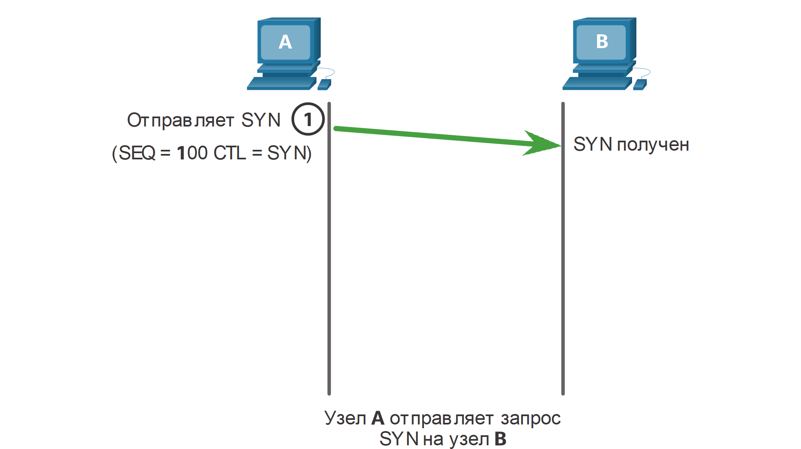
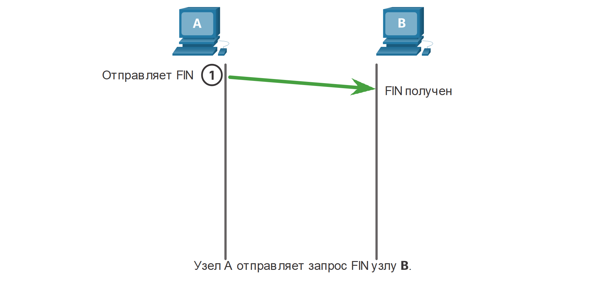
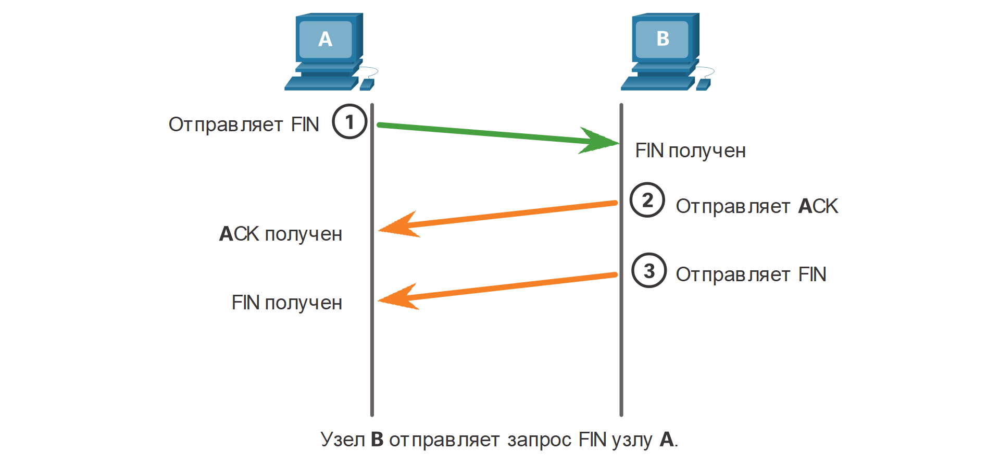

# Обмен данными по протоколу TCP

<!-- 14.5.1 -->
## Процессы TCP-сервера

Вы уже знаете основы TCP. Понимание роли номеров портов поможет вам понять детали процесса связи TCP. В этом разделе вы также узнаете о трехстороннем рукопожатии TCP и процессах завершения сеанса.

Каждый процесс приложения, работающий на сервере, использует номер порта. Номер порта автоматически назначается или настраивается системным администратором вручную.

Не допускается использование двумя различными службами на одном и том же сервере одного и того же порта с одинаковым протоколом транспортного уровня. Например, приложение веб-сервера и приложение передачи файлов, которые запущены на одном узле, не могут быть настроены на использование одного и того же порта (например, TCP-порта 80).

Активное серверное приложение, которому присвоен какой-либо определенный порт, считается открытым, что означает, что транспортный уровень может принимать и обрабатывать сегменты, направляемые на этот порт. Любой входящий запрос, который адресован правильному сокету, будет принят, а данные будут переданы приложению сервера. На сервере может быть одновременно открыто сразу несколько портов, по одному для каждого активного приложения сервера.

### Клиенты, отправляющие запросы TCP

Клиент 1 запрашивает веб-службы, а Клиент 2 запрашивает службу электронной почты, используя известные порты (например, веб-службы = порт 80, службы электронной почты = порт 25).

<!-- /courses/itn-dl/aeed7cc0-34fa-11eb-ad9a-f74babed41a6/af244430-34fa-11eb-ad9a-f74babed41a6/assets/2e61f205-1c25-11ea-81a0-ffc2c49b96bc.svg -->

### Запрос Портов назначения

Запросы динамически генерируют номер порта источника. В этом случае клиент 1 использует порт источника 49152, а клиент 2 использует порт источника 51152.

<!-- /courses/itn-dl/aeed7cc0-34fa-11eb-ad9a-f74babed41a6/af244430-34fa-11eb-ad9a-f74babed41a6/assets/2e624020-1c25-11ea-81a0-ffc2c49b96bc.svg -->

### Запрос Портов источника

Когда сервер отвечает на запросы клиента, он меняет порты назначения и источника исходного запроса.

<!-- /courses/itn-dl/aeed7cc0-34fa-11eb-ad9a-f74babed41a6/af244430-34fa-11eb-ad9a-f74babed41a6/assets/2e626732-1c25-11ea-81a0-ffc2c49b96bc.svg -->

### Ответ Портов назначения 

Обратите внимание, что ответ сервера на веб-запрос теперь имеет порт назначения 49152, а ответ электронной почты теперь имеет порт назначения 51152.

<!-- /courses/itn-dl/aeed7cc0-34fa-11eb-ad9a-f74babed41a6/af244430-34fa-11eb-ad9a-f74babed41a6/assets/2e628e44-1c25-11ea-81a0-ffc2c49b96bc.svg -->

### Ответ Портов источника 

Порт источника в ответе сервера является исходным портом назначения в первоначальных запросах.

<!-- /courses/itn-dl/aeed7cc0-34fa-11eb-ad9a-f74babed41a6/af244430-34fa-11eb-ad9a-f74babed41a6/assets/2e62dc60-1c25-11ea-81a0-ffc2c49b96bc.svg -->

<!-- 14.5.2 -->
## Установление TCP-соединения

В некоторых странах при встрече двух человек принято обмениваться рукопожатиями. Обе стороны понимают акт рукопожатия как сигнал для дружеского приветствия. Подключения в сети осуществляются примерно так же. В соединениях TCP клиент хоста устанавливает соединение с сервером, используя процесс трехстороннего рукопожатия.

### Шаг 1. SYN

Инициирующий клиент запрашивает сеанс связи типа «клиент-сервер» с сервером.

<!-- /courses/itn-dl/aeed7cc0-34fa-11eb-ad9a-f74babed41a6/af244430-34fa-11eb-ad9a-f74babed41a6/assets/2e632a82-1c25-11ea-81a0-ffc2c49b96bc.svg -->

<!--
PCA инициирует трехстороннее рукопожатие, отправив сегмент syn на PCB.
-->

### Шаг 2. ACK и SYN

Сервер подтверждает сеанс обмена данными «клиент-сервер» и запрашивает сеанс обмена данными «сервер-клиент».

<!-- /courses/itn-dl/aeed7cc0-34fa-11eb-ad9a-f74babed41a6/af244430-34fa-11eb-ad9a-f74babed41a6/assets/2e635191-1c25-11ea-81a0-ffc2c49b96bc.svg -->

<!--
PCB отвечает на PCA, отправив свой собственный syn, а также ack, подтверждая syn от PCA и увеличивая порядковый номер на 1.
-->

### Шаг 3. ACK

Инициирующий клиент подтверждает сеанс связи «сервер-клиент».

<!-- /courses/itn-dl/aeed7cc0-34fa-11eb-ad9a-f74babed41a6/af244430-34fa-11eb-ad9a-f74babed41a6/assets/2e6378a2-1c25-11ea-81a0-ffc2c49b96bc.svg -->

<!--
PCA завершает трехстороннее рукопожатие, отправив ack на PCB, подтверждающий syn и увеличивая порядковый номер на 1.
-->

Трехстороннее рукопожатие подтверждает, что узел назначения доступен для связи. В этом примере узел A проверил, что узел B доступен.

<!-- 14.5.3 -->
## Прекращение TCP-соединения

Для прекращения соединения в заголовке сегмента должен быть установлен управляющий флаг Finish (FIN). Для завершения каждого одностороннего TCP-сеанса используется двухстороннее квитирование (рукопожатие), которое состоит из сегмента FIN и сегмента ACK (подтверждение). Следовательно, чтобы завершить один сеанс связи, поддерживаемый протоколом TCP, необходимы четыре операции обмена данными, которые завершат оба сеанса. Прекращение может инициировать клиент или сервер.

В этом примере термины клиент и сервер используются в качестве ссылки для простоты, но любые два хоста, которые имеют открытый сеанс, могут инициировать процесс завершения.

### Шаг 1. FIN

Когда у клиента больше нет данных для отправки в потоке, он отправляет сегмент с установленным флагом FIN.

<!-- /courses/itn-dl/aeed7cc0-34fa-11eb-ad9a-f74babed41a6/af244430-34fa-11eb-ad9a-f74babed41a6/assets/2e63c6c4-1c25-11ea-81a0-ffc2c49b96bc.svg -->

<!--
PCA отправляет сегмент FIN  на PCB для завершения сеанса, когда нет больше данных для отправки 
-->

### Шаг 2. ACK

Сервер отправляет подтверждение ACK, чтобы подтвердить получение FIN для завершения сеанса связи «клиент-сервер».

<!-- /courses/itn-dl/aeed7cc0-34fa-11eb-ad9a-f74babed41a6/af244430-34fa-11eb-ad9a-f74babed41a6/assets/2e63edd3-1c25-11ea-81a0-ffc2c49b96bc.svg -->

<!--
PCB отвечает с ack в ответ на PCAs syn
-->

### Шаг 3. FIN

Сервер отправляет клиенту флаг FIN для завершения сеанса связи между сервером и клиентом.

<!-- /courses/itn-dl/aeed7cc0-34fa-11eb-ad9a-f74babed41a6/af244430-34fa-11eb-ad9a-f74babed41a6/assets/2e6414e3-1c25-11ea-81a0-ffc2c49b96bc.svg -->

<!--
PCB также отправляет свой собственный FIN PCA, чтобы завершить свою часть сессии
-->

### Шаг 4. ACK

Клиент отправляет в ответ флаг ACK, чтобы подтвердить получение флага FIN от сервера.

<!-- /courses/itn-dl/aeed7cc0-34fa-11eb-ad9a-f74babed41a6/af244430-34fa-11eb-ad9a-f74babed41a6/assets/2e643bf5-1c25-11ea-81a0-ffc2c49b96bc.svg -->

<!--
PCA отправляет ack в ответ на FIN PCB, который завершает соединение
-->

После подтверждения всех сегментов, сеанс закрывается.

<!-- 14.5.4 -->
## Анализ трехстороннего квитирования TCP

Узлы отслеживают каждый сегмент данных, передаваемых во время сеанса, и обмениваются информацией о полученных данных с использованием сведений в заголовке TCP. TCP — это полнодуплексный протокол, в котором каждое соединение представляет два односторонних потока обмена данными или сеанса. Для установления связи узлы используют трехстороннее квитирование. Как показано на рисунке, управляющие биты в заголовке TCP указывают на ход и состояние соединения.

Таковы функции трехстороннего квитирования:

* Определяет, присутствует ли в сети устройство назначения;
* Проверяет, имеется ли на устройстве назначения активная служба и принимает ли она запросы на номер порта назначения, который инициирующий клиент планирует использовать;
* Информирует устройство назначения, что клиент источника планирует установить сеанс связи на этом номере порта.

По завершении обмена данными все сеансы закрываются, а соединение прерывается. Механизмы подключения и осуществления сеанса связи включают в себя функции TCP, обеспечивающие надежность.

### Поле управляющих битов

<!-- /courses/itn-dl/aeed7cc0-34fa-11eb-ad9a-f74babed41a6/af244430-34fa-11eb-ad9a-f74babed41a6/assets/2e648a14-1c25-11ea-81a0-ffc2c49b96bc.svg -->

<!--
показывает поля заголовка сегмента tcp с выделенным полем битов управления 6 бит
-->

Шесть бит в поле битов управления в заголовке сегмента TCP называются флагами. Каждый флаг представляет собой бит, который либо включен, либо выключен.

Флаги шести битов управления выглядят следующим образом:

* **URG** - флаг «Указатель важности»;
* **ACK** - Флаг подтверждения, используемый при установке соединения и завершении сеанса;
* **PSH** - флаг "Push";
* **RST** - Флаг RST используется для сброса соединения при возникновении ошибки или в случае превышения времени ожидания;
* **SYN** - Синхронизирует порядковые номера, используемые при установке соединения;
* **FIN** - больше нет данных от отправителя, используется при завершении сеанса.

Задайте поиск в Интернете, чтобы узнать больше о флагах PSH и URG.

<!-- 14.5.5 -->
## Видеоролик. Трехэтапное квитирование TCP

Нажмите  «Воспроизведение», чтобы посмотреть видео о трехстороннем квитировании TCP в программе Wireshark.

<video width="768" height="432" controls>
  <source src="./assets/14.5.5.mp4" type='video/mp4; codecs="avc1.42E01E, mp4a.40.2"'>
</video>

<!-- 14.5.6 -->
<!-- quiz -->

