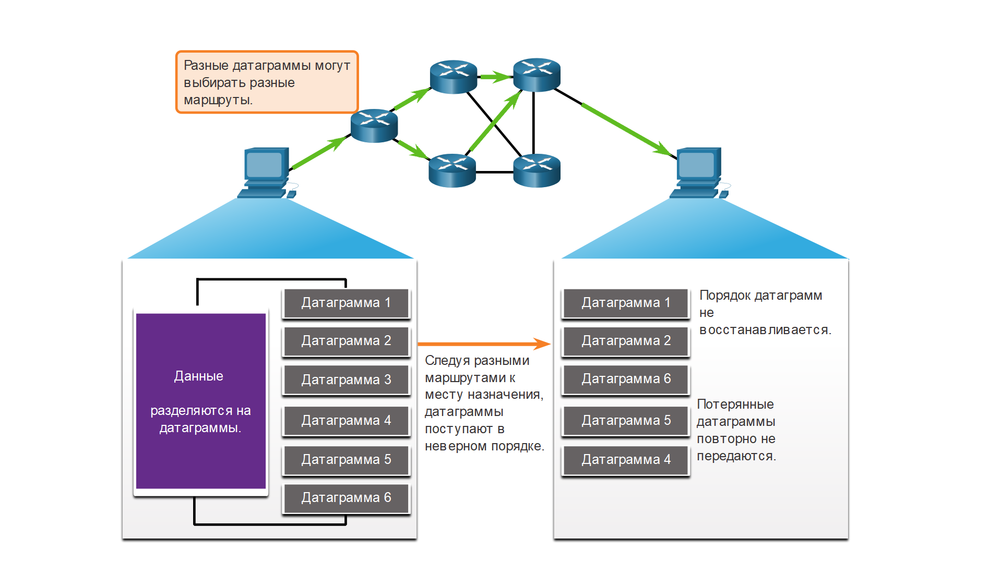

# Обмен данными по протоколу UDP

<!-- 14.7.1 -->
## UDP: низкие накладные расходы или надежность?

Как объяснялось ранее, UPD идеально подходит для связи, которая должна быть быстрой, например VoIP. В этом разделе подробно объясняется, почему UDP идеально подходит для некоторых типов передач. Как показано на рисунке, UDP не устанавливает соединение. Протокол UDP обеспечивает передачу данных с меньшими накладными расходами, поскольку он имеет небольшой заголовок датаграммы и не обменивается управляющим трафиком.

<!-- /courses/itn-dl/aeed7cc0-34fa-11eb-ad9a-f74babed41a6/af246b40-34fa-11eb-ad9a-f74babed41a6/assets/2e691df2-1c25-11ea-81a0-ffc2c49b96bc.svg -->

<!-- 14.7.2 -->
## Сборка датаграмм UDP

Как и в случае с сегментами TCP, когда на узел назначения отправляются датаграммы UDP, они могут использовать разные пути и прибыть в неправильном порядке. Протокол UDP не отслеживает порядковые номера, как это делает протокол TCP. Как показано на рисунке, у UDP нет способа повторно скомпоновать датаграммы в том порядке, который использовался при их передаче.

Таким образом, протокол UDP просто повторно собирает данные в том порядке, в котором они были приняты, и пересылает их приложению. Если последовательность данных важна для работы приложения, оно должно определить правильную последовательность и выбрать оптимальный способ обработки данных.

### Протокол UDP: ненадежная доставка без установления соединения

<!-- /courses/itn-dl/aeed7cc0-34fa-11eb-ad9a-f74babed41a6/af246b40-34fa-11eb-ad9a-f74babed41a6/assets/2e694504-1c25-11ea-81a0-ffc2c49b96bc.svg -->

<!-- 14.7.3 -->
## Процессы и запросы UDP-сервера

Как и приложениям, использующим протокол TCP, серверным приложениям на основе протокола UDP присваиваются известные или зарегистрированные номера портов, как показано на рисунке. Когда эти приложения или процессы запущены на сервере, они принимают данные, совпадающие с присвоенным номером порта. Если UDP получает датаграмму, адресованную одному из этих портов, он пересылает данные приложения соответствующему приложению, исходя из его номера порта.

### Ожидание запросов UDP сервером

<!-- /courses/itn-dl/aeed7cc0-34fa-11eb-ad9a-f74babed41a6/af246b40-34fa-11eb-ad9a-f74babed41a6/assets/2e69ba30-1c25-11ea-81a0-ffc2c49b96bc.svg -->

**Примечание:** Сервер RADIUS (Remote Authentication Dial-in User Service ― удаленная аутентификация абонента телефонной сети), изображенный на рисунке, предоставляет службы аутентификации, авторизации и учета для управления доступом пользователей. Подробные сведения о работе сервера RADIUS не включены в данный курс.

<!-- 14.7.4 -->
## Процессы UDP-клиента

Как и в случае с TCP, обмен данными между клиентом и сервером инициируется клиентским приложением, которое запрашивает данные с серверного процесса. Процесс UDP-клиента динамически выбирает номер порта из диапазона номеров портов и использует его в качестве порта источника для сеанса связи. Как правило, порт назначения — это общеизвестный или зарегистрированный номер порта, присвоенный процессу сервера.

После того как клиент выбрал порты источника и назначения, эта же пара портов будет указана в заголовке всех датаграмм, которые используются в процессе пересылки. Для того чтобы сервер мог вернуть данные клиенту, номера портов источника и назначения в заголовке датаграммы указываются в обратном порядке.

### Клиенты, отправляющие запросы UDP

Клиент 1 отправляет запрос DNS с использованием известного порта 53, а клиент 2 запрашивает службы аутентификации RADIUS с помощью зарегистрированного порта 1812.

<!-- /courses/itn-dl/aeed7cc0-34fa-11eb-ad9a-f74babed41a6/af246b40-34fa-11eb-ad9a-f74babed41a6/assets/2e69e146-1c25-11ea-81a0-ffc2c49b96bc.svg -->

### UDP Запрос Портов назначения

Запросы клиентов динамически генерируют номера портов источника. В этом случае клиент 1 использует порт источника 49152, а клиент 2 использует порт источника 51152.

<!-- /courses/itn-dl/aeed7cc0-34fa-11eb-ad9a-f74babed41a6/af246b40-34fa-11eb-ad9a-f74babed41a6/assets/2e6a085a-1c25-11ea-81a0-ffc2c49b96bc.svg -->

### UDP Запрос Портов источника

Когда сервер отвечает на запросы клиента, он меняет порты назначения и источника исходного запроса.

<!-- /courses/itn-dl/aeed7cc0-34fa-11eb-ad9a-f74babed41a6/af246b40-34fa-11eb-ad9a-f74babed41a6/assets/2e6a5673-1c25-11ea-81a0-ffc2c49b96bc.svg -->

### UDP  ответ назначения

В ответ сервера на запрос DNS теперь является порт назначения 49152, а ответ проверки подлинности RADIUS теперь порт назначения 51152.

<!-- /courses/itn-dl/aeed7cc0-34fa-11eb-ad9a-f74babed41a6/af246b40-34fa-11eb-ad9a-f74babed41a6/assets/2e6a7d89-1c25-11ea-81a0-ffc2c49b96bc.svg -->

### UDP Ответ Портов источника

Порт источника в ответе сервера является исходным портом назначения в первоначальных запросах.

<!-- /courses/itn-dl/aeed7cc0-34fa-11eb-ad9a-f74babed41a6/af246b40-34fa-11eb-ad9a-f74babed41a6/assets/2e6acba2-1c25-11ea-81a0-ffc2c49b96bc.svg -->

<!-- 14.7.5 -->
<!-- quiz -->

