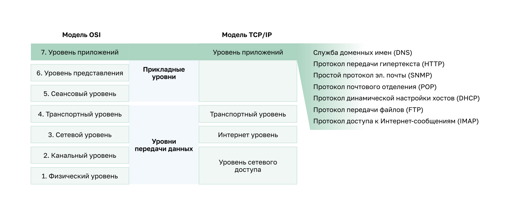
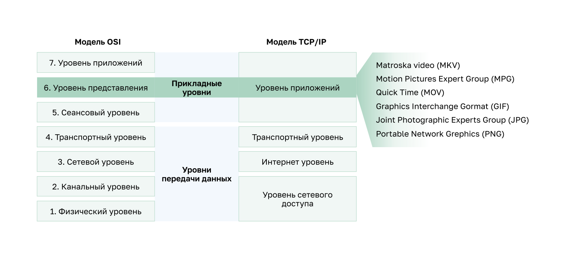

<!-- verified: agorbachev 03.05.2022 -->

<!-- 15.1.1 -->
## Уровень приложений

В моделях OSI и TCP/IP прикладной уровень находится ближе всего к конечному пользователю. Как показано на рисунке, на этом уровне взаимодействуют приложения, используемые для коммуникации, и базовая сеть, по которой передаются сообщения. Протоколы уровня приложений используются для обмена данными между программами, выполняемыми на узле источника и узле назначения.

Три верхних уровня модели OSI (приложений, представления и сеансовый) определяют функции одного уровня приложений в модели TCP/IP.

Существует множество протоколов уровня приложений, постоянно разрабатываются новые протоколы. Наиболее известные из них: протокол передачи гипертекста (Hypertext Transfer Protocol, HTTP), протокол передачи файлов (File Transfer Protocol, FTP), простой протокол передачи файлов (Trivial File Transfer Protocol , TFTP), протокол доступа к сообщениям в Интернете (Internet Message Access Protocol , IMAP) и протокол системы доменных имен (Domain Name System, DNS).

<!-- 15.1.2 -->
## Уровень представления и сеансовый уровень

**Уровень представления**

Уровень представления выполняет три основные функции:

* форматирует или представляет данные из исходного устройства в форме, подходящей для получения устройством назначения;
* сжимает данные, чтобы их можно было распаковать на устройстве назначения;
* шифрует данные для передачи и дешифрует при получении.

Как показано на рисунке, на уровне представления форматируются данные для уровня приложений и устанавливаются стандарты форматов файлов. Широко известные форматы видеофайлов: Matroska Video (MKV), Стандарт сжатия движущихся изображений Motion Picture Experts Group (MPG), и QuickTime Video (MOV). Наиболее известные форматы обмена графическими данными: Формат обмена графическими изображениями (Graphics Interchange Format, GIF), cтандарт от объединенной группы экспертов по фотографии (Joint Photographic Experts Group, JPEG) и Формат переносимой сетевой графики (Portable Network Graphics, PNG).

**Сеансовый уровень**

Как следует из названия, функция сеансового уровня установливает и поддерживает связь между приложениями источника и назначения. На сеансовом уровне происходит обмен данными для установления связи, поддержания ее в активном состоянии и для перезапуска сеансов, которые были прерваны или неактивны в течение продолжительного времени.

<!-- 15.1.3 -->
## Протоколы уровня приложений TCP/IP

Протоколы уровня приложений TCP/IP определяют форматы и управляют данными, необходимыми для многих распространенных функций обмена через Интернет. Во время сеанса связи и устройства-источники, и устройства назначения использут протоколы уровня приложений. Для успешного обмена данными протоколы уровня приложений на узлах источника и назначения должны быть совместимыми.

### Система доменных имен (DNS - Domain Name System\Service):

* TCP, UDP клиент 53;
* преобразует имена доменов, например cisco.com, в IP-адреса.

### Конфигурация хоста 

**BOOTP — Bootstrap Protocol:**

* UDP клиент 68, сервер 67;
* позволяет бездисковым рабочим станциям узнавать свой IP-адрес и IP-адреса BOOTP-сервера в сети, а также загружать файл в память для запуска компьютера;
* его вытеснил протоколом DHCP.

**DHCP — Dynamic Host Configuration Protocol:**

* UDP клиент 68, сервер 67;
* динамически назначает IP-адреса для повторного использования, когда они больше не нужны.

### Электронная почта

**SMTP — Simple Mail Transfer Protocol:**

* TCP 25;
* позволяет клиентам отправлять электронные сообщения на почтовый сервер;
* позволяет серверам отправлять электронные сообщения на другие серверы.

**POP3 — Post Office Protocol:**

* TCP 110;
* позволяет клиентам получать электронные сообщения с почтового сервера;
* загружает письмо в локальное почтовое приложение клиента.

**IMAP — Internet Message Access Protocol:**

* TCP 143;
* позволяет клиентам получать доступ к электронным сообщениям на почтовом сервере;
* синхронизирует электронные сообщения с почтовым сервером.

### Передача файлов

**FTP — File Transfer Protocol:**

* TCP 20 - 21;
* устанавливает правила, которые позволяют пользователю получать доступ к файлам на других узлах и обмениваться ими по сети;
* FTP — надежный протокол доставки файлов с подтверждением и установлением соединения.

**TFTP — Trivial File Transfer Protocol:**

* UDP клиент 69;
* простой протокол передачи файлов без подтверждения, в режиме "best-effort" (негарантированная доставка);
* он использует меньше накладных расходов, чем FTP.

### Интернет

**HTTP — Hypertext Transfer Protocol:**

* TCP 80, 8080;
* задает правила обмена в Интернете текстом, графическими изображениями, звуковыми, видео и другими файлами мультимедиа по Интернету.

**HTTPS — HTTP Secure**

* TCP, UDP 443;
* браузер использует шифрование для безопасного подключения;
* проводит аутентификацию веб-сайта, к которому подключается браузер.

<!-- 15.1.4 -->
<!-- quiz -->

