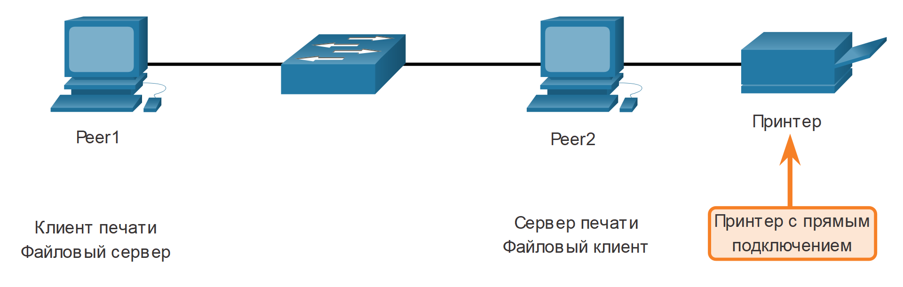

<!-- verified: agorbachev 03.05.2022 -->

<!-- 15.2.1 -->
## Модель «клиент-сервер»

В предыдущем разделе вы узнали, что протоколы прикладного уровня TCP/IP, реализованные на исходном и целевом хостах, должны быть совместимы. В этом разделе вы узнаете о модели клиент/сервер и используемых процессах, которые находятся на уровне приложений. То же самое относится и к одноранговой сети. В модели типа «клиент-сервер» устройство, запрашивающее информацию, называется клиентом, а устройство, которое отвечает на данный запрос, — сервером. Клиент представляет собой сочетание аппаратного и программного обеспечения, которое люди используют для прямого доступа к ресурсам, хранящимся на сервере.

Считается, что процессы модели «клиент-сервер» происходят на уровне приложений. Клиент начинает обмен данными, отправляя запрос на получение данных с сервера, который в ответ отправляет один или несколько потоков данных клиенту. Протоколы уровня приложений описывают формат запросов и ответов между клиентами и серверами. В дополнение к фактической передаче данных для этого обмена данными также может потребоваться аутентификация пользователей и идентификация передаваемых файлов данных.

Одним примером сети клиент/сервер является использование службы электронной почты интернет-провайдера для отправки, получения и хранения электронной почты. Почтовый клиент на домашнем компьютере отправляет запрос серверу электронной почты интернет-провайдера на получение списка новых сообщений. Сервер отвечает, отправляя запрошенное сообщение эл. почты клиенту. Передача данных в направлении от клиента к серверу называется отправкой (загрузкой на сервер, upload), а в направлении от сервера к клиенту — скачиванием (загрузкой с сервера, download).

Как показано на рисунке, файлы скачиваются с сервера на клиент.

<!-- /courses/itn-dl/aeed7cc2-34fa-11eb-ad9a-f74babed41a6/af249252-34fa-11eb-ad9a-f74babed41a6/assets/2e6fada4-1c25-11ea-81a0-ffc2c49b96bc.svg -->

<!-- 15.2.2 -->
## Одноранговые сети

В модели одноранговой сети (P2P) данные запрашиваются с равноправного устройства без использования выделенного сервера.

Сетевая модель P2P состоит двух частей: P2P-сетей и P2P-приложений. Обе части имеют похожие функции, но на практике работают по-разному.

В P2P-сети два компьютера (или более двух) подключаются между собой по сети и могут открывать доступ к своим ресурсам (например, к принтерам и файлам) без использования выделенного сервера. Каждое подключенное к сети конечное устройство (одноранговый узел) может выполнять функции как сервера, так и клиента. Один компьютер может играть роль сервера для одной операции, одновременно выступая в роли клиента для других операций. Роли клиента и сервера устанавливаются в зависимости от запроса.

Помимо поддержки функции файлового обмена подобная сеть позволит пользователям запускать сетевые игры или совместно использовать подключение к Интернету.

В одноранговой сети оба устройства считаются равноправными участниками процесса обмена данными. Одноранговый узел 1 имеет файлы, которые используются совместно с одноранговым узлом 2, и имеет доступ к общему принтеру, который напрямую подключен к одноранговому узлу 2 для печати файлов. Одноранговый узел 2 использует совместно подключенный принтер с одноранговым узлом 1, одновременно получая доступ к общим файлам на одноранговом узле 1, как показано на рисунке.

<!-- /courses/itn-dl/aeed7cc2-34fa-11eb-ad9a-f74babed41a6/af249252-34fa-11eb-ad9a-f74babed41a6/assets/2e6fd4b4-1c25-11ea-81a0-ffc2c49b96bc.svg -->

<!-- 15.2.3 -->
## Одноранговые приложения

Одноранговое приложение (P2P) позволяет устройству выступать в роли как клиента, так и сервера в пределах одного сеанса связи, как показано на рисунке. В этой модели каждый клиент является одновременно сервером, а каждый сервер — клиентом. Для P2P-приложений требуется, чтобы каждое конечное устройство предоставляло пользовательский интерфейс и запускало сервис в фоновом режиме.

В некоторых P2P-приложениях используется гибридная система, где общий доступ к ресурсам децентрализован, а индексы, указывающие на местоположения ресурсов, хранятся в центральном каталоге. В гибридной системе каждый узел обращается к серверу индексации, чтобы получить местоположение ресурса, который хранится на другом узле.

<!-- /courses/itn-dl/aeed7cc2-34fa-11eb-ad9a-f74babed41a6/af249252-34fa-11eb-ad9a-f74babed41a6/assets/2e7022d2-1c25-11ea-81a0-ffc2c49b96bc.svg -->

Оба клиента одновременно инициируют и получают сообщения.

<!-- 15.2.4 -->
## Наиболее распространенные одноранговые приложения

Все компьютеры в сети, на которых запущено P2P-приложение, могут выступать в роли клиента или сервера для других компьютеров в сети с этим же приложением. Наиболее распространенные P2P-сети:

* BitTorrent
* Direct Connect
* eDonkey
* Freenet

Некоторые Р2Р-приложения разработаны на основе протокола Gnutella, который предполагает обмен целыми файлами между пользователями. Как показано на рисунке, клиентское программное обеспечение, совместимое с протоколом Gnutella, позволяет пользователям подключаться к сервисам Gnutella через Интернет, а также находить и использовать ресурсы, доступ к которым был открыт другими одноранговыми узлами Gnutella. Доступны многие клиентские приложения Gnutella, включая µTorrent, BitComet, DC ++, Deluge и emule.

<!-- /courses/itn-dl/aeed7cc2-34fa-11eb-ad9a-f74babed41a6/af249252-34fa-11eb-ad9a-f74babed41a6/assets/2e7070f3-1c25-11ea-81a0-ffc2c49b96bc.svg -->

P2P-приложения Gnutella ищут общие ресурсы на нескольких узлах.

Многие P2P-приложения позволяют пользователям совместно использовать части множества файлов в одно и то же время. Клиенты используют торрент-файл для поиска других пользователей, располагающих необходимыми частями файлов, чтобы затем напрямую подключиться к ним. В этом файле также записана информация о трекере, на котором хранятся данные о том, какими файлами располагают пользователи. Клиенты запрашивают части файлов одновременно у разных пользователей, совокупность которых называют роем. Эта технология называется BitTorrent. У BitTorrent есть собственный клиент. Но есть много других клиентов BitTorrent, включая uTorrent, Deluge и qBittorrent.

**Примечание:** В общий доступ могут быть предоставлены любые типы файлов. Многие из них защищены авторским правом. Это значит, что только правообладатель может использовать и распространять такие файлы. Загрузка и распространение файлов, защищенных авторским правом, без разрешения правообладателя является нарушением закона. Нарушение авторского права может повлечь уголовное обвинение и гражданские иски.

<!-- 15.2.5 -->
<!-- quiz -->

