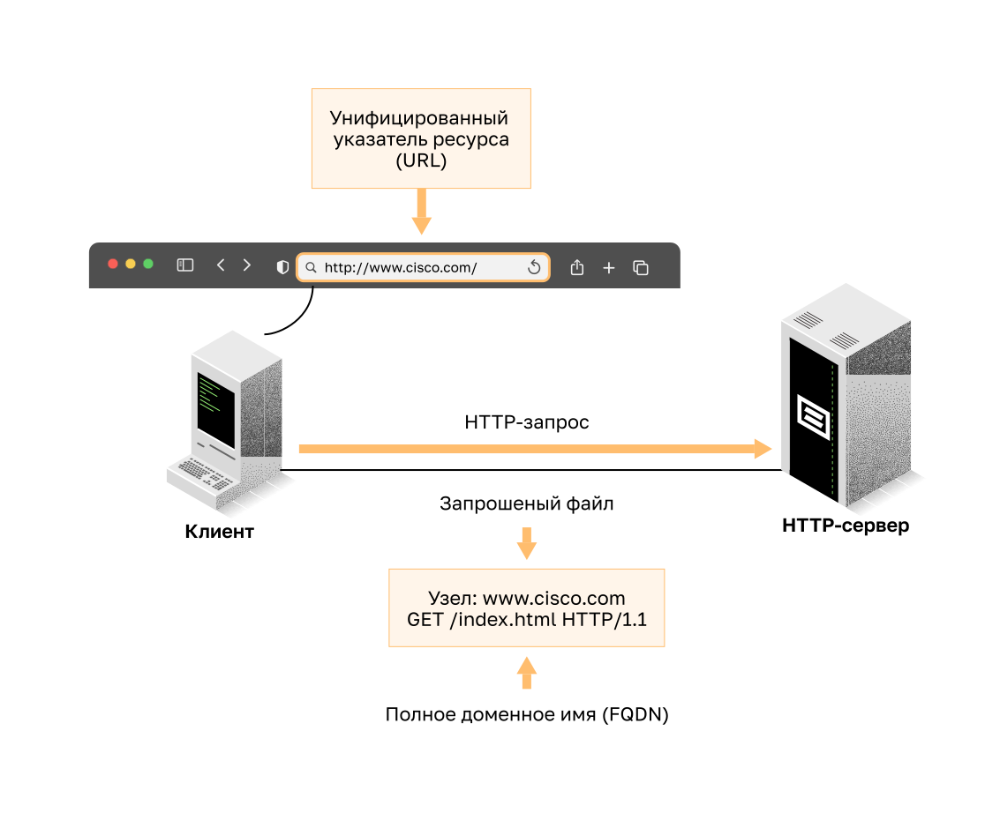
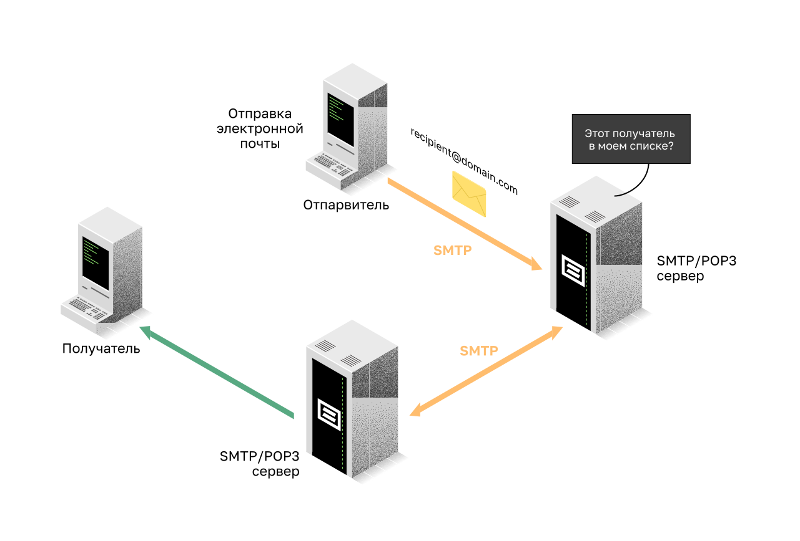
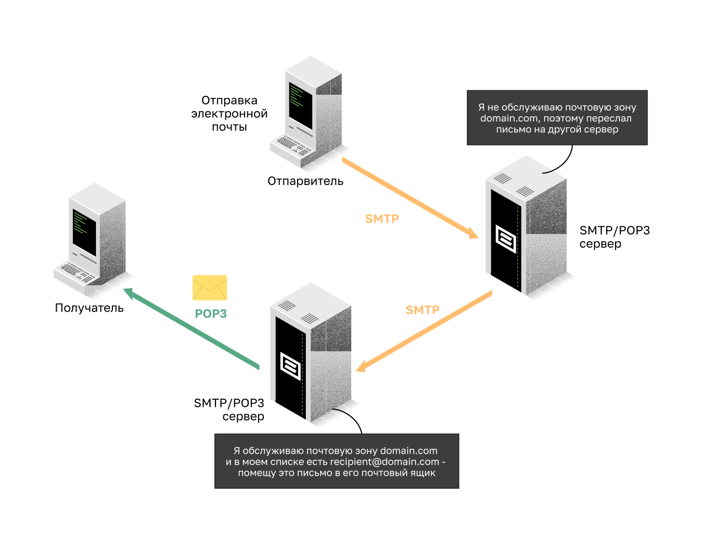
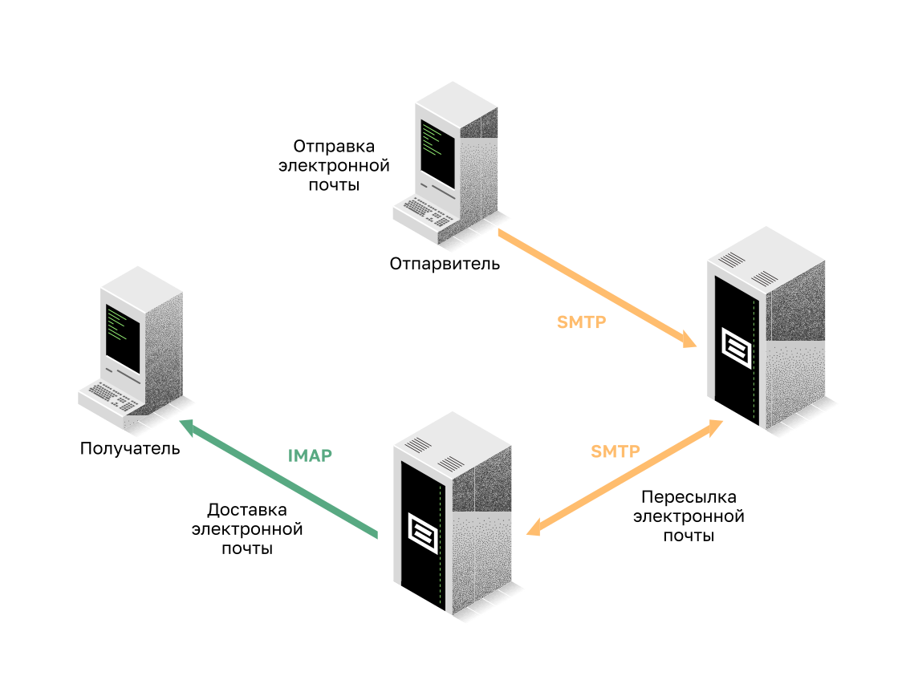

<!-- verified: agorbachev 03.05.2022 -->

<!-- 15.3.1 -->
## Разметка и передача гипертекста

Существуют специальные протоколы прикладного уровня для общего использования, такого как просмотр веб-страниц и электронная почта. Первая тема дала вам обзор этих протоколов. Рассмотрим их подробнее.

Когда веб-адрес или унифицированный указатель ресурса (URL) вводится в веб-браузере, устанавливается соединение с веб-службой. Веб-служба выполняется на сервере, использующем протокол HTTP. URL и унифицированные идентификаторы ресурсов (URI) — это названия, которые большинство пользователей ассоциируют с веб-адресами.

Для того чтобы вы могли лучше понять взаимодействие веб-обозревателя с веб-сервером, мы подробно опишем, как веб-страница открывается в браузере. В примере используется URL-адрес http://www.cisco.com/index.html.

**Шаг 1:** Браузер интерпретирует три части URL-адреса:

* http (протокол или схема)
* www.cisco.com (имя сервера)
* index.html (название конкретного запрашиваемого файла)

**Шаг 2:** Затем браузер с помощью сервера доменных имен преобразует имя www.cisco.com в числовой адрес для подключения к серверу. Клиент инициирует HTTP-запрос к серверу, отправляя GET-запрос на сервер и запрашивает файл index.html.

**Шаг 3:** В ответ на запрос сервер отправляет в браузер HTML-код для этой веб-страницы.

**Шаг 4:** Браузер декодирует HTML-код и форматирует страницу в окне браузера.

<!-- 15.3.2 -->
## Протоколы HTTP и HTTPS

Протокол передачи гипертекста HTTP основан на механизме «запрос-ответ». Когда клиент (обычно веб-браузер) отправляет запрос веб-серверу, протокол HTTP определяет типы сообщений для этого взаимодействия. Три основных типа сообщений (см. рис.):

* **GET** \— запрос данных клиентом. Клиент (веб-браузер) отправляет сообщение GET веб-серверу, чтобы запросить HTML-страницы;
* **POST** \— отправляет на веб-сервер файлы данных;
* **PUT** \— выгружает на веб-сервер ресурсы и контент, например изображения.

Несмотря на свою гибкость, протокол HTTP небезопасен. Сообщения запроса передают информацию на сервер в виде обычного текста, который можно перехватить и прочитать. Аналогичным образом ответы сервера (обычно это HTML-страницы) передаются в незашифрованном виде.

Для защищенного двустороннего обмена данными в Интернете используется защищенная модификация протокола HTTP Secure (HTTPS). HTTPS позволяет использовать аутентификацию и шифрование для защиты данных, пересылаемых между клиентом и сервером. В HTTPS используется тот же процесс «запрос-ответ», что и в HTTP, но поток данных зашифровывается посредством SSL (Secure Socket Layer) перед передачей по сети.

<!-- 15.3.3 -->
## Протоколы передачи электронной почты

Один из основных сервисов, предлагаемых интернет-провайдерами (ISP) — размещение (хостинг) серверов электронной почты. Но чтобы электронная почта заработала на компьютере или другом конечном устройстве, необходим ряд приложений и сервисов, как показано на рисунке. Электронная почта — это набор средств для доставки, хранения и извлечения электронных сообщений в сети. Сообщения хранятся на серверах электронной почты в базах данных.

Клиенты электронной почты для отправки и получения сообщений обращаются к её серверам, которые взаимодействуют друг с другам для обмена сообщениями между доменами. Почтовый клиент не соединяется непосредственно с другим почтовым клиентом для отправки сообщения. Оба клиента должны доверить транспортировку сообщений серверу электронной почты.

Электронная почта поддерживает три отдельных протокола: SMTP, POP и IMAP. В процессе уровня приложений, на котором выполняется отправка почты, используется протокол SMTP. Клиент получает электронную почту с помощью одного из двух протоколов уровня приложений: POP или IMAP.

<!-- 15.3.4 -->
### SMTP

В формате SMTP сообщение состоит из заголовка и тела сообщения. Тело сообщения может содержать текст произвольной длины. В заголовке адреса электронной почты получателя и отправителя должны быть указаны в соответствующем формате.

Когда клиент отправляет электронную почту, процесс SMTP-клиента подключается к процессу SMTP-сервера на общеизвестном порте 25. Установив соединение, клиент пытается отправить по нему электронное письмо серверу. Как только сервер получит сообщение, он помещает его в очередь сообщений локальной учетной записи, если абонент локальный, или пересылает другому почтовому серверу.

Целевой сервер электронной почты (сервер назначения) в момент доставки сообщения может оказаться недоступен или перегружен. На этот случай в SMTP предусмотрено временное хранение сообщений с последующей повторной отправкой. Периодически сервер проверяет очередь сообщений и пытается отправить их повторно. Если сообщение не удается доставить в течение установленного времени, оно возвращается отправителю с уведомлением о невозможности доставки.

### POP

С помощью протокола POP приложения получают сообщения от сервера электронной почты. При использовании POP сообщения загружаются клиентом с сервера и удаляются на сервере. Это стандартная операция POP.

Сетевой сервис POP на сервере пассивно ожидает запросов подключения клиентов к TCP-порту 110. Для использования этого сервиса клиент отправляет запрос на установку TCP-соединения с сервером, как показано на рисунке. После установки соединения сервер POP3 посылает приветствие. Затем клиент и сервер POP обмениваются командами и ответами, пока подключение не будет закрыто или прервано.

При использовании POP электронную почту загружает клиент, после чего она удаляются с сервера. Значит, сообщения не хранятся централизованно. Поэтому POP не подходит для малого бизнеса, которому нужно решение для централизованного резервного копирования.

POP3 — наиболее часто используемая версия.

### IMAP

Протокол IMAP предусматривает другой метод получения почтовых сообщений с сервера. Его отличие от POP в том, что при подключении пользователя к серверу IMAP в клиентское приложение загружаются только копии сообщений, как показано на рисунке. Исходные сообщения остаются на сервере до тех пор, пока их не удалят вручную. Пользователи просматривают копии сообщений в клиентах электронной почты.

Пользователи могут организовать на сервере иерархическую файловую структуру для упорядочения и хранения почты. Эта структура также дублируется клиентом электронной почты. Если пользователь решает удалить сообщение, оно синхронно удаляется из клиента и с сервера.

<!-- 15.3.5 -->
<!-- quiz -->
