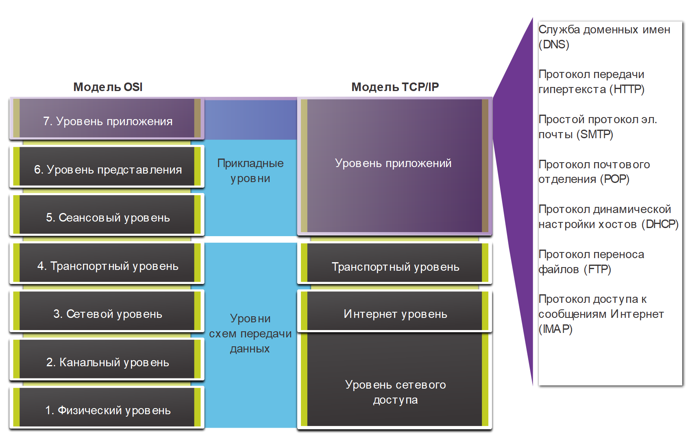
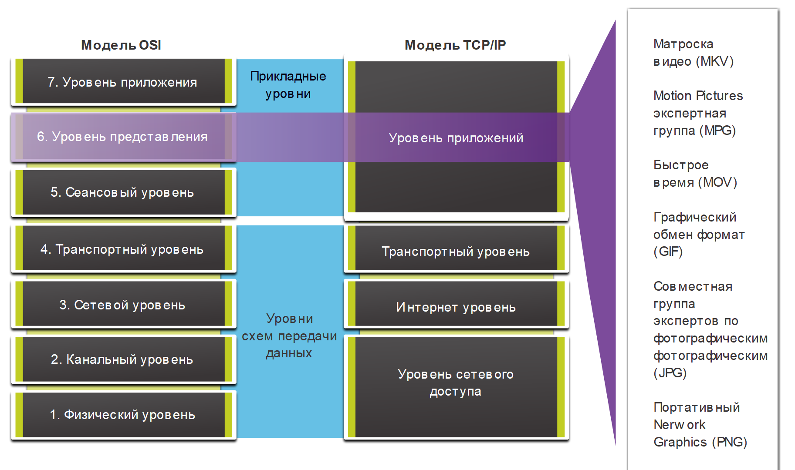

# Уровень приложений, уровень представления, сеансовый уровень

<!-- 15.1.1 -->
## Уровень приложений

В моделях OSI и TCP/IP прикладной уровень находится ближе всего к конечному пользователю. Как показано на рисунке, на этом уровне обеспечивается взаимодействие приложений, используемых для коммуникации, и базовой сети, по которой передаются сообщения. Протоколы уровня приложений используются для обмена данными между программами, выполняемыми на узле источника и узле назначения.

<!-- /courses/itn-dl/aeed7cc2-34fa-11eb-ad9a-f74babed41a6/af249250-34fa-11eb-ad9a-f74babed41a6/assets/2e6dd8e3-1c25-11ea-81a0-ffc2c49b96bc.svg -->

<!--
На рисунке показано сравнение слоев модели OSI и TCP/IP. Модель OSI показана слева. Сверху вниз расположены следующие номера и имена уровней: 7) Приложений, 6) Представления, 5) Сеансовый, 4) Транспортный, 3) Сетевой, 2) Канальный и 1) Физический. Модель TCP/IP показана справа.  Сверху вниз имена уровней и соответствующие номера уровней модели OSI: приложений (слои OSI 7, 6 и 5), транспортный (слой OSI 4), Межсетевой (слой OSI 3) и Сетевой доступ (слои OSI 2 и 1). Текст внизу гласит: ключевые сходства на транспортном и сетевом уровнях; однако эти две модели различаются по тому, как они относятся к уровням выше и ниже каждого уровня: уровень 3 OSI, сетевой уровень, отображается непосредственно на межсетевой уровень TCP/IP. Этот уровень описывает протоколы, определяющие пути передачи данных в сети. Уровень 4 модели OSI, или транспортный уровень, соответствует транспортному уровню модели TCP/IP. Этот уровень описывает общие сервисы и функции, которые обеспечивают упорядоченную и надежную доставку данных от источника до места назначения. Прикладной уровень TCP/IP включает в себя ряд протоколов, которые поддерживают определенные функции для работы разнообразных приложений конечных пользователей. Уровни 5, 6 и 7 модели OSI используются в качестве эталонов для разработчиков и поставщиков прикладного программного обеспечения для создания приложений, работающих в сетях. Обе модели (TCP/IP и OSI) широко применяются в отношении протоколов различных уровней. Так как модель OSI разделяет канальный и физический уровни, именно она используется для этих уровней. Прикладной уровень модели OSI, в частности, определяет: служба доменных имен (DNS), протокол передачи гипертекста (HTTP), простой протокол электронной почты (SMTP), почтовый протокол (POP), протокол динамической настройки узлов (DHCP), протокол передачи файлов (FTP) и протокол доступа к сообщениям Интернета (IMAP).
-->

Верхние три уровня модели OSI (приложений, представления и сеансовый) определяют функции одного уровня приложений в модели TCP/IP.

Существует множество протоколов уровня приложений, постоянно разрабатываются новые протоколы. К некоторым из наиболее известных протоколов уровня приложений относятся: протокол передачи гипертекста (Hypertext Transfer Protocol, HTTP), протокол передачи файлов (File Transfer Protocol, FTP), простой протокол передачи файлов (Trivial File Transfer Protocol , TFTP), протокол доступа к сообщениям в Интернете (Internet Message Access Protocol , IMAP) и протокол системы доменных имен (Domain Name System, DNS).

<!-- 15.1.2 -->
## Уровень представления и сеансовый уровень

**Уровень представления**

Уровень представления выполняет три основные функции:

* Форматирование или представление данных из исходного устройства в форме, подходящей для получения устройством назначения.
* Сжатие данных таким образом, чтобы их можно было распаковать на устройстве назначения.
* Шифрование данных для передачи и дешифрование при получении.

Как показано на рисунке, на уровне представления форматируются данные для уровня приложений и устанавливаются стандарты форматов файлов. К числу широко известных форматов видеофайлов относятся Matroska Video (MKV), Стандарт сжатия движущихся изображений Motion Picture Experts Group (MPG), и QuickTime Video (MOV). К некоторым из наиболее известных форматов обмена графическими данными относятся Формат обмена графическими изображениями (Graphics Interchange Format, GIF), cтандарт от объединенной группы экспертов по фотографии (Joint Photographic Experts Group, JPEG) и Формат переносимой сетевой графики (Portable Network Graphics, PNG).

<!-- /courses/itn-dl/aeed7cc2-34fa-11eb-ad9a-f74babed41a6/af249250-34fa-11eb-ad9a-f74babed41a6/assets/2e6e2704-1c25-11ea-81a0-ffc2c49b96bc.svg -->

<!--
На рисунке показано сравнение слоев модели OSI и TCP/IP. Модель OSI показана слева. Сверху вниз расположены следующие номера и имена уровней: 7) Приложений, 6) Представления, 5) Сеансовый, 4) Транспортный, 3) Сетевой, 2) Канальный и 1) Физический. Модель TCP/IP показана справа.  Сверху вниз имена уровней и соответствующие номера уровней модели OSI: приложений (слои OSI 7, 6 и 5), транспортный (слой OSI 4), Межсетевой (слой OSI 3) и Сетевой доступ (слои OSI 2 и 1). Текст внизу гласит: ключевые сходства на транспортном и сетевом уровнях; однако эти две модели различаются по тому, как они относятся к уровням выше и ниже каждого уровня: уровень 3 OSI, сетевой уровень, отображается непосредственно на межсетевой уровень TCP/IP. Этот уровень описывает протоколы, определяющие пути передачи данных в сети. Уровень 4 модели OSI, или транспортный уровень, соответствует транспортному уровню модели TCP/IP. Этот уровень описывает общие сервисы и функции, которые обеспечивают упорядоченную и надежную доставку данных от источника до места назначения. Прикладной уровень TCP/IP включает в себя ряд протоколов, которые поддерживают определенные функции для работы разнообразных приложений конечных пользователей. Уровни 5, 6 и 7 модели OSI используются в качестве эталонов для разработчиков и поставщиков прикладного программного обеспечения для создания приложений, работающих в сетях. Обе модели (TCP/IP и OSI) широко применяются в отношении протоколов различных уровней. Так как модель OSI разделяет канальный и физический уровни, именно она используется для этих уровней. Примеры для уровня представления в модели OSI: Matroska Video(MKV), Motion Pictures Expert Group(MPG), QuickTime(MOV), Graphics Interchange Format(GIF), Joint Photographic Experts Group(JPG), и Portable Network Graphics(PNG).
-->

**Сеансовый уровень**

Как следует из названия, функция сеансового уровня — установление и поддержание связи между приложениями источника и назначения. На сеансовом уровне происходит обмен данными для установления связи, поддержания ее в активном состоянии и для перезапуска сеансов, которые были прерваны или неактивны в течение продолжительного времени.

<!-- 15.1.3 -->
## Протоколы уровня приложений TCP/IP

Протоколы уровня приложений TCP/IP определяют форматы и управляют данными, необходимыми для многих распространенных функций обмена данными через Интернет. Во время сеанса связи, протоколы уровня приложений используются и устройствами-источниками, и устройствами назначения. Для успешного обмена данными протоколы уровня приложений на узлах источника и назначения должны быть совместимыми.

### Система доменных имен

**DNS - Domain Name System (or Service)**

* TCP, UDP клиент 53
* Преобразует имена доменов, например cisco.com, в IP-адреса.

### Конфигурация хоста

**BOOTP - Bootstrap Protocol**

* UDP клиент 68, сервер 67
* Позволяет бездисковым рабочим станциям узнавать свой IP-адрес, IP-адреса BOOTP-сервера в сети, а также загружать файл в память для запуска компьютера
* BOOTP был вытеснен протоколом DHCP

**DHCP - Dynamic Host Configuration Protocol**

* UDP клиент 68, сервер 67
* Динамически назначает IP-адреса для повторного использования, когда они больше не нужны

### Электронная почта

**SMTP - Simple Mail Transfer Protocol**

* TCP 25
* Позволяет клиентам отправлять электронные сообщения на почтовый сервер
* Позволяет серверам отправлять электронные сообщения на другие серверы

**POP3 - Post Office Protocol**

* TCP 110
* Позволяет клиентам получать электронные сообщения с почтового сервера
* Загружает письмо в локальное почтовое приложение клиента

**IMAP - Internet Message Access Protocol**

* TCP 143
* Позволяет клиентам получать доступ к электронным сообщениям, которые хранятся на почтовом сервере
* Синхронизирует электронные сообщения с почтовым сервером

### Передача файлов

**FTP - File Transfer Protocol**

* TCP 20 - 21
* Устанавливает правила, которые позволяют пользователю получать доступ к файлам на других узлах и обмениваться ими по сети
* FTP - надежный протокол доставки файлов с подтверждением и установлением соединения

**TFTP - Trivial File Transfer Protocol**

*  UDP client 69
* Простой протокол передачи файлов без подтверждения, режиме "best-effort" (негарантированная доставка)
* Он использует меньше накладных расходов, чем FTP

### Интернет

**HTTP - Hypertext Transfer Protocol**

* TCP 80, 8080
* Задает правила обмена в Интернете текстом, графическими изображениями, звуковыми, видео и другими файлами мультимедиа по Интернету.

**HTTPS - HTTP Secure**

* TCP, UDP 443 
* Браузер использует шифрование для безопасного подключения по протоколу HTTPS
* Проводит аутентификацию веб-сайта, к которому подключается ваш браузер

<!-- 15.1.4 -->
<!-- quiz -->

