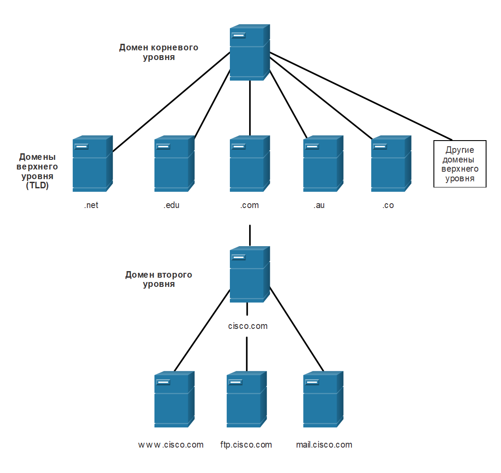
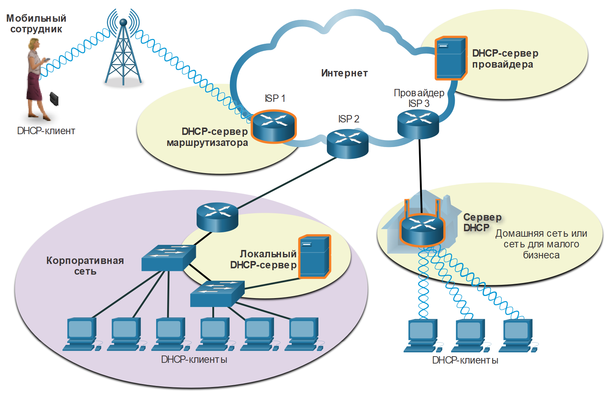
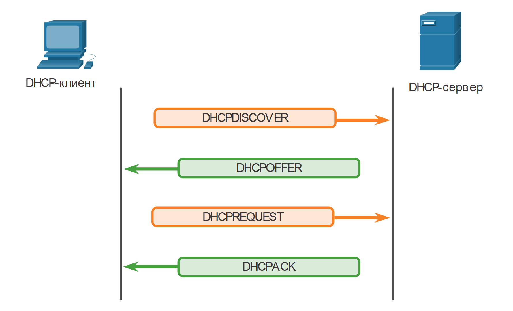

<!-- verified: agorbachev 03.05.2022 -->

<!-- 15.4.1 -->
## Служба доменных имен (DNS)

Существуют и другие протоколы для конкретных уровней приложений, которые были разработаны, чтобы облегчить получение адресов для сетевых устройств. Эти сервисы необходимы, потому что было бы очень сложно запомнить IP-адреса вместо URL-адресов или вручную настроить все устройства в сети среднего и большого размера. Первая тема в этом модуле дала вам обзор этих протоколов. В этом разделе более подробно рассматриваются службы IP-адресации, DNS и DHCP.

В сетях передачи данных устройства идентифицируются по числовым IP-адресам для отправки и получения данных. Доменные имена были созданы для того, чтобы преобразовать числовой адрес в простое и легко запоминаемое имя.

В Интернете полные доменные имена (fully-qualified domain names - FQDN), такие как [http://www.cisco.com](http://www.cisco.com/), гораздо проще запомнить, чем 198.133.219.25, который является фактическим числовым адресом для этого сервера. Если Cisco решит изменить числовой адрес [www.cisco.com](http://www.cisco.com/), он будет прозрачен для пользователя, поскольку доменное имя остается прежним. Новый адрес будет просто привязан к существующему имени домена без нарушения связи с сервером.

Протокол DNS определяет автоматизированный сервис, который сопоставляет имена ресурсов с соответствующими числовыми сетевыми адресами. В этом протоколе описывается формат для запросов, ответов и самих данных. При обмене данными по протоколу DNS используется единый формат, который называется сообщением. Такой формат сообщения используется для всех типов запросов клиента и ответов сервера, сообщений об ошибках и передачи записей ресурсов между серверами.

### Шаг 1

Пользователь вводит полное доменное имя в поле Адрес приложения браузера.


<!-- /courses/itn-dl/aeed7cc2-34fa-11eb-ad9a-f74babed41a6/af24b962-34fa-11eb-ad9a-f74babed41a6/assets/2e74b6b0-1c25-11ea-81a0-ffc2c49b96bc.svg -->

### Шаг 2

DNS-запрос отправляется на назначенный DNS-сервер для клиентского компьютера.


<!-- /courses/itn-dl/aeed7cc2-34fa-11eb-ad9a-f74babed41a6/af24b962-34fa-11eb-ad9a-f74babed41a6/assets/2e74ddc0-1c25-11ea-81a0-ffc2c49b96bc.svg -->

### Шаг 3

DNS-сервер сопоставляет полное доменное имя FQDN с его IP-адресом.


<!-- /courses/itn-dl/aeed7cc2-34fa-11eb-ad9a-f74babed41a6/af24b962-34fa-11eb-ad9a-f74babed41a6/assets/2e7504d0-1c25-11ea-81a0-ffc2c49b96bc.svg -->

### Шаг 4

Ответ DNS-запроса отправляется обратно клиенту с IP-адресом для полного доменного имени.


<!-- /courses/itn-dl/aeed7cc2-34fa-11eb-ad9a-f74babed41a6/af24b962-34fa-11eb-ad9a-f74babed41a6/assets/2e752be3-1c25-11ea-81a0-ffc2c49b96bc.svg -->

### Шаг 5

Клиентский компьютер использует IP-адрес для выполнения запросов сервера.


<!-- /courses/itn-dl/aeed7cc2-34fa-11eb-ad9a-f74babed41a6/af24b962-34fa-11eb-ad9a-f74babed41a6/assets/2e7552f3-1c25-11ea-81a0-ffc2c49b96bc.svg -->

<!-- 15.4.2 -->
## Формат сообщений DNS

На DNS-серверах хранятся различные типы записей ресурсов, используемые для разрешения имен. Эти записи содержат имя, адрес и тип записи. К некоторым типам записи относятся:

* **A** \- IPv4-адрес конечного устройства.
* **NS** - доверенный сервер имен.
* **AAAA** -IPv6-адрес конечного устройства (произносится как quad-A).
* **MX** - запись обмена почтовыми сообщениями.

Когда клиент выполняет запрос, процесс DNS-сервера сначала ищет это имя в своих записях, чтобы разрешить его. Если имя не удалось разрешить по локальным записям, сервер обращается к другим серверам для разрешения имени. Когда совпадение найдено, числовой адрес возвращается исходному серверу, который определенное время хранит эту запись на случай повторного запроса.

Клиентский сервис DNS на компьютере Windows также хранит ранее разрешенные имена в памяти. Команда **ipconfig /displaydns** выводит на экран все имеющиеся в кеше записи DNS.

Как показано в таблице, DNS использует один и тот же формат сообщений между серверами, состоящий из вопроса, ответа, полномочий и дополнительной информации для всех типов запросов клиента и ответов сервера, сообщений об ошибках и передачи записей ресурсов между серверами.

| **Раздел DNS-сообщений** | **Описание** |
| --- | --- |
| Вопрос | Вопрос для сервера имен |
| Ответ | Записи ресурсов с ответом на вопрос |
| Полномочия | Записи ресурсов с информацией о полномочиях |
| Дополнительно | Записи ресурсов, содержащие дополнительные сведения |

<!-- 15.4.3 -->
## Иерархия DNS

В протоколе DNS используется иерархическая структура для создания базы данных и разрешения имен, как показано на рисунке. Иерархическая структура DNS строится по именам доменов.

Она подразделяется на небольшие управляемые зоны. У каждого DNS-сервера имеется отдельный файл с базой данных. Сервер управляет привязкой имен к IP-адресам только в отдельной небольшой части общей структуры DNS. Получив запрос на преобразование имени, не относящегося к собственной зоне DNS, DNS-сервер пересылает этот запрос на обработку другому DNS-серверу в соответствующей зоне. DNS — это масштабируемый сервис разрешения имен узлов, который распределен по множеству серверов сети.

Различные домены верхнего уровня представляют либо определенный вид организации, либо страну происхождения. Примеры доменов верхнего уровня:

* **.com**  - коммерческие или промышленные предприятия
* **.org**  - некоммерческие организации
* **.au** - Австралия
* **.co** - Колумбия


<!-- /courses/itn-dl/aeed7cc2-34fa-11eb-ad9a-f74babed41a6/af24b962-34fa-11eb-ad9a-f74babed41a6/assets/2e75a113-1c25-11ea-81a0-ffc2c49b96bc.svg -->

<!-- 15.4.4 -->
## Команда nslookup

При настройке сетевого устройства указывают один или несколько адресов DNS-серверов, которые клиент DNS может использовать для разрешения имен. Обычно адреса DNS-серверов предоставляет интернет-провайдер (ISP). Когда пользовательское приложение запрашивает подключение к удаленному устройству по его имени, клиент DNS опрашивает сервер имен, чтобы преобразовать имя в числовой адрес.

В операционных системах компьютеров обычно есть утилита Nslookup, которая позволяет пользователю вручную опрашивать серверы для разрешения имен узлов. Эту утилиту также можно использовать для диагностики проблем разрешения имен и проверки текущего состояния серверов имен.

На рисунке показано, что после выполнения команды **nslookup** выводится DNS-сервер по умолчанию, настроенный для данного узла. В **nslookup** командной строке можно ввести имя узла или домена. Утилита nslookup имеет много параметров для расширенного тестирования и проверки процесса DNS.

```
C:\Users> nslookup
Default Server:  dns-sj.cisco.com
Address:  171.70.168.183
> www.cisco.com
Server:  dns-sj.cisco.com
Address:  171.70.168.183
Name:    origin-www.cisco.com
Addresses:  2001:420:1101:1::a
          173.37.145.84
Aliases:  www.cisco.com
> cisco.netacad.net
Server:  dns-sj.cisco.com
Address:  171.70.168.183
Name:    cisco.netacad.net
Address:  72.163.6.223
>
```

<!-- 15.4.5 -->
<!-- syntax -->

<!-- 15.4.6 -->
## Протокол динамической конфигурации узла (DHCP)

Служба протокола динамической конфигурации узла (Dynamic Host Configuration Protocol, DHCP) для IPv4 автоматизирует назначение адресов IPv4, масок подсети, шлюзов и других сетевых параметров IPv4. Это называется динамической адресацией. Альтернативой динамической адресации является статическая адресация. При использовании статической адресации администратор сети вручную вводит данные IP-адресов на узлах.

При подключении узла к сети устанавливается связь с DHCP-сервером и запрашивается адрес. DHCP-сервер выбирает адрес из заданного диапазона адресов, который называется пулом, и назначает его (сдает в аренду) узлу.

В более крупных сетях, а также в сетях с часто меняющимися пользователями адреса предпочтительно назначать с помощью DHCP. Могут появиться новые пользователи, которым нужно подключиться к сети. А другим пользователям могут установить новые компьютеры, которые также требуют подключения. Вместо использования статической адресации для каждого соединения намного эффективнее автоматически назначать IPv4-адреса с помощью DHCP.

DHCP может выделять IP-адреса на настраиваемый период времени, называемый периодом аренды. Период аренды является важным параметром DHCP. По истечении срока аренды или DHCPRELEASE сервер получает сообщение DHCPRELEASE, адрес возвращается в пул DHCP для повторного использования. Пользователи могут свободно переходить на другое место и снова подключиться к сети по DHCP.

Как показано на рисунке, серверами DHCP могут быть различные типы устройств. Сервер DHCP в большинстве средних и крупных сетей обычно представляет собой локальный выделенный сервер на базе компьютера. В домашних сетях сервер DHCP обычно находится на локальном маршрутизаторе, который соединяет домашнюю сеть с сетью интернет-провайдера (ISP).


<!-- /courses/itn-dl/aeed7cc2-34fa-11eb-ad9a-f74babed41a6/af24b962-34fa-11eb-ad9a-f74babed41a6/assets/2e768b74-1c25-11ea-81a0-ffc2c49b96bc.svg -->

В большинстве сетей используется и DHCP, и статическая адресация. DHCP используется для узлов общего назначения, таких как конечные пользовательские устройства. Статическая адресация применяется для сетевых устройств: шлюзов, коммутаторов, серверов и принтеров.

DHCP для IPv6 (DHCPv6) предлагает аналогичные сервисы для клиентов IPv6. Важное отличие состоит в том, что DHCPv6 не предоставляет адрес шлюза по умолчанию. Он может быть получен только динамически с помощью сообщения «Ответ маршрутизатора» (Router Advertisement, RA).

<!-- 15.4.7 -->
## Принцип работы DHCP

Как показано на рисунке, в то время когда устройство IPv4 с настроенным DHCP загружается или подключается к сети, клиент выполняет широковещательную рассылку сообщения обнаружения DHCP (DHCPDISCOVER), чтобы найти в сети все доступные серверы DHCP. Сервер DHCP отвечает сообщением с предложением DHCP (DHCPOFFER), которое разрешает клиенту арендовать адрес. Сообщение с предложением содержит назначаемые адрес IPv4 и маску подсети, адрес IPv4 DNS-сервера и адрес IPv4 шлюза по умолчанию. В предложении аренды также указывается ее срок.


<!-- /courses/itn-dl/aeed7cc2-34fa-11eb-ad9a-f74babed41a6/af24b962-34fa-11eb-ad9a-f74babed41a6/assets/2e76d993-1c25-11ea-81a0-ffc2c49b96bc.svg -->

Клиент может получить несколько сообщений DHCPOFFER, если в локальной сети более одного сервера DHCP. В таком случае клиент должен выбрать одно из них, для чего он отправляет сообщение с запросом DHCP (DHCPREQUEST), в котором клиент указывает конкретный сервер и предложение аренды, которое он принимает. Клиент также может запросить адрес, который ранее был присвоен ему сервером.

Если адрес IPv4, запрошенный клиентом или предлагаемый сервером, по-прежнему доступен, сервер возвращает сообщение с подтверждением DHCP (DHCPACK), которое подтверждает, что данный адрес предоставлен клиенту. Если предложение больше недействительно, выбранный сервер отвечает сообщением с отрицательным подтверждением DHCP (DHCPNAK). Если возвращено сообщение DHCPNAK, процесс выбора должен начаться повторно с отправкой нового сообщения DHCPDISCOVER. После того как клиент арендовал адрес, аренду необходимо будет продлить до истечения срока ее действия с помощью другого сообщения DHCPREQUEST.

DHCP-cервер обеспечивает уникальность всех IP-адресов (один и тот же IP-адрес не может быть назначен одновременно двум различным сетевым устройствам). Большинство интернет-провайдеров используют DHCP для выделения адресов своим клиентам.

DHCPv6 имеет набор сообщений, аналогичных сообщениям для DHCPv4. Сообщения DHCPv6: SOLICIT, ADVERTISE, INFORMATION REQUEST и REPLY.

<!-- 15.4.8 -->
## Лабораторная работа: Изучение разрешений DNS

В этой лабораторной работе вы выполните следующие задачи.

* Часть 1: Изучение DNS-преобразования URL в IP-адрес
* Часть 2:Изучение поиска в DNS с помощью **nslookup** команды на веб-сайте
* Часть 3:Изучение поиска в DNS с помощью **nslookup** команды на почтовых серверах

[Изучение DNS (lab)](./assets/15.4.8-lab---observe-dns-resolution.pdf)

<!-- 15.4.9 -->
<!-- quiz -->

