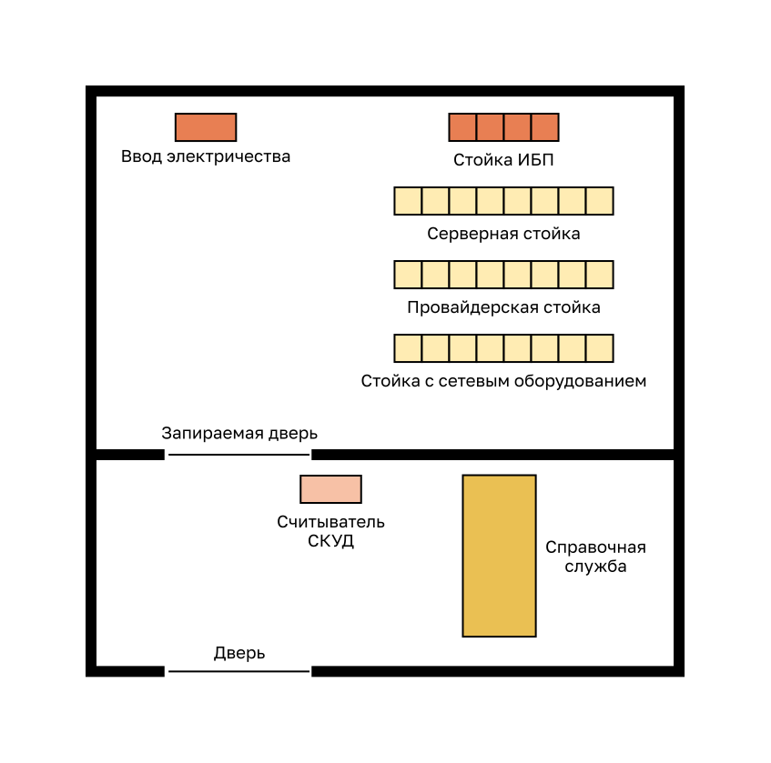

<!-- verified: agorbachev 03.05.2022 -->

<!-- 16.1.1 -->
## Типы угроз

Проводные и беспроводные компьютерные сети играют важнейшую роль в повседневной жизни. Физические лица и организации в равной степени зависят от своих компьютеров и сетей. Несанкционированное вторжение в сеть может привести к чрезвычайно затратным перебоям и потере ценных результатов работы. Атака на сеть может иметь разрушительные последствия с потерей времени и средств в результате повреждения или хищения важной информации и ресурсов.

Злоумышленники могут получить доступ к сети, используя уязвимости программного обеспечения, атаки на аппаратное обеспечение, подбор имени пользователя и пароля. Злоумышленников, которые получают доступ, внося изменения в ПО или используя его уязвимости, называют хакерами.

Хакер, получивший доступ к сети, сразу становится источником как минимум четырех видов угроз.

**Кража информации** взлом  компьютера для получения конфиденциальной информации. Информация может быть использована или продана для различных целей. Пример:

**Утечка данных и их неправомерное использование** - это проникновение в компьютер с целью уничтожения или изменения записей данных Примеры потери данных: передача вируса, форматирующего жесткий диск компьютера Примеры манипуляции с данными: проникновение в систему хранения данных с целью изменения информации, например цены изделия

**Кража персональных данных** - это вид хищения информации, при котором крадутся личные данные для использования этих данных с целью обмана Используя эти данные, человек может получить юридические документы, подать заявление на кредит и совершить несанкционированные покупки через Интернет Проблема хищения персональных данных продолжает обостряться, а финансовые потери составляют миллиарды долларов в год.

**Прекращение обслуживания** препятствует пользователям получать доступ к услугам, на которые они имеют право. Примеры: атаки типа «отказ в обслуживании» (DoS), направленные на серверы, сетевые устройства или сетевые каналы связи.

<!-- 16.1.2 -->
## Типы уязвимостей

Уязвимость — степень незащищенности, свойственная каждой сети и устройству. Некоторая степень уязвимости присуща маршрутизаторам, коммутаторам, настольным компьютерам, серверам и даже устройствам безопасности. Как правило, атакам подвержены такие оконечные сетевые устройства, как серверы и настольные компьютеры.

Три основных типа уязвимостей: технологии, конфигурация, и политика безопасности. Все три типа уязвимостей могут быть причиной атак, включая атаки с использованием вредоносного кода и сетевые атаки.

### Технологические уязвимости

| Уязвимость | Описание |
| --- | --- |
| Уязвимости протоколов TCP/IP | <ul><li>Протокол передачи гипертекста (HTTP), протокол передачи файлов (FTP), и Протокол управляющих сообщений Интернета (ICMP) в целом ненадежны.</li><li>Простой протокол сетевого управления (SNMP) и простой протокол передачи почты (SMTP) связаны с небезопасной структурой, на которой был разработан протокол TCP.</li></ul> |
| Уязвимости операционной системы | <ul><li>Во всех операционных системах существуют проблемы безопасности, которые необходимо устранить.</li><li>UNIX, Linux, Mac OS, Mac OS X, Windows Server 2012, Windows 7, Windows 8</li><li>Эти проблемы задокументированы в архивах группы CERT на веб-сайте http://www.cert.org.</li></ul> |
| Уязвимости сетевого оборудования | Различные типы сетевого оборудования, такие как маршрутизаторы, брандмауэры и коммутаторы, имеют недостатки безопасности, которые должны быть обнаружены и защищены от них. К их недостаткам относятся защита паролем, отсутствие аутентификации, протоколы маршрутизации и дыры в брандмауэрах. |

### Конфигурационные уязвимости

| Уязвимость | Описание |
| --- | --- |
| Незащищенные учетные записи пользователей | Информация учетной записи пользователя может передаваться по сети небезопасно, подвергая имена пользователей и пароли воздействию злоумышленников. |
| Системные учетные записи с паролями, которые легко подобрать | Такая распространенная проблема возникает в результате неграмотного выбора пользователями подобных паролей. |
| Ошибки в конфигурации интернет-служб | Включение JavaScript в веб-браузерах позволяет осуществлять атаки посредством JavaScript, контролируемого злоумышленниками при доступе к ненадежным сайтам. Другие потенциальные источники недостатков включают неправильно настроенные терминальные службы, FTP или веб-серверы (например, Microsoft Internet Information Services (IIS) и Apache HTTP Server). |
| Незащищенные настройки по умолчанию для продуктов | Настройки по умолчанию во многих продуктах могут стать источником возникновения проблем с безопасностью. |
| Ошибки в конфигурации сетевого оборудования | Ошибки в конфигурации оборудования сами по себе могут стать причиной существенных проблем с безопасностью. Например, неправильно настроенные списки доступа, протоколы маршрутизации или пароли SNMP (community strings) могут создать или включить дыры в безопасности. |

### Уязвимости политики безопасности

| Уязвимость | Описание |
| --- | --- |
| Отсутствие утвержденной политики безопасности | Ели политика безопасности не утверждена, то обеспечить ее согласованное применение и соблюдение невозможно. |
| Политики | Конфликты политик безопасности существенно усложняют их согласованное применение. |
| Отсутствие непрерывной аутентификации | Неграмотный выбор, возможность легкого подбора или использование паролей по умолчанию могут стать причиной несанкционированного доступа к сети. |
| Не применяются логические элементы управления доступом | Некачественный мониторинг и учет делают возможными атаки и несанкционированное использование, что приводит к растрачиванию ресурсов компании. Это может привести к судебному иску или увольнению ИТ-специалистов, ИТ-менеджмента или даже руководства компании, что позволит сохранить эти небезопасные условия. |
| Установка и модификация программного и аппаратного обеспечения не соответствуют политике безопасности | Несанкционированные изменения топологии сети или установка не утвержденных приложений также создают проблемы в системе безопасности. |
| Отсутствие плана аварийного восстановления системы | Атаки на сеть предприятия при отсутствии плана аварийного восстановления системы приводят к хаосу, панике и замешательству. |

<!-- 16.1.3 -->
## Физическая защита

Не меньшее значение имеет физическая безопасность устройств. Злоумышленник может блокировать доступ к сетевым ресурсам, если их можно повредить на физическом уровне.

Имеется четыре класса угроз:

* **Угрозы для аппаратного обеспечения** — физическое повреждение серверов, маршрутизаторов, коммутаторов, кабельных линий и рабочих станций.
* **Угрозы со стороны окружающей среды** — предельные температуры (слишком высокие или слишком низкие) или крайние значения влажности (слишком низкая или слишком высокая).
* **Электрические угрозы** — всплески напряжения, недостаточное напряжение в электрической сети (провалы напряжения), колебания напряжения (шум) и полное отключение электропитания.
* **Эксплуатационные угрозы** — ненадлежащее обращение с ключевыми электрическими компонентами (электростатический разряд), нехватка важных запасных деталей, неправильная прокладка кабелей и ненадлежащая маркировка.

Хороший план физической безопасности должен быть создан и реализован для решения этих проблем. На рисунке показан пример плана физической безопасности.

* Поэтажный план безопасного компьютерного зала
* Планирование физической системы безопасности в целях ограничения ущерба для оборудования

**Шаг 1.** Блокирование оборудования и предотвращение несанкционированного доступа через двери, потолок, съемный пол, окна, вентиляционные и канализационные шахты

**Шаг 2.** Мониторинг и управление доступом к серверному шкафу с помощью электронной системы учета

**Шаг 3.** Использование камер системы безопасности

<!-- 16.1.4 -->
<!-- quiz -->