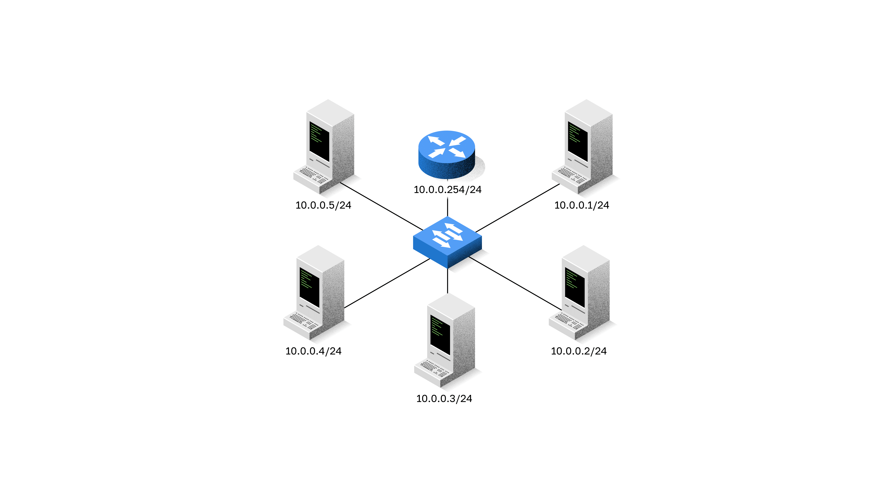

<!-- verified: agorbachev 03.05.2022 -->

<!-- 17.5.1 -->
## Настройка IP-конфигурации в среде Windows

Если вы использовали любое из средств, приведенных в предыдущем разделе, для проверки подключения и обнаружили, что часть сети работает не так, как это должно быть, настало время использовать дополнительные команды для устранения неполадок устройств. Команды ПК и Cisco IOS могут помочь вам определить, связана ли проблема с IP-адресацией ваших устройств, что является распространенной проблемой сети.

Проверка IP-адресации на хост-устройствах является обычной практикой в сети для проверки и устранения неполадок сквозного подключения. В Windows 10 можно получить доступ к сведениям об IP-адресе **Network and Sharing Center**, как показано на рисунке, чтобы быстро просмотреть четыре важных параметра: адрес, маска, шлюз и DNS.


Тем не менее, сетевые администраторы обычно просматривают информацию IP-адресации на  Windows устройствах, выполняя  команду **ipconfig** в командной строке  Windows, как показано в примере.

```
C:\Users\PC-A> ipconfig
Windows IP Configuration
(Output omitted)
Wireless LAN adapter Wi-Fi:
   Connection-specific DNS Suffix  . :
   Link-local IPv6 Address . . . . . : fe80::a4aa:2dd1:ae2d:a75e%16   
   IPv4 Address. . . . . . . . . . . : 192.168.10.10   
   Subnet Mask . . . . . . . . . . . : 255.255.255.0
   Default Gateway . . . . . . . . . : 192.168.10.1
(Output omitted)
```

С помощью команды **ipconfig /all** можно узнать MAC-адрес компьютера, а также ряд сведений об адресации уровня 3 для устройства, как показано в примере.

```
C:\Users\PC-A> ipconfig /all
Windows IP Configuration
   Host Name . . . . . . . . . . . . : PC-A-00H20
   Primary Dns Suffix  . . . . . . . : cisco.com
   Node Type . . . . . . . . . . . . : Hybrid
   IP Routing Enabled. . . . . . . . : No
   WINS Proxy Enabled. . . . . . . . : No
   DNS Suffix Search List. . . . . . : cisco.com
(Output omitted)
Wireless LAN adapter Wi-Fi:
   Connection-specific DNS Suffix  . :
   Description . . . . . . . . . . . : Intel(R) Dual Band Wireless-AC 8265
   Physical Address. . . . . . . . . : F8-94-C2-E4-C5-0A
   DHCP Enabled. . . . . . . . . . . : Yes
   Autoconfiguration Enabled . . . . : Yes
   Link-local IPv6 Address . . . . . : fe80::a4aa:2dd1:ae2d:a75e%16(Preferred) 
   IPv4 Address. . . . . . . . . . . : 192.168.10.10(Preferred)
   Subnet Mask . . . . . . . . . . . : 255.255.255.0
   Lease Obtained. . . . . . . . . . : August 17, 2019 1:20:17 PM
   Lease Expires . . . . . . . . . . : August 18, 2019 1:20:18 PM
   Default Gateway . . . . . . . . . : 192.168.10.1
   DHCP Server . . . . . . . . . . . : 192.168.10.1
   DHCPv6 IAID . . . . . . . . . . . : 100177090
   DHCPv6 Client DUID. . . . . . . . : 00-01-00-01-21-F3-76-75-54-E1-AD-DE-DA-9A
   DNS Servers . . . . . . . . . . . : 192.168.10.1
   NetBIOS over Tcpip. . . . . . . . : Enabled
```

Если узел настроен как DHCP-клиент, конфигурацию IP-адреса можно обновить с помощью команды **ipconfig /release** и **ipconfig /renew**, как показано в примере.

```
C:\Users\PC-A> ipconfig /release
(Output omitted)
Wireless LAN adapter Wi-Fi:
   Connection-specific DNS Suffix  . :
   Link-local IPv6 Address . . . . . : fe80::a4aa:2dd1:ae2d:a75e%16
   Default Gateway . . . . . . . . . :
(Output omitted)
C:\Users\PC-A> ipconfig /renew
(Output omitted)
Wireless LAN adapter Wi-Fi:
   Connection-specific DNS Suffix  . :
   Link-local IPv6 Address . . . . . : fe80::a4aa:2dd1:ae2d:a75e%16
   IPv4 Address. . . . . . . . . . . : 192.168.1.124
   Subnet Mask . . . . . . . . . . . : 255.255.255.0
   Default Gateway . . . . . . . . . : 192.168.1.1
(Output omitted)
C:\Users\PC-A>
```

Служба «Клиент DNS» на ПК с операционной системой Windows также оптимизирует производительность разрешения имен DNS, сохраняя ранее разрешенные имена в памяти. На ПК с операционной системой Windows команда **ipconfig /displaydns** выводит на экран все кэшированные записи DNS.

```
C:\Users\PC-A> ipconfig /displaydns
Windows IP Configuration
(Output omitted)
    netacad.com
    ----------------------------------------
    Record Name . . . . . : netacad.com
    Record Type . . . . . : 1
    Time To Live  . . . . : 602
    Data Length . . . . . : 4
    Section . . . . . . . : Answer
    A (Host) Record . . . : 54.165.95.219
(Output omitted)
```

<!-- 17.5.2 -->
## Настройка IP-конфигурации в среде Linux

Проверка параметров IP с помощью графического интерфейса на компьютере Linux будет отличаться в зависимости от дистрибутива Linux (дистрибутива) и интерфейса рабочего стола. На рисунке показано  диалоговое окно **Connection Information** в дистрибутиве Ubuntu под управлением рабочего стола Gnome.


В командной строке сетевые администраторы используют  команду **ifconfig** для отображения состояния активных интерфейсов и их IP-конфигурации, как показано в примере.

```
[analyst@secOps ~]$ ifconfig
enp0s3    Link encap:Ethernet  HWaddr 08:00:27:b5:d6:cb  
          inet addr: 10.0.2.15  Bcast:10.0.2.255  Mask: 255.255.255.0
          inet6 addr: fe80::57c6:ed95:b3c9:2951/64 Scope:Link
          UP BROADCAST RUNNING MULTICAST  MTU:1500  Metric:1
          RX packets:1332239 errors:0 dropped:0 overruns:0 frame:0
          TX packets:105910 errors:0 dropped:0 overruns:0 carrier:0
          collisions:0 txqueuelen:1000 
          RX bytes:1855455014 (1.8 GB)  TX bytes:13140139 (13.1 MB)
lo: flags=73  mtu 65536
        inet 127.0.0.1  netmask 255.0.0.0
        inet6 ::1  prefixlen 128  scopeid 0x10<host>
        loop  txqueuelen 1000  (Local Loopback)
        RX packets 0  bytes 0 (0.0 B)
        RX errors 0  dropped 0  overruns 0  frame 0
        TX packets 0  bytes 0 (0.0 B)
        TX errors 0  dropped 0 overruns 0  carrier 0  collisions 0
```

В Linux команда **ip address** используется для отображения адресов и их свойств. Она также может использоваться для добавления или удаления IP-адресов.

**Примечание:** Вывод  может варьироваться в зависимости от дистрибутива Linux .

<!-- 17.5.3 -->
## Настройка IP-конфигурации в среде MacOS 

В графическом интерфейсе хоста Mac откройте меню  **Network Preferences > Advanced** для получения информации об IP-адресации, как показано на рисунке.


Однако,  команда **ifconfig** также может использоваться для проверки конфигурации интерфейса IP, показанной в выводе.

```
MacBook-Air:~ Admin$ ifconfig en0
en0: flags=8863 mtu 1500
        ether c4:b3:01:a0:64:98
        inet6 fe80::c0f:1bf4:60b1:3adb%en0 prefixlen 64 secured scopeid 0x5
        inet 10.10.10.113 netmask 0xffffff00 broadcast 10.10.10.255
        nd6 options=201
        media: autoselect
        status: active
MacBook-Air:~ Admin$ 
```

Другие полезные команды macOS для проверки параметров IP узла включают **networksetup -listallnetworkservices** и **networksetup -getinfo <**_network service_**\>,** как показано в следующих выходных данных. 

```
MacBook-Air:~ Admin$ networksetup -listallnetworkservices
An asterisk (*) denotes that a network service is disabled.
iPhone USB
Wi-Fi
Bluetooth PAN
Thunderbolt Bridge
MacBook-Air:~ Admin$ 
MacBook-Air:~ Admin$ networksetup -getinfo Wi-Fi
DHCP Configuration
IP address: 10.10.10.113
Subnet mask: 255.255.255.0
Router: 10.10.10.1
Client ID:
IPv6: Automatic
IPv6 IP address: none
IPv6 Router: none
Wi-Fi ID: c4:b3:01:a0:64:98
MacBook-Air:~ Admin$
```

<!-- 17.5.4 -->
## Команда arp

 Команда **arp** выполняется из командной строки Windows, Linux или Mac.  Команда arp –a позволяет получить список всех устройств, которые в данный момент представлены в ARP-кэше узла, а также IPv4-адрес, физический адрес и тип адресации (статическая/динамическая) для каждого из устройств.

Например, обратимся к следующей топологии.


<!-- /courses/itn-dl/aeeda3d0-34fa-11eb-ad9a-f74babed41a6/af257cb2-34fa-11eb-ad9a-f74babed41a6/assets/2e8f1c83-1c25-11ea-81a0-ffc2c49b96bc.svg -->

Вывод  команды **arp -a** на узле Windows PC-A. 

```
C:\Users\PC-A> arp -a
Interface: 192.168.93.175 --- 0xc
  Internet Address      Physical Address      Type
  10.0.0.2              d0-67-e5-b6-56-4b     dynamic
  10.0.0.3              78-48-59-e3-b4-01     dynamic
  10.0.0.4              00-21-b6-00-16-97     dynamic
  10.0.0.254            00-15-99-cd-38-d9     dynamic
  
```

Команда **arp -a** отображает  связку известных IP-адресов и MAC-адресов. Обратите внимание, что IP-адрес 10.0.0.5 не включен в список. Это связано с тем, что кэш ARP отображает информацию только с устройств, к которым недавно обращались.

Чтобы проверить заполнение кэша ARP, выполните команду **ping** для проверки связи с устройством, чтобы для него была создана запись в таблице ARP. Например, если PC-A посылает запрос 10.0.0.5, то кэш ARP будет содержать запись для этого IP-адреса.

Если администратору сети необходимо повторно заполнить кэш обновленными данными, можно выполнить команду **netsh interface ip delete arpcache** для очистки кэша.

**Примечание**: Для использования команды **netsh interface ip delete arpcache** может потребоваться доступ администратора на хосте.

<!-- 17.5.5 -->
## Команды Cisco IOS для просмотра текущей информации

С помощью команд можно проверять настройки интерфейсов промежуточных устройств по аналогии с тем, как команды и утилиты использовались на узлах для проверки их настроек. В Cisco IOS имеются команды для проверки работоспособности интерфейсов маршрутизатора и коммутатора.

Cisco IOS CLI позволяет пользоваться командами **show** для отображения информации о конфигурации и режиме работы устройства. Специалисты по обслуживанию сети широко пользуются командами **show** для просмотра файлов конфигурации, проверки состояния интерфейсов и процессов на устройствах, а также для контроля рабочего состояния устройств. С помощью команды **show** можно отобразить состояние практически любого процесса или функции маршрутизатора.

В таблице перечислены часто используемые **show** команды и время их использования.

| Команда | **Для чего используется** |
| --- | --- |
| **show running-config**  | Проверяет текущую конфигурацию и параметры |
| **show interfaces** | Проверяет состояние интерфейса и отображает все сообщения об ошибках |
| **show ip interface** | Проверяет информацию 3 уровня  интерфейса |
| **show arp** | Проверяет список известных узлов в локальных сетях Ethernet |
| **show ip route**  | Проверяет информацию маршрутизации уровня 3 |
| **show protocols**  | Проверяет, какие протоколы работают |
| **show version**  | Проверяет память, интерфейсы и лицензии устройства |

### Команда ``show running-config`` 

Проверяет текущую конфигурацию и параметры

```
R1# show running-config

(Output omitted)

!
version 15.5
service timestamps debug datetime msec
service timestamps log datetime msec
service password-encryption
!
hostname R1
!
interface GigabitEthernet0/0/0
 description Link to R2
 ip address 209.165.200.225 255.255.255.252
 negotiation auto
!
interface GigabitEthernet0/0/1
 description Link to LAN
 ip address 192.168.10.1 255.255.255.0
 negotiation auto
!
router ospf 10
 network 192.168.10.0 0.0.0.255 area 0
 network 209.165.200.224 0.0.0.3 area 0
!
banner motd ^C Authorized access only! ^C
!
line con 0
 password 7 14141B180F0B
 login
line vty 0 4
 password 7 00071A150754
 login
 transport input telnet ssh
!
end
R1#
```

### Команда ``show interfaces``

Проверяет состояние интерфейса и отображает все сообщения об ошибках

```
R1# show interfaces
GigabitEthernet0/0/0 is up, line protocol is up
  Hardware is ISR4321-2x1GE, address is a0e0.af0d.e140 (bia a0e0.af0d.e140)
  Description: Link to R2
  Internet address is 209.165.200.225/30
  MTU 1500 bytes, BW 100000 Kbit/sec, DLY 100 usec,
     reliability 255/255, txload 1/255, rxload 1/255
  Encapsulation ARPA, loopback not set
  Keepalive not supported
  Full Duplex, 100Mbps, link type is auto, media type is RJ45
  output flow-control is off, input flow-control is off
  ARP type: ARPA, ARP Timeout 04:00:00
  Last input 00:00:01, output 00:00:21, output hang never
  Last clearing of "show interface" counters never
  Input queue: 0/375/0/0 (size/max/drops/flushes); Total output drops: 0
  Queueing strategy: fifo
  Output queue: 0/40 (size/max)
  5 minute input rate 0 bits/sec, 0 packets/sec
  5 minute output rate 0 bits/sec, 0 packets/sec
     5127 packets input, 590285 bytes, 0 no buffer
     Received 29 broadcasts (0 IP multicasts)
     0 runts, 0 giants, 0 throttles
     0 input errors, 0 CRC, 0 frame, 0 overrun, 0 ignored
     0 watchdog, 5043 multicast, 0 pause input
     1150 packets output, 153999 bytes, 0 underruns
     0 output errors, 0 collisions, 2 interface resets
     0 unknown protocol drops
     0 babbles, 0 late collision, 0 deferred
     1 lost carrier, 0 no carrier, 0 pause output
     0 output buffer failures, 0 output buffers swapped out
GigabitEthernet0/0/1 is up, line protocol is up
(Output omitted)
```

### Команда ``show ip interface``

Проверяет информацию уровня 3 интерфейса

```
R1# show ip interface
GigabitEthernet0/0/0 is up, line protocol is up
  Internet address is 209.165.200.225/30
  Broadcast address is 255.255.255.255
  Address determined by setup command
  MTU is 1500 bytes
  Helper address is not set
  Directed broadcast forwarding is disabled
  Multicast reserved groups joined: 224.0.0.5 224.0.0.6
  Outgoing Common access list is not set
  Outgoing access list is not set
  Inbound Common access list is not set
  Inbound  access list is not set
  Proxy ARP is enabled
  Local Proxy ARP is disabled
  Security level is default
  Split horizon is enabled
  ICMP redirects are always sent
  ICMP unreachables are always sent
  ICMP mask replies are never sent
  IP fast switching is enabled
  IP Flow switching is disabled
  IP CEF switching is enabled
  IP CEF switching turbo vector
  IP Null turbo vector
  Associated unicast routing topologies:
        Topology "base", operation state is UP
  IP multicast fast switching is enabled
  IP multicast distributed fast switching is disabled
  IP route-cache flags are Fast, CEF
  Router Discovery is disabled
  IP output packet accounting is disabled
  IP access violation accounting is disabled
  TCP/IP header compression is disabled
  RTP/IP header compression is disabled
  Probe proxy name replies are disabled
  Policy routing is disabled
  Network address translation is disabled
  BGP Policy Mapping is disabled
  Input features: MCI Check
  IPv4 WCCP Redirect outbound is disabled
  IPv4 WCCP Redirect inbound is disabled
  IPv4 WCCP Redirect exclude is disabled
GigabitEthernet0/0/1 is up, line protocol is up
(Output omitted)
```

### Команда ``show arp``

Проверяет список известных узлов в локальных сетях Ethernet

```
R1# show arp
Protocol  Address          Age (min)  Hardware Addr   Type   Interface
Internet  192.168.10.1            -   a0e0.af0d.e141  ARPA   GigabitEthernet0/0/1
Internet  192.168.10.10          95   c07b.bcc4.a9c0  ARPA   GigabitEthernet0/0/1
Internet  209.165.200.225         -   a0e0.af0d.e140  ARPA   GigabitEthernet0/0/0
Internet  209.165.200.226       138   a03d.6fe1.9d90  ARPA   GigabitEthernet0/0/0
R1#
```

### Команда ``show ip route`` 

Проверяет информацию маршрутизации уровня 3

```
R1# show ip route
Codes: L - local, C - connected, S - static, R - RIP, M - mobile, B - BGP
       D - EIGRP, EX - EIGRP external, O - OSPF, IA - OSPF inter area
       N1 - OSPF NSSA external type 1, N2 - OSPF NSSA external type 2
       E1 - OSPF external type 1, E2 - OSPF external type 2
       i - IS-IS, su - IS-IS summary, L1 - IS-IS level-1, L2 - IS-IS level-2
       ia - IS-IS inter area, * - candidate default, U - per-user static route
       o - ODR, P - periodic downloaded static route, H - NHRP, l - LISP
       a - application route
       + - replicated route, % - next hop override, p - overrides from PfR
Gateway of last resort is 209.165.200.226 to network 0.0.0.0
O*E2  0.0.0.0/0 [110/1] via 209.165.200.226, 02:19:50, GigabitEthernet0/0/0
      10.0.0.0/24 is subnetted, 1 subnets
O        10.1.1.0 [110/3] via 209.165.200.226, 02:05:42, GigabitEthernet0/0/0
      192.168.10.0/24 is variably subnetted, 2 subnets, 2 masks
C        192.168.10.0/24 is directly connected, GigabitEthernet0/0/1
L        192.168.10.1/32 is directly connected, GigabitEthernet0/0/1
      209.165.200.0/24 is variably subnetted, 3 subnets, 2 masks
C        209.165.200.224/30 is directly connected, GigabitEthernet0/0/0
L        209.165.200.225/32 is directly connected, GigabitEthernet0/0/0
O        209.165.200.228/30
           [110/2] via 209.165.200.226, 02:07:19, GigabitEthernet0/0/0
R1#
```

### Команда ``show protocols``

Проверяет, какие протоколы работают

```
R1# show protocols
Global values:
  Internet Protocol routing is enabled
GigabitEthernet0/0/0 is up, line protocol is up
  Internet address is 209.165.200.225/30
GigabitEthernet0/0/1 is up, line protocol is up
  Internet address is 192.168.10.1/24
Serial0/1/0 is down, line protocol is down
Serial0/1/1 is down, line protocol is down
GigabitEthernet0 is administratively down, line protocol is down
R1#
```

### Команда ``show version ``

Проверяет память, интерфейсы и лицензии устройства

```
R1# show version
Cisco IOS XE Software, Version 03.16.08.S - Extended Support Release
Cisco IOS Software, ISR Software (X86_64_LINUX_IOSD-UNIVERSALK9-M), Version 15.5(3)S8, RELEASE SOFTWARE (fc2)
Technical Support: http://www.cisco.com/techsupport
Copyright (c) 1986-2018 by Cisco Systems, Inc.
Compiled Wed 08-Aug-18 10:48 by mcpre

(Output omitted)

ROM: IOS-XE ROMMON
R1 uptime is 2 hours, 25 minutes
Uptime for this control processor is 2 hours, 27 minutes
System returned to ROM by reload
System image file is "bootflash:/isr4300-universalk9.03.16.08.S.155-3.S8-ext.SPA.bin"
Last reload reason: LocalSoft

(Output omitted)

Technology Package License Information:
-----------------------------------------------------------------
Technology    Technology-package           Technology-package
              Current       Type           Next reboot
------------------------------------------------------------------
appxk9        appxk9        RightToUse     appxk9
uck9          None          None           None
securityk9    securityk9    Permanent      securityk9
ipbase        ipbasek9      Permanent      ipbasek9
cisco ISR4321/K9 (1RU) processor with 1647778K/6147K bytes of memory.
Processor board ID FLM2044W0LT
2 Gigabit Ethernet interfaces
2 Serial interfaces
32768K bytes of non-volatile configuration memory.
4194304K bytes of physical memory.
3207167K bytes of flash memory at bootflash:.
978928K bytes of USB flash at usb0:.
Configuration register is 0x2102
R1#
```

<!-- 17.5.6 -->
## Команда ``show cdp neighbors``

Несколько других полезных команд IOS. Протокол Cisco Discovery Protocol (CDP) — проприетарный протокол компании Cisco, функционирующий на канальном уровне. Поскольку протокол CDP функционирует на канальном уровне, два (или более) сетевых устройства Cisco, такие как маршрутизаторы с поддержкой различных протоколов сетевого уровня, могут получить данные друг о друге даже в том случае, если соединения 3-го уровня не существует.

Во время загрузки устройства Cisco протокол CDP запускается по умолчанию. Протокол CDP автоматически обнаруживает соседние устройства Cisco, на которых запущен протокол CDP, независимо от работающих протоколов 3-го уровня и пакетов. Протокол CDP осуществляет обмен данными о программном и аппаратном обеспечении устройства с непосредственно подключенными соседними устройствами CDP.

Протокол CDP предоставляет следующие сведения о каждом из соседних устройств CDP.

* **Идентификаторы устройств** — настроенное имя узла коммутатора, маршрутизатора или другого устройства
* **Список адресов** — не более одного адреса сетевого уровня для каждого из поддерживаемых протоколов
* **Идентификатор порта** — имя локального и удаленного порта в виде строки символов ASCII (например, FastEthernet 0/0)
* **Список возможностей** — например, является ли конкретное устройство коммутатором уровня 2 или коммутатором уровня 3
* **Платформа** — аппаратная платформа устройства, например маршрутизатор Cisco серии 1841


<!-- /courses/itn-dl/aeeda3d0-34fa-11eb-ad9a-f74babed41a6/af257cb2-34fa-11eb-ad9a-f74babed41a6/assets/2e8fdfd2-1c25-11ea-81a0-ffc2c49b96bc.svg -->

```
R3# show cdp neighbors
Capability Codes: R - Router, T - Trans Bridge, B - Source Route Bridge
                  S - Switch, H - Host, I - IGMP, r - Repeater, P - Phone,
                  D - Remote, C - CVTA, M - Two-port Mac Relay
Device ID        Local Intrfce     Holdtme    Capability  Platform  Port ID
S3               Gig 0/0/1         122              S I   WS-C2960+ Fas 0/5
Total cdp entries displayed : 1
R3#
```

Выходные данные показывают, что интерфейс R3 GigabitEthernet 0/0/1 подключен к интерфейсу FastEthernet 0/5 S3, который является коммутатором Cisco Catalyst 2960+. Обратите внимание, что R3 не собрал информацию о S4. Это связано с тем, что CDP может обнаруживать только напрямую подключенные устройства Cisco. S4 напрямую не подключен к R3 и поэтому не указан в выводе.

Команда **show cdp neighbors detail** показывает IP-адрес соседнего устройства, как показано на выводе. Протокол CDP отображает IP-адрес соседнего устройства независимо от того, насколько успешно удается выполнить проверку связи с ним. Эту команду рекомендуется использовать, когда двум маршрутизаторам Cisco не удается выполнить маршрутизацию по общему каналу данных. Команда **show cdp neighbors detail** позволяет определить наличие ошибок конфигурации IP в любом из соседних устройств CDP.

Несмотря на свою полезность, CDP также может быть угрозой безопасности, поскольку он может предоставлять злоумышленникам важные данные сетевой инфраструктуры. Например, по умолчанию многие версии IOS посылают объявления CDP на все поддерживаемые порты. Рекомендуется включать CDP только на интерфейсах, соединенных с другими устройствами инфраструктуры Cisco. Объявления CDP должны быть отключены на портах, ориентированных на пользователей.

Поскольку некоторые версии IOS по умолчанию рассылают анонсы CDP, важно знать, как отключить протокол CDP. Чтобы отключить протокол CDP на глобальном уровне, используйте команду глобальной конфигурации **no cdp run**. Чтобы отключить протокол CDP на уровне интерфейса, используйте команду интерфейса **no cdp enable**.

<!-- 17.5.7 -->
## Команда ``show ip interface brief``

К наиболее часто используемым командам относится команда **show ip interface brief**. Эта команда выводит выходные данные в более компактном формате, чем команда **show ip interface**. Она предоставляет сводку по ключевым данным для всех сетевых интерфейсов на маршрутизаторе.

В результатах выполнения команды **show ip interface brief** отображаются все интерфейсы на маршрутизаторе, IP-адрес, назначенный для каждого из интерфейсов (если есть), и рабочее состояние интерфейса.

```
R1# show ip interface brief
Interface              IP-Address      OK? Method Status                Protocol
GigabitEthernet0/0/0   209.165.200.225 YES manual up                    up
GigabitEthernet0/0/1   192.168.10.1    YES manual up                    up
Serial0/1/0            unassigned      NO  unset  down                  down
Serial0/1/1            unassigned      NO  unset  down                  down
GigabitEthernet0       unassigned      YES unset  administratively down down
R1#
```

Команду **show ip interface brief** также можно использовать для проверки статуса интерфейсов коммутатора.

```
S1# show ip interface brief
Interface              IP-Address      OK? Method Status                Protocol
Vlanl                  192.168.254.250 YES manual up                    up
FastEthernet0/l        unassigned      YES unset  down                  down
FastEthernet0/2        unassigned      YES unset  up                    up
FastEthernet0/3        unassigned      YES unset  up                    up
```

Интерфейсу VLAN1 назначен IPv4-адрес 192.168.254.250, он включен и работает.

В результатах выполнения команды также указано, что интерфейс FastEthernet0/1 отключен. Это означает, что к интерфейсу не подключены устройства или сетевой интерфейс подключенного устройства не работает.

И наоборот, в результатах выполнения команды указано, что интерфейсы FastEthernet0/2 и FastEthernet0/3 работают. Это обозначено состоянием up в столбцах Status (Состояние) и Protocol (Протокол).

<!-- 17.5.8 -->
## Видео: использование команды ``show version``

Команду **show version** можно применять для проверки и устранения неполадок базовых программных и аппаратных компонентов, которые используются во время загрузки. Посмотрите видео, представленное ранее в этом курсе, посвященное команде **show version**.


<!-- 17.5.9 -->
## Работа в симуляторе: интерпретация выходных данных ``show``-команд

Это упражнение предназначено для закрепления знаний о командах **show** маршрутизатора. Вам не нужно будет выполнять настройку, вы просто изучите выходные данные отдельных команд show.

[Интерпретация выходных данных команды show (pdf)](./assets/17.5.9-packet-tracer---interpret-show-command-output_ru-RU.pdf)

[Интерпретация выходных данных команды show (pka)](./assets/17.5.9-packet-tracer---interpret-show-command-output_ru-RU.pka)