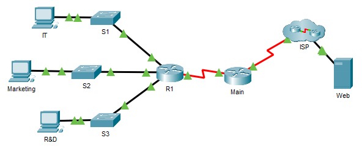

---

> **ВАЖНО**
> 
> Форма для ответов на вопросы будет доступна только при развертывании лабораторной работы 

---

## Топология

## Таблица адресации

| Устройство | Интерфейс | IP адрес/префикс      | Шлюз по умолчанию |
|------------|-----------|-----------------------|-------------------|
| R1         | G0/0      | 172.16.1.62 /26       | —                 |
| R1         | G0/0      | 2001:db8:cafe::1/64   | —                 |
| R1         | G0/0      | fe80::1               | —                 |
| R1         | G0/1      | 172.16.1.126 /26      | —                 |
| R1         | G0/1      | 2001:db8:cafe:1::1/64 | —                 |
| R1         | G0/1      | fe80::1               | —                 |
| R1         | G0/2      | 172.16.1.254 /25      | —                 |
| R1         | G0/2      | 2001:db8:cafe:2::1/64 | —                 |
| R1         | G0/2      | fe80::1               | —                 |
| R1         | S0/0/1    | 10.0.0.2 /30          | —                 |
| R1         | S0/0/1    | 2001:db8:2::1/64      | —                 |
| R1         | S0/0/1    | fe80::1               | —                 |
| Main       | S0/0/0    | 209.165.200.226 /30   | —                 |
| Main       | S0/0/0    | 2001:db8:1::1/64      | —                 |
| Main       | S0/0/0    | fe80::2               | —                 |
| Main       | S0/0/1    | 10.0.0.1 /30          | —                 |
| Main       | S0/0/1    | 2001:db8:2::2/64      | —                 |
| Main       | S0/0/1    | fe80::2               | —                 |
| S1         | VLAN 1    | 172.16.1.61 /26       | 172.16.1.62       |
| S2         | VLAN 1    | 172.16.1.125 /26      | 172.16.1.126      |
| S3         | VLAN 1    | 172.16.1.253 /25      | 172.16.1.254      |
| IT         | NIC       | 172.16.1.1 /26        | 172.16.1.62       |
| IT         | NIC       | 2001:db8:cafe::2/64   | fe80::1           |
| IT         | NIC       | fe80::2               |                   |
| Marketing  | NIC       | 172.16.1.65 /26       | 172.16.1.126      |
| Marketing  | NIC       | 2001:db8:cafe:1::2/64 | fe80::1           |
| Marketing  | NIC       | fe80::2               |                   |
| R&D        | NIC       | 172.16.1.129 /25      | 172.16.1.254      |
| R&D        | NIC       | 2001:db8:cafe:2::2/64 | fe80::1           |
| R&D        | NIC       | fe80::2               |                   |
| Web        | NIC       | 64.100.0.3 /29        | 64.100.0.1        |
| Web        | NIC       | 2001:db8:acad::3/64   | fe80::1           |
| Web        | NIC       | fe80::2               |                   |

## Цели

-   Устраненить распространенные проблемы в локальной сети.

## Общие сведения и сценарий

После обновления сети некоторые устройства необходимо настроить заново. Нужно исправить конфигурации и убедиться, что все компьютеры имеют доступ к серверу, R1 и коммутаторам. Кроме того, все ПК должны иметь доступ к R1 с помощью SSH, а также проверить подключение как для IPv4, так и для IPv6, за исключением коммутаторов.

## Инструкции

На роутере R1 и коммутаторах были выставлены следующие настройки:

-   пароль привилегированного режима: **Ciscoenpa55**;

-   пароль консоли: **Ciscoconpa55**;

-   имя пользователя и пароль администратора для SSH: **Admin1/Admin1pa55**.

Требуемое количество узлов в подсети:

-   50 узлов для IT;

-   50 узлов для Marketing;

-   100 узлов для R&D.

Если все проблемы конфигурации были устранены, все устройства должны иметь возможность пинговать друг друга и сервер.

[Скачать файл Packet Tracer для локального запуска](./assets/17.8.3-lab.pka)
