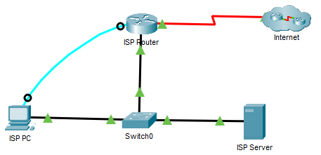

## Топология



## Задачи

Часть 1. Анализ выходных данных команды show

Часть 2. Вопросы для повторения

## Общие сведения

Это упражнение предназначено для закрепления знаний о командах **show** маршрутизатора. Вам не нужно будет выполнять настройку, вы просто изучите выходные данные отдельных команд **show**. Это задание не выполняет автоматическую оценку.

## Инструкции

### Часть 1. Анализ выходных данных команды show

1.  Щелкните **ISP PC** (ПК интернет-провайдера), откройте вкладку **Desktop** (Рабочий стол) и выберите **Terminal** (Терминал).

2.  Войдите в привилегированный режим EXEC.

3.  Используйте следующие команды **show**, чтобы ответить на вопросы для закрепления из части 2:

    Примечание. Если команда приостанавливается с помощью -—More—prompt, убедитесь, что нажат пробел, пока не появится запрос ISPRouter#, чтобы получить все выходные данные команды.

    ```
    show arp
    show flash:
    show ip route
    show interfaces
    show ip interface brief
    show protocols
    show users
    show version
    ```

### Часть 2. Вопросы для повторения

1.  Какие команды можно использовать для определения IP-адреса и сетевого префикса интерфейсов?

    **Введите ваш ответ здесь.**

2.  Какие команды выводят сведения об IP-адресе и назначении интерфейса, но не выводят сведений о префиксе сети?

    **Введите ваш ответ здесь.**

3.  Какие команды вы используете, чтобы определить, работает ли интерфейс?

    **Введите ваш ответ здесь.**

4.  Необходимо определить версию IOS, которая выполняется на маршрутизаторе. Какая команда даст вам эту информацию?

    **Введите ваш ответ здесь.**

5.  Какие команды выводят сведения об адресах интерфейсов маршрутизатора?

    **Введите ваш ответ здесь.**

6.  Вы рассматриваете обновление IOS и должны определить, может ли флэш-память маршрутизатора содержать новое IOS. Какие команды выводят сведения об объеме доступной флеш-памяти?

    **Введите ваш ответ здесь.**

7.  Необходимо настроить конфигурацию маршрутизатора, но вы подозреваете, что коллега может также работать с маршрутизатором из другого местоположения. Какие команды выводят сведения о линиях, используемых для настройки или мониторинга устройства?

    **Введите ваш ответ здесь.**

8.  Вам было предложено проверить производительность интерфейса устройства. Какие команды выводят статистику по трафику интерфейсов маршрутизатора?

    **Введите ваш ответ здесь.**

9.  Клиенты жалуются на то, что они не могут достичь сервера, который они используют для хранения файлов. Вы подозреваете, что сеть может стать недоступной из-за недавнего обновления. Какие команды выводят сведения о путях, доступных для сетевого трафика?

    **Введите ваш ответ здесь.**

10. Какие интерфейсы в данный момент активны на маршрутизаторе?

    **Введите ваш ответ здесь.**

[Скачать файл Packet Tracer для локального запуска](./assets/17.5.9-packet-tracer---interpret-show-command-output_ru-RU.pka)
