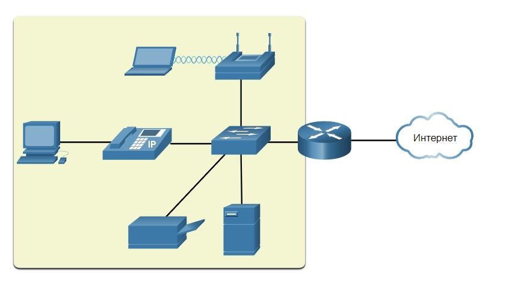
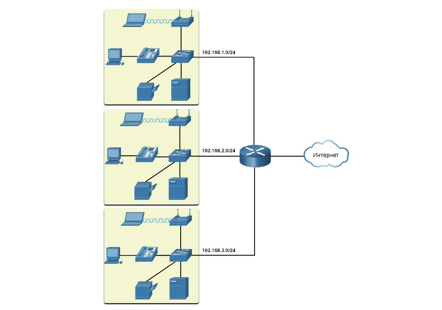
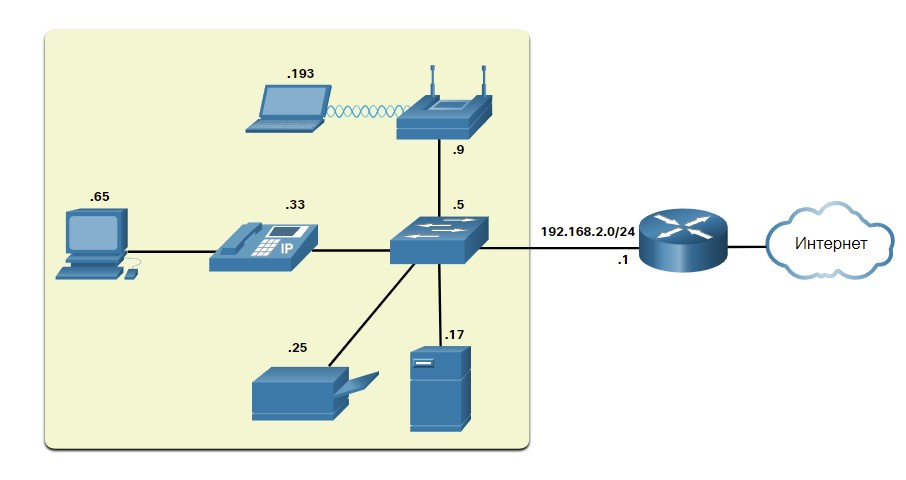
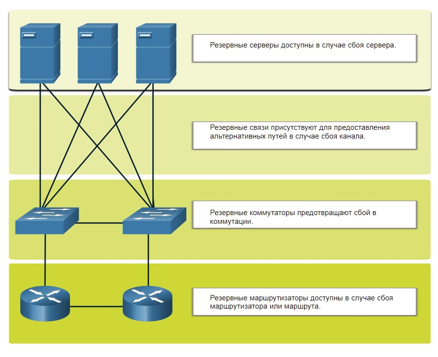
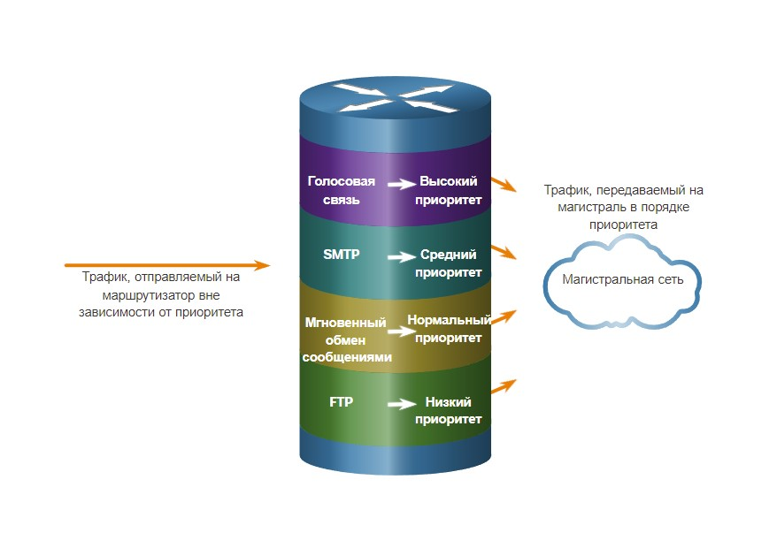

# Устройства в рамках небольшой сети

<!-- 17.1.1 -->

## Топологии небольших сетей

Большинство предприятий небольшие; поэтому неудивительно, что большинство сетей таких предприятий также невелики.

Небольшая сеть обычно проста. Количество устройств в таких сетях и их типов существенно меньше по сравнению с большими сетями.

Например, обратимся к примеру сети малого бизнеса, показанному на рисунке.

<!-- /courses/itn-dl/aeeda3d0-34fa-11eb-ad9a-f74babed41a6/af2555a0-34fa-11eb-ad9a-f74babed41a6/assets/2e869103-1c25-11ea-81a0-ffc2c49b96bc.svg -->

Эта небольшая сеть требует маршрутизатора, коммутатора и беспроводной точки доступа для подключения проводных и беспроводных пользователей, IP-телефона, принтера и сервера. Небольшой сети обычно предусматривается одно WAN-подключение, реализованное посредством DSL-соединения, кабеля или Ethernet-соединения.

Крупным сетям требуется ИТ-отдел для обслуживания, защиты и устранения неполадок сетевых устройств, а также для защиты организационных данных. Для управления небольшими сетями требуются преимущественно те же навыки, что и для управления большими сетями. Малые сети управляются местным ИТ-специалистом или профессионалом, нанятым по контракту.

***

<!-- 17.1.2 -->

## Выбор устройств для сети небольшого размера

Как и большим сетям, для небольших сетей требуется планирование и проектирование. На этапе планирования рассматриваются и учитываются все требования, стоимость и возможности внедрения.

В рамках реализации небольшой сети при проектировании необходимо в первую очередь учитывать тип промежуточных устройств, которые будут использоваться для поддержки сети.

### **Стоимость**

Стоимость коммутатора зависит от его производительности и функций. Под производительностью устройства подразумевается количество портов и их типы, а также производительность внутренней шины. Другие факторы, влияющие на стоимость оборудования - возможности сетевого управления, встроенные технологии безопасности и дополнительные продвинутые технологии коммутации. Следует также учитывать и стоимость прокладки кабелей, необходимых для подключения всех устройств к сети. Другим немаловажным фактором, влияющим на стоимость сети, является уровень резервирования, которым должна обладать сеть.

### **Скорость и типы портов (интерфейсов)**

Выбор количества и типа портов маршрутизатора или коммутатора имеет критическое значение. В более новых моделях компьютеров предусмотрены встроенные сетевые платы 1 Гбит/с. Некоторые серверы могут иметь порты 10 Гбит/с. Хотя при выборе устройств 2-го уровня, которые могут работать на более высоких скоростях, объем затрат возрастает, но это позволяет расширять сеть без замены центральных устройств.

### **Расширяемость**

Сетевые устройства выпускаются в фиксированной и модульной конфигурации. В фиксированной конфигурации строго определены количество и тип портов или интерфейсов. У модульных устройств есть слоты расширения, позволяющие добавлять новые модули. Существуют коммутаторы, оснащенные дополнительными портами для создания высокоскоростных восходящих каналов. С помощью маршрутизаторов можно объединять сети различных типов. Следует внимательно подходить к выбору модулей и интерфейсов, подходящих для определенной среды.

### **Функции и сервисы операционной системы**

Сетевые устройства должны иметь операционную систему, которая может выполнять требования организации, такие как:

- Коммутация уровня 3
- Преобразование сетевых адресов (NAT)
- Протокол динамической конфигурации узла сети (DHCP)
- Безопасность
- Качество обслуживания (QoS)
- Передача голоса по IP-протоколу (VoIP)

***

<!-- 17.1.3 -->

## IP-адресация в рамках небольшой сети
При реализации сети создайте схему IP-адресации и используйте ее. Все устройства в пределах сети организации должны иметь уникальный адрес.

К устройствам, которые будут учитываться в схеме IP-адресации, относятся следующие:

Конечные устройства * - количество и тип подключения (например, проводное, беспроводное, удаленное)

Серверы и периферийные устройства (например, принтеры и камеры безопасности).
Промежуточные устройства, такие как - маршрутизаторы, коммутаторы и точки доступа.
Рекомендуется планировать, документировать и поддерживать схему IP-адресации основываясь на типах устройств. Использование запланированной схемы IP-адресации облегчает определение типа устройства и устранение неполадок, например, при устранении неполадок сетевого трафика с помощью анализатора протоколов.

Например, см. топологию сети малого и среднего размера на рисунке.

<!-- /courses/itn-dl/aeeda3d0-34fa-11eb-ad9a-f74babed41a6/af2555a0-34fa-11eb-ad9a-f74babed41a6/assets/2e872d43-1c25-11ea-81a0-ffc2c49b96bc.svg -->

Организация требует трех пользовательских локальных сетей (т.е. 192.168.1.0/24, 192.168.2.0/24 и 192.168.3.0/24). Организация приняла решение внедрить согласованную схему IP-адресации для каждой локальной сети 192.168.x.0/24, используя следующие соглашения:

|Тип Устройства|Назначеный Диапазон IP-адресов| Суммируется как...|
|-|-|-|
|шлюз по умолчанию (маршрутизатор);|	192.168.x.**1** - 192.168.х.**2**|	192.168.х. **0/30**|
|Коммутаторы (макс. 2)|	192.168.х.**5** - 192.168.х.**6**|	192.168.х. **4/30**|
|Точки доступа (макс. 6)|	192.168.х. **9** - 192.168.x.**14**|	192.168.х. **8/29**|
|Серверы (макс. 6)|	192.168.х. **17** − 192.168.х.**22**|	192.168.х. **16/29**|
|Принтеры (макс. 6)|	192.168.х. **25** − 192.168.х.**30**|	192.168.х. **24/29**|
|IP-телефоны (макс. 6)|	192.168.х. **33** − 192.168.х.**38**|	192.168.х. **32/29**|
|Проводные устройства (макс. 62)|	192.168.х. **65** - 192.168.х.**126**|	192.168.х. **64/26**|
|Беспроводные устройства (макс. 62)|	192.168.х. **193** - 192.168.х.**254**|	192.168.х. **192/26**|

На рисунке показан пример сетевых устройств 192.168.2.0/24 с назначенными IP-адресами, использующих предопределенную схему IP-адресации.

<!-- /courses/itn-dl/aeeda3d0-34fa-11eb-ad9a-f74babed41a6/af2555a0-34fa-11eb-ad9a-f74babed41a6/assets/2e87c982-1c25-11ea-81a0-ffc2c49b96bc.svg -->

Например, IP-адрес шлюза по умолчанию — 192.168.2.1/24, коммутатор — 192.168.2.5/24, сервер — 192.168.2.17/24 и т.д.

Обратите внимание, что диапазоны назначаемых IP-адресов были специально выделены на границах подсети для упрощения суммирования типа группы. Например, предположим, что в сеть добавлен другой коммутатор с IP-адресом 192.168.2.6. Чтобы определить все коммутаторы в сетевой политике, администратор может указать суммарный сетевой адрес 192.168.x.4/30.

***

<!-- 17.1.4 -->

## Резервирование в небольшой сети

Другим важным фактором при проектировании сети является обеспечение ее надежности. Даже работа малых предприятий очень часто в большой степени зависит от сети. Сбой в работе сети может повлечь значительные затраты.

Чтобы обеспечить высокую степень надежности, при проектировании сети необходимо резервирование. Резервирование позволяет устранить единые точки отказа.

Резервирование в сети осуществляется множеством различных способов. Это может быть резервное оборудование или же резервные сетевые каналы на критически важных участках, как показано на рисунке.

<!-- /courses/itn-dl/aeeda3d0-34fa-11eb-ad9a-f74babed41a6/af2555a0-34fa-11eb-ad9a-f74babed41a6/assets/2e87f093-1c25-11ea-81a0-ffc2c49b96bc.svg -->

В небольших сетях обычно имеется единая точка выхода в Интернет, реализуемая через один или несколько шлюзов по умолчанию. Однако, в случае сбоя в работе маршрутизатора без подключения к Интернету остается вся сеть. В связи с этим малым предприятиям можно порекомендовать приобрести в качестве резервного соединения пакет услуг у другого провайдера.

***

<!-- 17.1.5 -->

## Управление трафиком

В конечном счете целью нового проекта сети (даже небольшой) являются повышение эффективности работы сотрудников и сведение к минимуму времени простоя сети. При проектировании сети администратор должен учитывать различные типы трафика и их обработку.

Маршрутизаторы и коммутаторы в небольшой сети необходимо настроить так, чтобы поддержка трафика данных, передаваемых в режиме реального времени (например, голоса или видео), осуществлялась отдельно от поддержки трафика других данных. Фактически при качественном проектировании сети трафик четко классифицируется в соответствии с приоритетностью, как показано на рисунке.

<!-- /courses/itn-dl/aeeda3d0-34fa-11eb-ad9a-f74babed41a6/af2555a0-34fa-11eb-ad9a-f74babed41a6/assets/2e8817a5-1c25-11ea-81a0-ffc2c49b96bc.svg -->

Есть четыре очереди приоритета. Очередь с высоким приоритетом всегда освобождается первой.

<!-- 17.1.6 quiz -->
