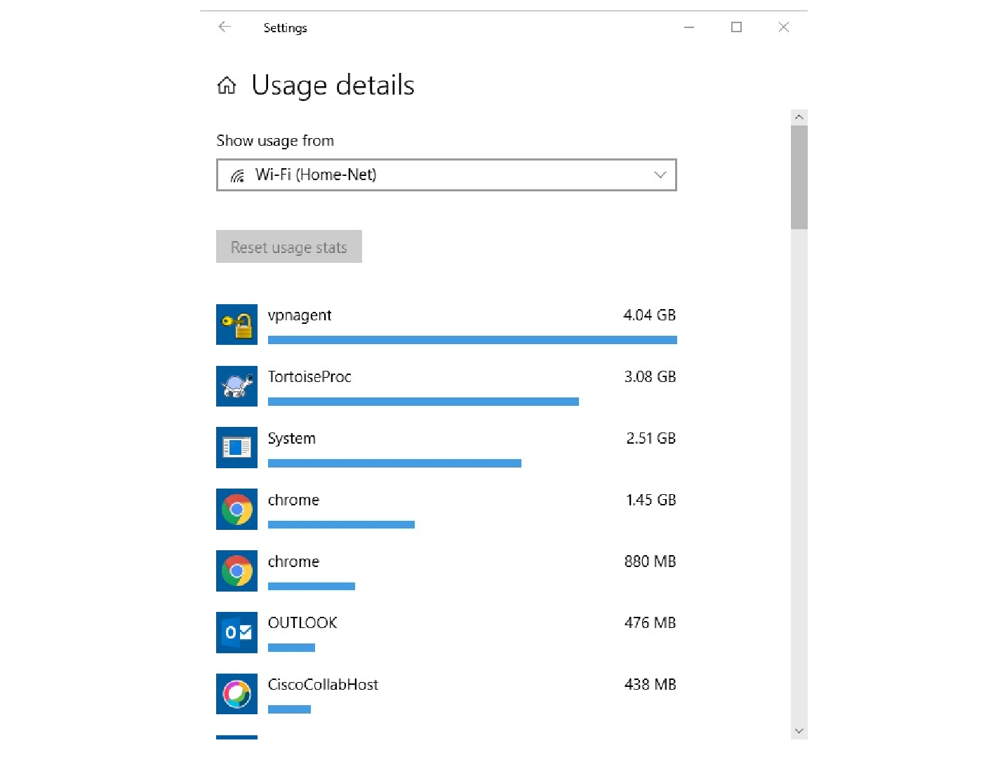

# Масштабирование до размеров более крупных сетей

<!-- 17.3.1 -->
## Расширение небольшой сети

Если ваша сеть предназначена для малого бизнеса, вероятно, вы хотите, чтобы этот бизнес рос, и ваша сеть росла вместе с ним. Это называется масштабированием сети, и вот некоторые рекомендации для этого.

Расширение — естественный процесс для многих малых предприятий, поэтому используемые в них сети должны расти и развиваться соответственно. Желательно, чтобы у администратора сети было достаточно времени для принятия взвешенных решений относительно расширения сети по мере развития компании.

Для масштабирования сети требуется ряд элементов:

* **сетевая документация**  (физическая и логическая топология);
* **реестр устройств**  (список устройств, которые используют сеть или являются ее частью);
* **бюджет**  (детализированный бюджет на ИТ, включая годовой бюджет на закупку оборудования на финансовый год);
* **анализ трафика** — протоколы, приложения и службы, а также их требования к трафику; должны быть задокументированы.

Эти элементы используются для принятия взвешенных решений в рамках масштабирования небольшой сети.

<!-- 17.3.2 -->
## Анализ протоколов

По мере роста сети становится важным определить, как управлять сетевым трафиком. По мере роста сети очень важно понимать тип и поток трафика, проходящего по сети. Существует несколько инструментов управления сетью, которые могут быть использованы для этой цели. Тем не менее, может быть использован простой анализатор протокола, такой как Wireshark.

Например, запуск Wireshark на нескольких ключевых узлах может выявить типы сетевого трафика, проходящего через сеть. На следующем рисунке показана статистика иерархии протоколов Wireshark для узла Windows в небольшой сети.

<!-- /courses/itn-dl/aeeda3d0-34fa-11eb-ad9a-f74babed41a6/af2555a4-34fa-11eb-ad9a-f74babed41a6/assets/2e8b24e2-1c25-11ea-81a0-ffc2c49b96bc.svg -->

Рисунок  показывает, что хост использует протоколы IPv6 и IPv4. Выходные данные IPv4 также показывают, что хост использовал DNS, SSL, HTTP, ICMP и другие протоколы.

Для того, чтобы определить характерные потоки трафика, важно:

* Захват трафика следует производить в период пиковой нагрузки, чтобы получить надлежащее представление о различных типах трафика.
* Выполнить захват в различных сегментах сети; некоторые типы трафика будут ограничены определенными сегментами.

Информация, собранная анализатором протоколов, оценивается на основе данных об источнике и получателе трафика, а также с учетом типа отправляемого трафика. Результаты анализа можно использовать при принятии решений об эффективном управлении трафиком. Этого можно добиться путем уменьшения ненужных потоков трафика или изменения режима потоков, например, за счет перемещения сервера.

В отдельных случаях достаточно просто переместить сервер или службу в другой сегмент сети, чтобы повысить производительность сети и обеспечить соответствие требованиям в условиях роста сети. В других случаях для оптимизации производительности сети может потребоваться серьезное вмешательство и перепроектирование сети.

<!-- 17.3.3 -->
## Использование сети сотрудниками

Помимо понимания изменений в тенденциях трафика администратор сети также должен знать, как именно изменяется использование сети. Многие операционные системы предоставляют встроенные средства для отображения такой информации. Например, узел  под управлением Windows предоставляет такие инструменты, как диспетчер задач, средство просмотра событий и средства использования данных.

Эти инструменты могут использоваться для получения «моментального снимка» информации, например:

* ОС и ее версия
* Использование ЦП
* Использование ОЗУ
* Использование дискового пространства
* Приложения, не являющиеся сетевыми
* Сетевые приложения

Документирование снимков по сотрудникам в небольшой сети в динамике существенно повышает информированность администраторов сети о растущих требованиях к протоколам и связанных с ними потоках трафика. В связи с подобным изменением в использовании ресурсов администратору сети может потребоваться соответствующим образом изменить политику выделения сетевых ресурсов.

Средство использования данных в ОС Windows 10 особенно полезно для определения приложений, использующих сетевые службы на узле. Доступ к инструменту «Использование данных» осуществляется с помощью **Settings > Network & Internet > Data usage > network interface** (за последние 30 дней).

Пример на рисунке показывает приложения, запущенные на удаленном пользовательском хосте Windows 10, используя подключение к локальной сети Wi-Fi.

<!-- /courses/itn-dl/aeeda3d0-34fa-11eb-ad9a-f74babed41a6/af2555a4-34fa-11eb-ad9a-f74babed41a6/assets/2e8b7300-1c25-11ea-81a0-ffc2c49b96bc.svg -->

<!-- 17.3.4 -->
<!-- quiz -->

