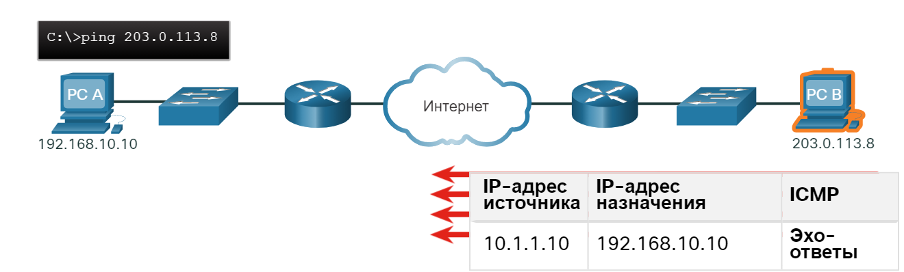
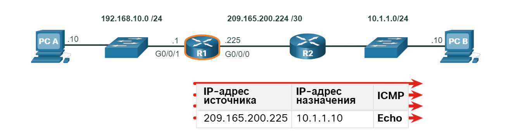
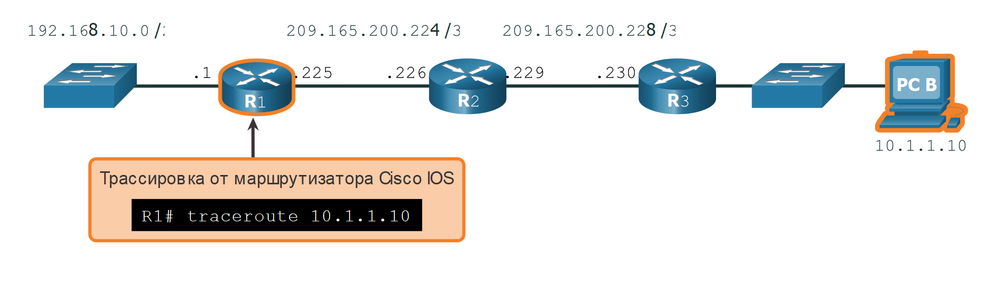
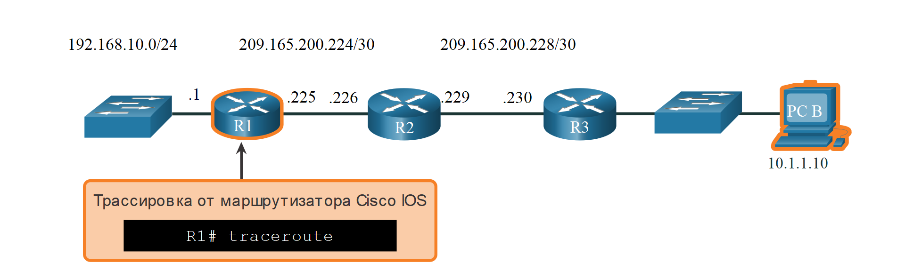

<!-- verified: agorbachev 03.05.2022 -->

<!-- 17.4.1 -->
## Проверка подключения с помощью Ping

Независимо от того, является ли ваша сеть небольшой и новой, или вы масштабируете существующую сеть, вы всегда будете иметь возможность убедиться, что ваши компоненты правильно подключены друг к другу и к Интернету. В этом разделе рассматривается ряд служебных программ, которые можно использовать для проверки подключения к сети.

Команда **ping** является наиболее эффективным способом быстрого тестирования подключения уровня 3 между IP-адресами источника и назначения. Команда также отображает различные статистику о времени прохождения пакета в оба конца.

В частности,  команда **ping** использует эхо-запросы протокола ICMP (ICMP Type 8) и эхо-ответы (ICMP Type 0) сообщения.  Команда **ping** доступна в большинстве операционных систем, включая Windows, Linux, macOS и Cisco IOS.

На узле Windows 10  команда  **ping** отправляет четыре последовательных эхо-запроса ICMP и ожидает четыре последовательных эхо-ответа ICMP от места назначения.

Например, предположим, что компьютер A пингует ПК B. Как показано на рисунке, хост ПК A Windows отправляет четыре последовательных эхо-запроса ICMP на ПК B (например, 10.1.1.10).


<!-- /courses/itn-dl/aeeda3d0-34fa-11eb-ad9a-f74babed41a6/af257cb0-34fa-11eb-ad9a-f74babed41a6/assets/2e8c3653-1c25-11ea-81a0-ffc2c49b96bc.svg -->

Хост назначения получает и обрабатывает эхо-запросы ICMP. Как показано на рисунке, ПК Б отвечает отправкой четырех ICMP эхо-ответов  на ПК А.


<!-- /courses/itn-dl/aeeda3d0-34fa-11eb-ad9a-f74babed41a6/af257cb0-34fa-11eb-ad9a-f74babed41a6/assets/2e8c5d63-1c25-11ea-81a0-ffc2c49b96bc.svg -->

Как показано в выходных данных команды, ПК A получил эхо-ответы от ПК B, проверяющие сетевое подключение.

```
C:\Users\PC-A> ping 10.1.1.10
Pinging 10.1.1.10 with 32 bytes of data:
Reply from 10.1.1.10: bytes=32 time=47ms TTL=51
Reply from 10.1.1.10: bytes=32 time=60ms TTL=51
Reply from 10.1.1.10: bytes=32 time=53ms TTL=51
Reply from 10.1.1.10: bytes=32 time=50ms TTL=51
Ping statistics for 10.1.1.10:
    Packets: Sent = 4, Received = 4, Lost = 0 (0% loss),
Approximate round trip times in milli-seconds:
    Minimum = 47ms, Maximum = 60ms, Average = 52ms
C:\Users\PC-A>
```

Выходные данные подтверждают наличие сетевого взаимодействия между ПК A и ПК B.

Выходные данные  команды **ping** Cisco IOS зависят от хоста Windows. Например, комадна  ping  для IOS  отправляет пять эхо-запросов ICMP, как показано на выводе.

```
R1# ping 10.1.1.10
Type escape sequence to abort.
Sending 5, 100-byte ICMP Echos to 10.1.1.10, timeout is 2 seconds:
!!!!!
Success rate is 100 percent (5/5), round-trip min/avg/max = 1/1/2 ms
R1#
```

Обратите внимание на   символы **!!!!!** в выводе  команды.  Команда **ping** в IOS отображает индикатор для каждого полученного эхо-ответа ICMP. В таблице перечислены наиболее распространенные  символы  вывода команды **ping**.

### Символы вывода команды ping в IOS

| Элемент | Описание |
| --- | --- |
| **!** | <ul><li>Восклицательный знак указывает на успешное получение сообщения эхо-ответа.</li><li>Он проверяет соединение уровня 3 между источником и назначением.</li></ul> |
| **.** | <ul><li>Точка означает, что истек срок ожидания сообщения эхо-ответа. </li><li>Это указывает на проблемы подключения в какой-либо точке пути.</li></ul> |
| **U** | <ul><li>Прописная буква **U** указывает, что маршрутизатор на пути ответил сообщением об ошибке ICMP типа 3 «пункт назначения недоступен».</li><li>Возможные причины: маршрутизатор не знает маршрута до сети назначения или не удалось найти хост в сети назначения.</li></ul> |

**Примечание:** Другие возможные варианты вывода команды ping включают Q, M,?  или &. Однако, смысл этих модулей выходит за рамки этого модуля.

<!-- 17.4.2 -->
## Расширенная команда ping

Обычно **ping** использует IP-адрес интерфейса, ближайшего к сети назначения, в качестве источника **ping**. R1 будет использовать в команде **ping 10.1.1.10** адрес  209.165.200.225 установленый на интерфейс G0/0/0 как IP-адрес источника пакетов - как показано в примере.


<!-- /courses/itn-dl/aeeda3d0-34fa-11eb-ad9a-f74babed41a6/af257cb0-34fa-11eb-ad9a-f74babed41a6/assets/2e8cab83-1c25-11ea-81a0-ffc2c49b96bc.svg -->

В Cisco IOS имеется возможность отправлять команду **ping** в расширенном режиме Этот режим позволяет создавать специальный запрос ping, настраивая параметры, связанные с работой команды.

Для перехода в этот режим необходимо ввести **ping**  в привилегированном режиме EXEC, не указывая IP-адрес назначения Затем вам будет предложено несколько подсказок для настройки расширенного режима **ping**.

**Примечание:** При нажатии клавиши **Enter**  принимаются указанные значения по умолчанию

Например, предположим, что вы хотите проверить возможность связи  локальной сети R1 (т.е. 192.168.10.0/24) с локальной сетью 10.1.1.0. Это может быть проверено на ПК А. Тем не менее, расширенный  **ping** может быть настроен на R1 для указания другого адреса источника.

Как показано в примере,  IP-адрес источника в расширенной версии  команды **ping**  на R1 может быть настроен на использование IP-адреса интерфейса G0/0/1 (т.е. 192.168.10.1).


<!-- /courses/itn-dl/aeeda3d0-34fa-11eb-ad9a-f74babed41a6/af257cb0-34fa-11eb-ad9a-f74babed41a6/assets/2e8cd292-1c25-11ea-81a0-ffc2c49b96bc.svg -->
-->

Следующий вывод команды настраивает расширенный  **ping** на R1 и определяет IP-адрес источника которым является IP-адрес интерфейса G0/0/1 (т.е. 192.168.10.1).

```
R1# ping
Protocol [ip]:
Target IP address: 10.1.1.10
Repeat count [5]:
Datagram size [100]:
Timeout in seconds [2]:
Extended commands [n]: y
Ingress ping [n]:
Source address or interface: 192.168.10.1
DSCP Value [0]:
Type of service [0]:
Set DF bit in IP header? [no]:
Validate reply data? [no]:
Data pattern [0x0000ABCD]:
Loose, Strict, Record, Timestamp, Verbose[none]:
Sweep range of sizes [n]:
Type escape sequence to abort.
Sending 5, 100-byte ICMP Echos to 10.1.1.1, timeout is 2 seconds:
Packet sent with a source address of 192.168.10.1
!!!!!
Success rate is 100 percent (5/5), round-trip min/avg/max = 1/1/1 ms
R1#
```

**Примечание:** Команда **ping ipv6** может использоваться для расширеных эхо-запросов IPv6.

<!-- 17.4.3 -->
## Проверка подключения с помощью команды Traceroute

Команда **ping** полезна для быстрого определения наличия проблемы подключения на уровне 3. Тем не менее он не определяет, где проблема находится вдоль пути.

Traceroute может помочь найти проблемные области уровня 3 в сети. Команда trace возвращает список переходов по мере маршрутизации пакета по сети Он может быть использован для определения точки на пути, где проблема может быть найдена.

Синтаксис команды trace различается в разных операционных системах, как показано на рисунке.

###  Команды трассировки Windows и Cisco IOS


<!-- /courses/itn-dl/aeeda3d0-34fa-11eb-ad9a-f74babed41a6/af257cb0-34fa-11eb-ad9a-f74babed41a6/assets/2e8d20b2-1c25-11ea-81a0-ffc2c49b96bc.svg -->

Ниже приведен пример выходных данных  команды **tracert** на узле Windows 10. 

```
C:\Users\PC-A> tracert 10.1.1.10
Tracing route to 10.1.10 over a maximum of 30 hops:
  1     2 ms     2 ms     2 ms  192.168.10.1
  2     *        *        *     Request timed out.
  3     *        *        *     Request timed out.
  4     *        *        *     Request timed out.
^C
C:\Users\PC-A>
```

**Примечание:** Используйте **Ctrl-C** для прерывания **tracert** в Windows.

Единственный успешный ответ был от шлюза на R1. Тайм-аут запросов к следующему прыжку истек, как указано звездочкой (\ *), означая, что маршрутизатор следующего перехода не ответил. Результаты трассировки указывают либо на сетевой сбой за пределами локальной сети, либо на то, что эти маршрутизаторы настроены на блокировку эхо-запросов в команде трассировки. В этом примере это происходит  между R1 и R2.

Выходные данные **traceroute** команды Cisco IOS отличаются от **tracert** команды Windows. Например, обратимся к следующей топологии.


<!-- /courses/itn-dl/aeeda3d0-34fa-11eb-ad9a-f74babed41a6/af257cb0-34fa-11eb-ad9a-f74babed41a6/assets/2e8d47c2-1c25-11ea-81a0-ffc2c49b96bc.svg -->

Ниже приведен пример выходных данных команды traceroute на R1.

```
R1# traceroute 10.1.1.10
Type escape sequence to abort.
Tracing the route to 10.1.1.10
VRF info: (vrf in name/id, vrf out name/id)
  1 209.165.200.226 1 msec 0 msec 1 msec 
  2 209.165.200.230 1 msec 0 msec 1 msec 
  3 10.1.1.10 1 msec 0 msec 
R1#
```

В этом примере трассировка подтвердила, что она может успешно достичь ПК B. 

Тайм-ауты указывают на потенциальную проблему. Например, если узел 10.1.1.10 недоступен,  команда **traceroute** отобразит следующий вывод. 

```
R1# traceroute 10.1.1.10
Type escape sequence to abort.
Tracing the route to 10.1.1.10
VRF info: (vrf in name/id, vrf out name/id)
  1 209.165.200.226 1 msec 0 msec 1 msec
  2 209.165.200.230 1 msec 0 msec 1 msec
  3 * * * 
  4 * * * 
  5 * 
```

Используйте **Ctrl-Shift-6** для прерывания  **traceroute** в Cisco IOS.

**Примечание**: Аналогично команде ping команда traceroute (tracert) в ОС Windows отправляет эхо-запросы ICMP. Cisco IOS и Linux используют UDP с недопустимым номером порта. Конечный пункт назначения возвращает сообщение о недоступности порта ICMP.

<!-- 17.4.4 -->
## Расширенная команда traceroute

Как и расширенная  команда **ping**, существует также расширенная  команда **traceroute**. Это позволяет администратору настраивать параметры, связанные с операцией команды. Это может пригодиться при поиске и устранении петель маршрутизации, определении точного маршрутизатора следующего перехода, либо определении места, в котором пакет сбрасывается маршрутизатором или отклоняется межсетевым экраном.

Команда **tracert**  в  Windows также позволяет указать ряд параметров, Однако, ввод выполняется не посредством пошаговых запросов, а через параметры в командной строке. Тем не менее, он не работает, как расширенная команда traceroute IOS. В следующем выводе  отображаются доступные параметры для  команды **tracert** в Windows.

```
C:\Users\PC-A> tracert /?
Usage: tracert [-d] [-h maximum_hops] [-j host-list] [-w timeout]
               [-R] [-S srcaddr] [-4] [-6] target_name
Options:
    -d                 Do not resolve addresses to hostnames.
    -h maximum_hops    Maximum number of hops to search for target.
    -j host-list       Loose source route along host-list (IPv4-only).
    -w timeout         Wait timeout milliseconds for each reply.
    -R                 Trace round-trip path (IPv6-only).
    -S srcaddr         Source address to use (IPv6-only).
    -4                 Force using IPv4.
    -6                 Force using IPv6.
C:\Users\PC-A>
```

Этот режим позволяет создавать  специальный запрос **traceroute**, настраивая параметры, связанные с работой команды. Для перехода в этот режим необходимо ввести текст **traceroute** в привилегированном режиме EXEC, не указывая IP-адрес назначения IOS поможет настроить параметры команды, последовательно отобразив несколько запросов для ввода различных значений.

**Примечание:** Если нажать **Enter**, будет использовано значение по умолчанию, указанное в квадратных скобках.

Например, предположим, что вы хотите проверить подключение к ПК B от интерфейса локальной сети R1. Хотя это можно проверить с ПК A, расширенная команда  **traceroute** может быть настроен на R1 для указания другого адреса источника.


<!-- /courses/itn-dl/aeeda3d0-34fa-11eb-ad9a-f74babed41a6/af257cb0-34fa-11eb-ad9a-f74babed41a6/assets/2e8d95e3-1c25-11ea-81a0-ffc2c49b96bc.svg -->

Как показано в примере, IP-адрес источника в расширенной версии **traceroute** команды traceroute на R1 может быть настроен на использование IP-адреса интерфейса G0/0/1 (т.е. 192.168.10.1).

```
R1# traceroute
Protocol [ip]:
Target IP address: 10.1.1.10
Ingress traceroute [n]:
Source address: 192.168.10.1
DSCP Value [0]:
Numeric display [n]:
Timeout in seconds [3]:
Probe count [3]:
Minimum Time to Live [1]:
Maximum Time to Live [30]:
Port Number [33434]:
Loose, Strict, Record, Timestamp, Verbose[none]:
Type escape sequence to abort.
Tracing the route to 192.168.10.10
VRF info: (vrf in name/id, vrf out name/id)
  1 209.165.200.226 1 msec 1 msec 1 msec
  2 209.165.200.230 0 msec 1 msec 0 msec
  3  *
    10.1.1.10 2 msec 2 msec
R1#
```

<!-- 17.4.5 -->
## Базовый уровень сети

Одним из наиболее эффективных инструментов мониторинга и устранения неполадок с производительностью сети является определение базового уровня сети. Эффективный базовый уровень производительности сети создается за определенный период времени. Измерение производительности за различные периоды и с изменяемыми нагрузками позволяет составить более точную картину общей производительности сети.

Выходные данные, полученные в результате использования сетевых команд, предоставляют данные для внесения в базовый уровень сети. Одним из способов создания базового уровня является копирование и вставка результатов выполнения команды **ping**, **trace** или любой другой соответствующей команды в текстовый файл. В такие текстовые файлы можно добавить метку времени и дату, а затем сохранить их в архив для дальнейшего использования и сравнения.

Следует рассмотреть такие объекты, как сообщения об ошибках и значения времени отклика между узлами. В случае значительного увеличения времени отклика может возникнуть проблема, связанная с задержкой.

Например, следующий **ping** вывод был захвачен и вставлен в текстовый файл.

**19 августа 2019 в 08:14:43** 

```
C:\Users\PC-A> ping 10.1.1.10
Pinging 10.1.1.10 with 32 bytes of data:
Reply from 10.1.1.10: bytes=32 time<1ms TTL=64
Reply from 10.1.1.10: bytes=32 time<1ms TTL=64
Reply from 10.1.1.10: bytes=32 time<1ms TTL=64
Reply from 10.1.1.10: bytes=32 time<1ms TTL=64
Ping statistics for 10.1.1.10:
    Packets: Sent = 4, Received = 4, Lost = 0 (0% loss),
Approximate round trip times in milli-seconds:
    Minimum = 0ms, Maximum = 0ms, Average = 0ms
C:\Users\PC-A>
```

Обратите внимание, что время **ping** передачи в оба конца меньше 1 мс.

Через месяц пинг повторяется и захватывается.

**19 сентября 2019 в 10:18:21** 

```
C:\Users\PC-A> ping 10.1.1.10
Pinging 10.1.1.10 with 32 bytes of data:
Reply from 10.1.1.10: bytes=32 time=50ms TTL=64
Reply from 10.1.1.10: bytes=32 time=49ms TTL=64
Reply from 10.1.1.10: bytes=32 time=46ms TTL=64
Reply from 10.1.1.10: bytes=32 time=47ms TTL=64
Ping statistics for 10.1.1.10:
    Packets: Sent = 4, Received = 4, Lost = 0 (0% loss),
Approximate round trip times in milli-seconds:
    Minimum = 46ms, Maximum = 50ms, Average = 48ms
C:\Users\PC-A>
```

Обратите внимание на этот раз, что в команде **ping** время передачи в оба конца намного больше, что указывает на потенциальную проблему.

Корпоративные сети должны иметь расширенные базовые уровни, более широкие, чем можно описать в рамках данного курса. Для хранения и обслуживания данных базового уровня доступны профессиональные программные инструменты. В рамках данного курса рассматривается несколько основных приемов базовых уровней и обсуждается их назначение.

Рекомендации Cisco для базовых процессов можно найти, выполнив поиск в Интернете «Рекомендации по базовым процессам». (“Baseline Process Best Practices”)

<!-- 17.4.6 -->
## Лабораторная работа: Проверка задержки сети с помощью команд ping и traceroute

В этой лабораторной работе вы выполните следующие задачи.

* Часть 1: Регистрация задержки сети с помощью команды ping
* Часть 2: Регистрация задержки сети с помощью команды traceroute

[Проверка задержки сети с помощью команд ping и traceroute (лабораторная работа для физического оборудования)](./assets/17.4.6-lab---test-network-latency-with-ping-and-traceroute.pdf)

