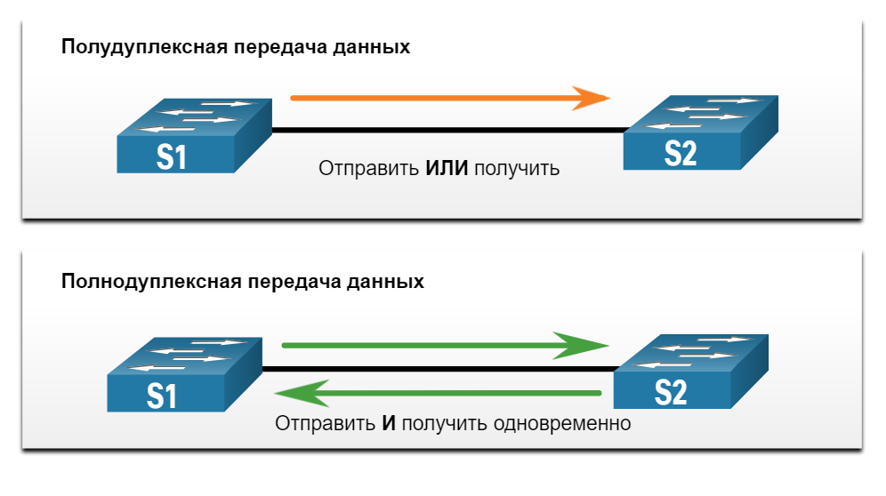
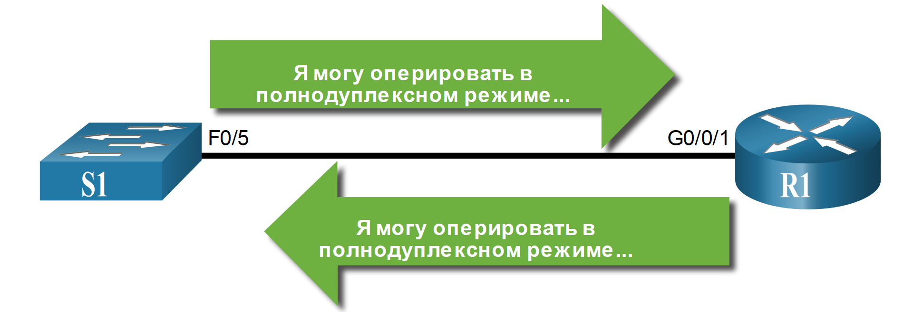

<!-- verified: agorbachev 03.05.2022 -->

<!-- 17.7.1 -->
##  Вопросы работы и несоответствия  настроек дуплекса на интерфейсе

Многие общие проблемы сети могут быть выявлены и решены без особых усилий. Теперь, когда у вас есть инструменты и процесс устранения неполадок в сети, в этом разделе рассмотрим некоторые распространенные сетевые проблемы, которые могут быть найдены администратором сети.

В процессе передачи данных термин «дуплекс» описывает направление передачи данных между двумя устройствами.

Существует два режима дуплексной связи:

* **Полудуплексный режим**  — Передача данных разрешена одновременно только в одном направлении.
* **Полнодуплексный** - Сообщения могут быть отправлены и получены одновременно.

На рисунке показано, как работает каждый дуплексный режим.


<!-- /courses/itn-dl/aeeda3d0-34fa-11eb-ad9a-f74babed41a6/af25cad0-34fa-11eb-ad9a-f74babed41a6/assets/2e9250d2-1c25-11ea-81a0-ffc2c49b96bc.svg -->

Чтобы обеспечить оптимальную производительность и отсутствие задержек канала связи, два подключенных сетевых интерфейса Ethernet должны работать в одном режиме дуплекса.

Функция автосогласования Ethernet облегчает настройку, минимизирует проблемы и максимизирует производительность соединения между двумя соединенными интерфейсами Ethernet. Сначала подключенные устройства объявляют поддерживаемые ими возможности, а затем на обоих концах соединения выбирается режим, который обеспечивает наибольшую производительность. Например, как показано на рисунке, коммутатор и маршрутизатор успешно согласовали полнодуплексный режим.


<!-- /courses/itn-dl/aeeda3d0-34fa-11eb-ad9a-f74babed41a6/af25cad0-34fa-11eb-ad9a-f74babed41a6/assets/2e9277e2-1c25-11ea-81a0-ffc2c49b96bc.svg -->

Если одно из двух подключенных устройств работает в полнодуплексном режиме, а другое в полудуплексном, происходит несовпадение дуплексных режимов. В этом случае передача данных будет выполняться, однако производительность канала связи будет очень низкой.

Несовпадения дуплексов обычно вызваны неправильной конфигурацией интерфейса или, в редких случаях, неудачным автосогласованием. Проблему несовпадения дуплексных режимов довольно сложно обнаружить, поскольку обмен данными между устройствами продолжается.

<!-- 17.7.2 -->
## Проблемы с IP-адресами на устройствах IOS

Проблемы, связанные с IP-адресами, обычно приводят к невозможности подключения удаленных сетевых устройств. Поскольку IP-адреса имеют иерархическую структуру, любой IP-адрес, назначенный сетевому устройству, должен соответствовать диапазону адресов своей сети. Неверное назначение IP-адресов создает целый ряд проблем, включая конфликты IP-адресов и проблемы с маршрутизацией.

Двумя основными причинами неверного назначения IPv4-адресов являются ошибки назначения адресов вручную и неполадки, связанные с протоколом DHCP.

Часто сетевым администраторам приходится вручную назначать IP-адреса таким устройствам, как серверы и маршрутизаторы. Если во время назначения допущена ошибка, то велика вероятность того, что при связи с устройством возникнет проблема.

Команды **show ip interface** и **show ip interface brief** на устройстве IOS позволяют проверить, какие IPv4-адреса назначены сетевым интерфейсам. Например,  выполнение команды **show ip interface** **brief**, как показано на рисунке, будет проверять состояние интерфейса на R1.

```
R1# show ip interface brief
Interface              IP-Address      OK? Method Status                Protocol
GigabitEthernet0/0/0   209.165.200.225 YES manual up                    up
GigabitEthernet0/0/1   192.168.10.1    YES manual up                    up
Serial0/1/0            unassigned      NO  unset  down                  down
Serial0/1/1            unassigned      NO  unset  down                  down
GigabitEthernet0       unassigned      YES unset  administratively down down
R1#
```

<!-- 17.7.3 -->
## Проблемы с IP-адресами на оконечных устройствах

Если устройству под управлением Windows не удается связаться с сервером DHCP, Windows автоматически назначает ему адрес из диапазона 169.254.0.0/16. Эта функция называется автоматической частной IP-адресацией (APIPA) и предназначена для облегчения связи в локальной сети. Представьте, что Windows говорит: «Я буду использовать этот адрес из диапазона 169.254.0.0/16, потому что не могу получить другой адрес».

Чаще всего компьютер с адресом из диапазона 169.254.0.0/16 не сможет связаться с другими устройствами в сети, потому что эти устройства, скорее всего, не будут принадлежать сети 169.254.0.0/16. Такая ситуация указывает на наличие неполадки автоматического назначения IPv4-адреса, которую необходимо устранить.

**Примечание**: Другие операционные системы, например Linux и OS X, в случае невозможности подключения к серверу DHCP не назначают сетевому интерфейсу IPv4-адрес.

Большинство оконечных устройств полагаются на автоматическое назначение IPv4-адреса сервером DHCP. Если устройству не удается подключиться к серверу DHCP, сервер не может назначить IPv4-адрес для конкретной сети и устройство не сможет установить соединение.

Чтобы проверить, какие IP-адреса назначены компьютеру с Windows, используйте команду **ipconfig**, как показано на рисунке.

```
C:\Users\PC-A> ipconfig
Windows IP Configuration
(Output omitted)
Wireless LAN adapter Wi-Fi:
   Connection-specific DNS Suffix  . :
   Link-local IPv6 Address . . . . . : fe80::a4aa:2dd1:ae2d:a75e%16
   IPv4 Address. . . . . . . . . . . : 192.168.10.10
   Subnet Mask . . . . . . . . . . . : 255.255.255.0
   Default Gateway . . . . . . . . . : 192.168.10.1
(Output omitted)
```

<!-- 17.7.4 -->
## Неполадки, связанные со шлюзом по умолчанию

Шлюзом по умолчанию для оконечного устройства является ближайшее сетевое устройство, которое способно пересылать трафик в другие сети. Если для устройства указан неверный или несуществующий адрес шлюза по умолчанию, оно не сможет связываться с устройствами в удаленных сетях. Поскольку шлюз по умолчанию является путем к удаленным сетям, он должен находиться в той же сети, что и оконечное устройство.

Адрес шлюза по умолчанию может быть настроен вручную или получен от сервера DHCP. Так же, как и проблемы с IPv4-адресами, проблемы со шлюзом по умолчанию могут быть вызваны неверной настройкой (при назначении вручную) или неполадками DHCP (если используется автоматическое назначение).

Для решения проблем, связанных с неверной настройкой шлюза по умолчанию, проследите за тем, чтобы для устройства был задан верный шлюз по умолчанию. Если адрес шлюза по умолчанию был задан вручную и содержит ошибку, просто замените его подходящим адресом. Если адрес был задан автоматически, убедитесь, что устройство может надлежащим образом подключиться к серверу DHCP. Необходимо также убедиться, что в интерфейсе маршрутизатора верно настроены IPv4-адрес и маска подсети, а сам интерфейс активен.

Чтобы проверить шлюз по умолчанию на компьютерах с Windows, используйте команду **ipconfig** (см. рисунок 1).

```
C:\Users\PC-A> ipconfig
Windows IP Configuration
(Output omitted)
Wireless LAN adapter Wi-Fi:
   Connection-specific DNS Suffix  . :
   Link-local IPv6 Address . . . . . : fe80::a4aa:2dd1:ae2d:a75e%16
   IPv4 Address. . . . . . . . . . . : 192.168.10.10
   Subnet Mask . . . . . . . . . . . : 255.255.255.0
   Default Gateway . . . . . . . . . : 192.168.10.1
(Output omitted)
```

Выполните команду **show ip route** на маршрутизаторе для отображения таблицы маршрутизации и убедитесь, что настроен шлюз по умолчанию, также называемый маршрутом по умолчанию. Этот маршрут используется в случаях, когда адрес назначения пакета не соответствует другим маршрутам, указанным в таблице маршрутизации.

Например, выходные данные проверяют, что R1 имеет шлюз по умолчанию, настроенный на IP-адрес 209.168.200.226.

```
R1# show ip route | begin Gateway
Gateway of last resort is 209.165.200.226 to network 0.0.0.0
O*E2  0.0.0.0/0 [110/1] via 209.165.200.226, 02:19:50, GigabitEthernet0/0/0
      10.0.0.0/24 is subnetted, 1 subnets
O        10.1.1.0 [110/3] via 209.165.200.226, 02:05:42, GigabitEthernet0/0/0
      192.168.10.0/24 is variably subnetted, 2 subnets, 2 masks
C        192.168.10.0/24 is directly connected, GigabitEthernet0/0/1
L        192.168.10.1/32 is directly connected, GigabitEthernet0/0/1
      209.165.200.0/24 is variably subnetted, 3 subnets, 2 masks
C        209.165.200.224/30 is directly connected, GigabitEthernet0/0/0
L        209.165.200.225/32 is directly connected, GigabitEthernet0/0/0
O        209.165.200.228/30
           [110/2] via 209.165.200.226, 02:07:19, GigabitEthernet0/0/0
R1#
```

Первая выделенная строка в  указывает, что это шлюз (т.е. 0.0.0.0) и  любой  пакет должен быть отправлен на IP-адрес 209.165.200.226. Вторая выделенная строка показывает, как R1 узнал о шлюзе по умолчанию. В нашем случае R1 получил информацию от другого маршрутизатора с поддержкой OSPF.

<!-- 17.7.5 -->
## Поиск и устранение неполадок, связанных с DNS

Служба доменных имен (DNS) — это автоматизированная служба, которая сопоставляет имена, например www.cisco.com, с IP-адресами. Преобразование имен DNS не имеет принципиального значения для связи между устройствами, но очень важно для конечного пользователя.

Многие пользователи ошибочно связывают работу интернет-канала с доступностью службы DNS. Жалобы пользователей на неработающую сеть или отсутствие Интернета часто бывают вызваны недоступностью сервера DNS. Так как маршрутизация пакетов и все другие сетевые сервисы продолжают работать, неполадки DNS часто приводят пользователя к неправильному выводу. Если пользователь введет в веб-браузере доменное имя, например www.cisco.com, а сервер DNS будет недоступен, имя не будет преобразовано в IP-адрес, и веб-сайт не будет открыт.

Адреса сервера DNS могут быть заданы вручную или назначены автоматически. Обычно сетевые администраторы вручную назначают адреса сервера DNS на серверах и других устройствах, а для автоматического назначения адресов сервера DNS на клиентах используется протокол DHCP.

Компании и организации часто разворачивают свои собственные серверы DNS, но для преобразования имен можно использовать любой доступный сервер DNS. Пользователи в небольших или домашних офисах обычно используют сервер DNS, предоставляемый их интернет-провайдером. В этом случае для назначения адреса сервера DNS используется протокол DHCP. Компания Google предлагает общедоступный сервер DNS, который может быть использован любым пользователем и очень удобен для тестирования. Общедоступный сервер DNS Google имеет IPv4-адрес 8.8.8.8 и IPv6-адрес 2001:4860:4860::8888.

Cisco предлагает OpenDNS, который обеспечивает безопасную службу DNS путем фильтрации фишинга и некоторых вредоносных сайтов. Можно изменить DNS-адрес на 208.67.222.222 и 208.67.220.220 в поле Предпочтительный DNS-сервер и Альтернативный DNS-сервер. Расширенные функции, такие как фильтрация веб-содержимого и безопасность, доступны для людей и предприятий.

Чтобы узнать, какой сервер DNS используется на компьютере с Windows, выполните команду **ipconfig /all**.

```
C:\Users\PC-A> ipconfig /all
(Output omitted)
Wireless LAN adapter Wi-Fi:
   Connection-specific DNS Suffix  . :
   Description . . . . . . . . . . . : Intel(R) Dual Band Wireless-AC 8265
   Physical Address. . . . . . . . . : F8-94-C2-E4-C5-0A
   DHCP Enabled. . . . . . . . . . . : Yes
   Autoconfiguration Enabled . . . . : Yes
   Link-local IPv6 Address . . . . . : fe80::a4aa:2dd1:ae2d:a75e%16(Preferred)
   IPv4 Address. . . . . . . . . . . : 192.168.10.10(Preferred)
   Subnet Mask . . . . . . . . . . . : 255.255.255.0
   Lease Obtained. . . . . . . . . . : August 17, 2019 1:20:17 PM
   Lease Expires . . . . . . . . . . : August 18, 2019 1:20:18 PM
   Default Gateway . . . . . . . . . : 192.168.10.1
   DHCP Server . . . . . . . . . . . : 192.168.10.1
   DHCPv6 IAID . . . . . . . . . . . : 100177090
   DHCPv6 Client DUID. . . . . . . . : 00-01-00-01-21-F3-76-75-54-E1-AD-DE-DA-9A
   DNS Servers . . . . . . . . . . . : 208.67.222.222
   NetBIOS over Tcpip. . . . . . . . : Enabled
(Output omitted)
```

Еще одним полезным инструментом для устранения неполадок DNS на ПК является команда **nslookup**. С помощью команды **nslookup** пользователь может вручную отправлять запросы DNS, а затем анализировать полученные ответы DNS.  Команда **nslookup** показывает выходные данные запроса для www.cisco.com. Обратите внимание, что вы также можете просто ввести IP-адрес и  **nslookup** вернет доменное имя.

```
C:\Users\PC-A> nslookup
Default Server:  Home-Net
Address:  192.168.1.1
> cisco.com
Server:  Home-Net
Address:  192.168.1.1
Non-authoritative answer:
Name:    cisco.com
Addresses:  2001:420:1101:1::185
          72.163.4.185
> 8.8.8.8
Server:  Home-Net
Address:  192.168.1.1
Name:    dns.google
Address:  8.8.8.8
>
> 208.67.222.222
Server:  Home-Net
Address:  192.168.1.1
Name:    resolver1.opendns.com
Address:  208.67.222.222
>
```

<!-- 17.7.6 -->
## Packet Tracer. Поиск и устранение неполадок подключения

Цель данного упражнения в программе Packet Tracer — найти неисправности подключения и по возможности устранить их. Если проблемы с подключением устранить не удается, подробно задокументируйте их для дальнейшей эскалации.

[Поиск и устранение неполадок подключения (pdf)](./assets/17.7.7-packet-tracer---troubleshoot-connectivity-issues.pdf)

[Поиск и устранение неполадок подключения (pka)](./assets/17.7.7-packet-tracer---troubleshoot-connectivity-issues.pka)

<!-- 17.7.7 -->
## Лабораторная работа. Поиск и устранение неполадок подключения

Выполняя эту лабораторную работу, вы решите следующие задачи:

* Определение проблемы
* Реализация изменений в сети
* Проверка полной функциональности
* Документирование результатов проделанной работы и изменений в конфигурации

[Packet Tracer - Поиск и устранение неполадок подключения- Режим симуляции физического оборудования (pdf)](./assets/17.7.7-packet-tracer---troubleshoot-connectivity-issues---physical-mode.pdf)

[Packet Tracer - Поиск и устранение неполадок подключения- Режим симуляции физического оборудования (pka)](./assets/17.7.7-packet-tracer---troubleshoot-connectivity-issues---physical-mode.pka)

**Лабораторное оборудование** 

[Поиск и устранение неполадок подключения (lab)](./assets/17.7.6-lab---troubleshoot-connectivity-issues.pdf)

