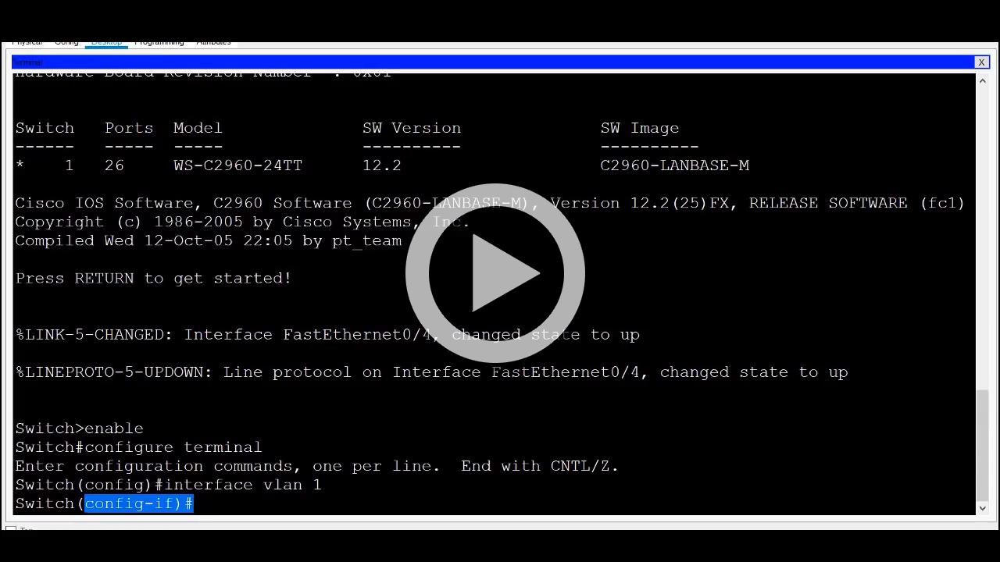

<!-- verified: agorbachev 22.04.2022 -->

# Навигация по IOS

<!-- 2.2.1 -->
## Основные командные режимы

В предыдущем разделе вы узнали, что для всех сетевых устройств требуется ОС и что их можно настроить с помощью интерфейса командной строки или графического интерфейса пользователя. Использование интерфейса командной строки может предоставить администратору сети более точный контроль и гибкость, чем использование графического интерфейса пользователя. В этом разделе рассматривается использование интерфейса командной строки для навигации по Cisco IOS.

По соображениям безопасности Cisco IOS использует два отдельных командных режима для доступа к административным функциям.

* **Пользовательский режим EXEC** — это режим с ограниченными возможностями, но он удобен для базовых операций. В пользовательском режиме доступно только ограниченное число основных команд мониторинга, но невозможно выполнять какие-либо команды, которые могут изменить конфигурацию устройства. Пользовательский режим EXEC можно определить по командной строке CLI, оканчивающейся символом «>».
* **Привилегированный режим EXEC** — этот режим должен использовать сетевой администратор для выполнения команд настройки. Режимы конфигурации более высокого уровня, например, режим глобальной конфигурации, доступны только из привилегированного режима EXEC. Привилегированный режим EXEC можно определить по командной строке, оканчивающейся символом # .

На рисунке приведена сводка по двум режимам и показаны стандартные запросы CLI, которые используются на коммутаторах и маршрутизаторах Cisco.

| **Командный режим**| **Описание**	|**Командная строка устройства по умолчанию**|
|---|---|---|
|**Пользовательский режим EXEC**| <li>Обеспечивает доступ к ограниченному количеству базовых команд мониторинга. <li> Этот режим часто называется «режимом только для просмотра».| Switch> <br> Router>|
|**Привилегированный режим EXEC**| <li> В этом режиме предоставляется доступ ко всем командам и функциям. <li>Пользователь может использовать любые команды мониторинга, а также имеет доступ ко всем конфигурациям и командам управления.|Switch# <br> Router#|

<!-- 2.2.2 -->
## Режим конфигурации и вложенные режимы конфигурации

Для настройки устройства пользователь должен перейти в режим глобальной конфигурации.

В режиме глобальной конфигурации выполняются изменения конфигурации CLI, влияющие на работу устройства в целом. Режим глобальной конфигурации можно определить по командной строке с именем устройства, после которого следует (config)#, например Switch(config)#.

Перед тем как перейти в другие специализированные режимы конфигурации, нужно войти в режим глобальной конфигурации. Из режима глобальной конфигурации пользователь может перейти в различные дополнительные режимы конфигурации. Каждый из этих режимов позволяет настроить конфигурацию отдельной части или функции устройства IOS. Два распространенных вложенных режима конфигурации

* **Режим настройки линии**  -  педназначен для настройки доступа через одну из физических или виртуальных линий (консоль, SSH, Telnet или AUX).
* **Режим настройки интерфейса** -  предназначен для настройки порта коммутатора или сетевого интерфейса маршрутизатора.

Когда используется CLI, режим определяется приглашением командной строки, которое является уникальным для этого режима. По умолчанию каждый диалог начинается с имени устройства. После имени следует остальная часть диалога, которая определяет режим. Например, запрос по умолчанию для режима конфигурации  — **Switch(config-line)#**  а для режима интерфейсной настройки — **Switch(config-if)#**.

<!-- 2.2.3 -->
## Видео. Основные командные режимы интерфейса командной строки IOS

Посмотрите видео, демонстрирующее переключение между режимами IOS.

 [](https://www.youtube.com/watch?v=B269UlVAN40)

<!-- 2.2.4 -->
## Переключение между режимами IOS

Для переключения диалогов командной строки используются различные команды. Чтобы перейти из пользовательского режима EXEC в привилегированный, введите команду **enable**. Чтобы вернуться в пользовательский режим EXEC, используйте команду привилегированного режима **disable**.

**Примечание**: Привилегированный режим EXEC иногда называют режимом включения (enable).

Для входа в режим глобальной конфигурации и выхода из него используйте команду привилегированного режима EXEC **configure terminal**. Чтобы вернуться в привилегированный режим EXEC, введите команду режима глобальной конфигурации **exit**.

Есть множество разных вложенных режимов конфигурации. Например, для перехода в режим подконфигурации линии введите команду **line**, а затем тип и номер нужной линии управления. Для выхода из режима подконфигурации и возврата в режим глобальной конфигурации используйте команду **exit**.

```
Switch(config)# line console 0
Switch(config-line)# exit
Switch(config)#
```

Чтобы перейти из любого вложенного  режима  в рамках режима глобальной конфигурации на один уровень выше в иерархии режимов, введите команду **exit**.

Чтобы перейти из любого вложенного режима в привилегированный режим EXEC, введите команду **end** или используйте сочетание клавиш **Ctrl+Z**.

```
Switch(config-line)# end
Switch#
```

Также можно напрямую переходить из одного вложенного режима конфигурации в другой. Обратите внимание, что после выбора интерфейса командная строка изменяется **(config-line)#** на **(config-if)#**.

```
Switch(config-line)# interface FastEthernet 0/1
Switch(config-if)#
```

<!-- 2.2.5 -->
## Видео. Переключение между режимами IOS

Посмотрите видео, демонстрирующее переключение между различными режимами CLI в IOS.

[](https://www.youtube.com/watch?v=Z-n1tO4Xg6w)

<!-- 2.2.6 -->
## Примечание о действиях проверки синтаксиса

Когда вы изучаете, как изменять конфигурации устройств, вы можете начать работу в безопасной, непроизводственной среде, прежде чем опробовать ее на реальном оборудовании. NetAcad предоставляет различные инструменты моделирования, которые помогут вам развить навыки настройки и устранения неполадок. Поскольку это инструменты моделирования, они обычно не обладают всеми функциональными возможностями реального оборудования. Одним из таких инструментов является проверка синтаксиса. (Syntax Checker.) В каждом задании Syntax Checker вам дается набор инструкций для ввода определенного набора команд. Вы не можете выполнить проверку синтаксиса, если не будет введена точная и полная команда, как указано. Более продвинутые инструменты моделирования, такие как Packet Tracer, позволяют вводить сокращенные команды, как и на реальном оборудовании.

<!-- 2.2.7 -->
<!-- ##  Проверка синтаксиса - переход между режимами IOS -->

<!-- 2.2.8 -->
<!-- quiz -->

