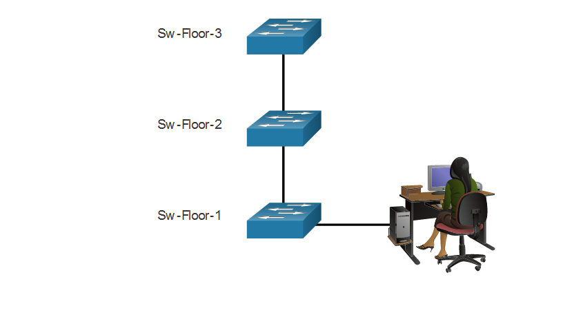

# Базовая настройка устройств

<!-- 2.4.1 -->
## Имена устройств

Вы многое узнали о Cisco IOS, навигации по IOS и структуре команд. Теперь вы готовы к настройке устройств! Первая задача конфигурации на любом устройстве - дать ему уникальное имя устройства или имя хоста. По умолчанию всем устройствам присваивается имя по умолчанию. Например, коммутатором Cisco IOS является "Switch."

Если у всех устройств оставить имена по умолчанию, то будет сложно идентифицировать конкретное устройство. Например, как вы узнали, что вы подключены к нужному устройству при удаленном доступе к нему используя SSH? Имя хоста подтверждает, что вы подключены к нужному устройству.

Имя по умолчанию должно быть изменено на более описательное. Если выбрать имена со смыслом, то запоминать, документировать и идентифицировать сетевые устройства будет легче. Вот несколько важных рекомендаций по выбору имени хоста:

- начинаться с буквы
- не содержать пробелов
- оканчиваться на букву или цифру
- содержать только буквы, цифры и тире
- состоять не более чем из 64 символов

Организация должна выработать общее правило об именах устройств, которое позволяет легко и интуитивно идентифицировать конкретное устройство. В именах узлов, используемых в устройствах IOS, сохраняются все прописные и строчные символы. Например, на рисунке показаны три коммутатора, расположенные на трех разных этажах, связаны друг с другом по сети. В соглашении об именовании учитывается местоположение и назначение каждого устройства. В сетевой документации выбор этих имен необходимо объяснить, чтобы можно было назначить дополнительным устройствам соответствующие имена.



<!-- /courses/itn-dl/aeecb970-34fa-11eb-ad9a-f74babed41a6/af1eed02-34fa-11eb-ad9a-f74babed41a6/assets/2da66a30-1c25-11ea-81a0-ffc2c49b96bc.svg -->

При использовании имен сетевые устройства легко идентифицировать для последующей настройки. На диаграмме показаны три взаимосвязанных коммутатора, охватывающих три этажа. Верхний коммутатор называется Sw-Floor-3, средний коммутатор — Sw-Floor-2, а нижний — Sw-Floor-1.  Пользователь, сидящий за компьютером, подключен к коммутатору Sw-Floor-1. 

После определения соглашения об именовании нужно присвоить устройствам имена с помощью CLI. Как показано в примере, из привилегированного режима EXEC перейдите в режим глобальной конфигурации с помощью команды **configure terminal**. Обратите внимание на изменение в диалоге командной строки.

```
Switch# configure terminal
Switch(config)# hostname Sw-Floor-1
Sw-Floor-1(config)#
```

В режиме глобальной конфигурации введите команду **hostname**, а затем имя коммутатора и нажмите клавишу **Enter**. Обратите внимание на изменение имени в диалоге командной строки.

**Примечание**: Чтобы удалить настроенное имя узла и вернуть стандартный диалог командной строки для коммутатора, используйте команду глобальной конфигурации **no hostname**.

Каждый раз, когда добавляется или изменяется устройство, должна обновляться документация. В этой документации устройствам должно быть присвоено местоположение, назначение и адрес.

<!-- 2.4.2 -->
## Правила выбора паролей

Использование слабых или легко угадываемых паролей по-прежнему является самой большой проблемой безопасности организаций. Для сетевых устройств, включая домашние беспроводные маршрутизаторы, всегда необходимо задавать пароли, чтобы ограничить административный доступ.

В Cisco IOS можно настроить пароли иерархических режимов, чтобы предоставлять разные права доступа к сетевому устройству.

Все сетевые устройства должны ограничивать административный доступ, защищая привилегированный доступ EXEC, пользовательский EXEC и удаленный доступ Telnet с помощью паролей. Кроме того, все пароли должны быть зашифрованы и должны быть настроены уведомления о том, что лишь авторизованным пользователям можно получить доступ к устройству.

Используйте надежные пароли, которые сложно подобрать. При выборе паролей необходимо учитывать некоторые ключевые моменты:

* Используйте пароли длиной более 8 символов.
* Используйте сочетание букв в верхнем и нижнем регистре, цифр, специальных символов и (или) числовых последовательностей.
* Не используйте одинаковый пароль для всех устройств.
* Не используйте часто употребляющиеся слова, поскольку их легко подобрать.

Используйте поиск в Интернете, чтобы найти генератор паролей. Многие из них позволят вам установить длину, набор символов и другие параметры.

**Примечание:** В большинстве лабораторных работ этого курса используются простые пароли, такие как **cisco** или **class**. Эти пароли ненадежны и их легко подобрать, поэтому использовать их в рабочей среде не рекомендуется. Мы используем эти пароли лишь для удобства работы в учебной аудитории или для демонстрации примеров.

<!-- 2.4.3 -->
## Настройка паролей

При первоначальном подключении к устройству вы находитесь в пользовательском режиме EXEC. Этот режим защищен с помощью консоли.

Для обеспечения доступа пользователя в режиме EXEC введите режим конфигурации консоли линии с помощью команды  глобальной конфигурации **line console 0**, как показано в примере. Ноль используется для обозначения первого (а в большинстве случаев — единственного) интерфейса консоли. Затем задайте пароль пользовательского режима EXEC с помощью команды **password** password. Наконец, включите доступ к пользовательскому режиму EXEC с помощью команды **login**.

```
Sw-Floor-1# configure terminal 
Sw-Floor-1(config)# line console 0 
Sw-Floor-1(config-line)# password cisco 
Sw-Floor-1(config-line)# login
Sw-Floor-1(config-line)# login
Sw-Floor-1#
```

Теперь для доступа к пользовательскому режиму EXEC с консоли будет необходим пароль.

Чтобы иметь доступ администратора ко всем командам IOS, включая настройку устройства, необходимо получить привилегированный доступ  режима EXEC. Это самый важный метод доступа, поскольку он обеспечивает полный доступ к устройству.

Для защиты доступа к привилегированному режиму EXEC используйте команду глобальной конфигурации **enable secret** password.

```
Sw-Floor-1# configure terminal
Sw-Floor-1(config)# enable secret class
Sw-Floor-1(config)# exit
Sw-Floor-1#
```

Линии виртуального терминала (VTY) обеспечивают удаленный доступ к устройству через Telnet или SSH. Большинство коммутаторов Cisco поддерживают до 16 линий VTY, пронумерованных от 0 до 15.

Чтобы защитить  VTY, войдите в режим line VTY, используя команду глобальной конфигурации **line vty 0 15**. Затем задайте пароль VTY с помощью команды **password** password . Наконец, включите доступ к VTY с помощью команды **login**.

Пример защиты линий VTY на коммутаторе приведен ниже.

```
Sw-Floor-1# configure terminal
Sw-Floor-1(config)# line vty 0 15 
Sw-Floor-1(config-line)# password cisco 
Sw-Floor-1(config-line)# login 
Sw-Floor-1(config-line)# end
Sw-Floor-1#
```

<!-- 2.4.4 -->
## Шифрование паролей

Файлы конфигурации startup-config и running-config отображают большинство паролей в виде простого текста. Это создает угрозу безопасности, поскольку при наличии доступа к этим файлам любой пользователь может увидеть пароли.

Чтобы зашифровать все пароли открытого текста, используйте команду глобальной конфигурации **service password-encryption**, как показано в примере.

```
Sw-Floor-1# configure terminal
Sw-Floor-1(config)# service password-encryption 
Sw-Floor-1(config)#
```

Команда применяет слабый алгоритм шифрования ко всем незашифрованным паролям. Шифрование применяется только к паролям в файле конфигурации, но не к паролям, которые отправлены по сети. Эта команда не позволяет неавторизованным пользователям прочитать пароли в файле конфигурации.

С помощью команды **show running-config** убедитесь, что пароли зашифрованы.

```
Sw-Floor-1(config)# end
Sw-Floor-1# show running-config 
!
!
line con 0password 7 094F471A1A0A 
login
!
line vty 0 4
password 7 03095A0F034F38435B49150A1819
login
!
 
!end 
```

<!-- 2.4.5 -->
## Баннерные сообщения

Хотя пароли защищают сеть от несанкционированного доступа, необходимо использовать уведомления о том, что лишь авторизованным пользователям можно получить доступ к устройству. Для этого нужно добавить баннер в выходные данные устройства. Баннеры могут стать важной частью судебного процесса, если пользователь был обвинен в несанкционированном доступе. Отдельные законодательства не разрешают возбуждать судебные дела против пользователей или даже просто следить за их действиями без предупреждения.

Чтобы создать баннерное сообщение дня на сетевом устройстве, используйте команду глобальной конфигурации **banner motd #** _the message of the day_ **#**. Символ «#» в синтаксисе команды называется разделителем. Он вводится до и после сообщения. Разделителем может быть любой символ, которого нет в самом сообщении. Поэтому часто используются такие символы, как «#». После выполнения команды баннер будет отображаться при всех последующих попытках доступа к устройству, пока не будет удален.

В следующем примере показаны шаги по настройке баннера на Sw-Floor-1.


```
Sw-Floor-1# configure terminal
Sw-Floor-1(config)# banner motd #Authorized Access Only# 
```

<!-- 2.4.6 -->
## Видео - Безопасный административный доступ к коммутатору

Нажмите кнопку «Воспроизведение» на рисунке для просмотра видео, демонстрирующего защиту административного доступа к коммутатору.

<video width="768" height="432" controls>
  <source src="./assets/2.4.6.mp4" type='video/mp4; codecs="avc1.42E01E, mp4a.40.2"'>
</video>

<!-- 2.4.7 -->
## Проверка синтаксиса - базовая конфигурация устройства

Защищенный доступ к управлению коммутатора.

* Назначение имени устройству.
* Безопасный пользовательский доступ EXEC.
* Безопасный привилегированный доступ EXEC.
* Защищенный доступ к VTY.
* Зашифруйте все открытые пароли.
* Показать баннер при входе на устройство.

<!-- 2.4.8 -->
<!-- quiz -->

