# Правила

<!-- 3.1.1 -->
## Видео - Устройства в пузыре

Нажмите  Воспроизведение, чтобы просмотреть видео, объясняющее, как сетевое устройство работает в сети.

<video width="768" height="432" controls>
  <source src="./assets/3.1.1.mp4" type='video/mp4; codecs="avc1.42E01E, mp4a.40.2"'>
</video>

<!-- 3.1.2 -->
## Основы коммуникаций

Сети могут различаться по размеру, форме и функциям. Сеть может быть сложной (устройства, подключенные через Интернет) или простой (два компьютера, подключенные напрямую с помощью одного кабеля). Возможно и что-то среднее. Тем не менее для связи недостаточно иметь только физическое соединение между оконечными устройствами. Для успешного обмена данными эти устройства должны «знать», как обмениваться информацией.

Люди обмениваются идеями разными способами. У всех методов обмена данными есть три общих элемента:

* **Источник сообщения (отправитель)**  -  Отправителем может быть человек или электронное устройство, которому нужно отправить сообщение другому человеку или устройству.
* **Получатель сообщения (приемник)**  - Адресат получает и интерпретирует сообщение.
* **Канал**   - представляет собой средство подключения, по которому сообщение передается от источника к получателю.

<!-- 3.1.3 -->
## Протоколы связи

Отправка этого сообщения посредством индивидуального общения или по сети регулируется правилами, которые называются протоколами. Эти протоколы зависят от типа используемого метода связи. При ежедневном личном общении правила обмена данными через одно средство связи, например телефон, не обязательно совпадают с протоколом использования другого средства связи, например почты.

Процесс отправки письма похож на связь, которая происходит в компьютерных сетях.

### Аналогия

Нажмите кнопку «Воспроизведение» на рисунке, чтобы просмотреть анимацию, в которой два человека общаются лицом к лицу.

До начала общения они должны договориться о способе общения. Если общение будет происходить с помощью голоса, сначала они должны договориться о том, на каком языке они будут общаться. Затем, когда у них есть сообщение друг для друга, они должны суметь выразить его таким образом, чтобы оно стало понятным.

Например, если кто-то говорит на английском, но неправильно структурирует предложение, сообщение может быть истолковано неверно. Каждая из этих задач описывает протоколы, которые нужно применить для успешной коммуникации.

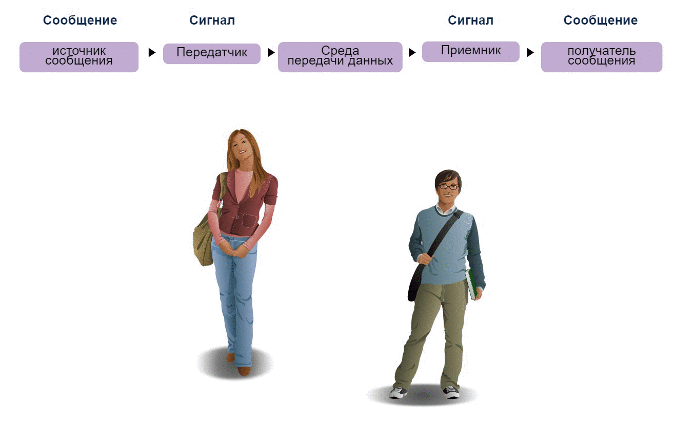

<!--
The figure is an animated representation of communication between a female and a male. Up top are words with right arrows between them: message, message source signal transmitter transmission medium signal receiver, and message, message destination. The animation shows a lightbulb appearing above the female traveling to the male and a lightbulb appear above his head.
-->

### Сеть

Нажмите «Воспроизвести» на рисунке, чтобы просмотреть анимацию взаимодействия двух устройств.

Как показано в анимации, это также верно для компьютерной связи. Подумайте над тем, сколько разных правил или протоколов регулируют способы коммуникации, существующие в современном мире.

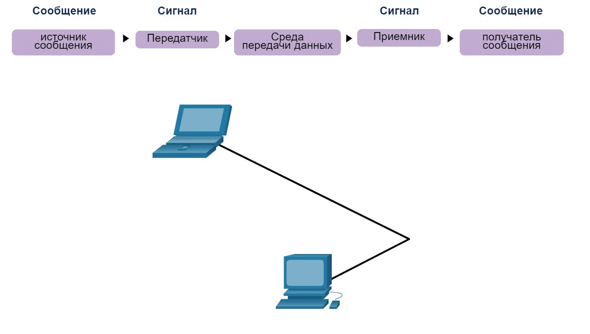

<!--
The figure is an animated representation of communication between a laptop and a p c that have a line between them. Up top are words with right arrows between them: message, message source signal transmitter transmission medium signal receiver, and message, message destination. The animation shows a lightbulb appearing on the laptop display then traveling through an envelope along the wire to the p c and a lightbulb appear within the display of the p c.
-->

<!-- 3.1.4 -->
## Установление правил

Для начала общения друг с другом люди должны использовать установленные правила или соглашения, регулирующие разговор. Рассмотрим это сообщение, например:

```
общение между людьми регламентируется правилами Очень трудно понять сообщения, которые плохо отформатированы или не соблюдают установленные правила и протоколы. Структура грамматики, языка, пунктуации и предложения делает человеческую конфигурацию понятной для многих людей.
```

Обратите внимание, как трудно прочитать сообщение, потому что оно не форматировано должным образом. Оно должно быть написано с использованием правил (т.е. протоколов), необходимых для эффективной коммуникации. В примере показано сообщение, которое теперь правильно отформатировано для языка и грамматики.

```
Коммуникация между людьми подчиняется правилам. Понять сообщения, которые плохо отформатированы или не соблюдают установленные правила и протоколы, очень трудно. Структура грамматики, языка, пунктуации и синтаксиса помогает разным людям понять конфигурацию.
```

Протоколы должны учитывать следующие требования для успешной доставки сообщения, понятного получателю:

* Известные отправитель и получатель;
* Общепринятые язык и грамматика;
* Скорость и время доставки;
* Требования к утверждению или подтверждению;

<!-- 3.1.5 -->
## Требования к сетевому протоколу.

Протоколам, применяемым для связи в сети, свойственны многие из этих фундаментальных особенностей. Помимо адреса источника и места назначения для соответствия упомянутым выше требованиям компьютерные и сетевые протоколы определяют способ передачи сообщения через сеть. Распространенные компьютерные протоколы включают в себя следующие требования:

- Кодирование сообщений
- Форматирование и инкапсуляция сообщений
- Размер сообщений
- Синхронизация сообщений
- Варианты доставки сообщений


<!-- 3.1.6 -->
## Кодирование сообщения

Один из первых этапов отправки сообщения — кодирование. Кодирование — это процесс преобразования информации в форму, приемлемую для последующей передачи. Декодирование — обратный процесс, в результате которого информация преобразуется в исходный вид.

### Аналогия

Представьте, что человек звонит другу, чтобы обсудить детали прекрасного заката. Нажмите Воспроизвести, чтобы просмотреть анимацию кодировки сообщений.

Чтобы передать сообщение, девушка выражает свои мысли на выбранном языке. Она произносит слова, используя звуки и интонацию, чтобы донести сообщение. Друг слушает ее и декодирует звуки, чтобы понять полученное сообщение.

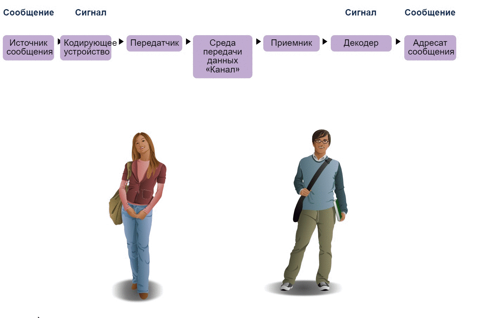

### Сеть

Нажмите Воспроизвести, чтобы просмотреть анимацию кодирования сообщений в компьютерной связи.

Кодировка данных при обмене между узлами должна быть в формате, соответствующем средству подключения. Прежде всего, узел-отправитель преобразует передаваемое по сети сообщение в биты. Каждый бит закодирован в схеме напряжения на медных проводах, инфракрасном свете в оптических волокнах или микроволнах для беспроводных систем. Конечный хост принимает и декодирует сигналы и интерпретирует сообщение.

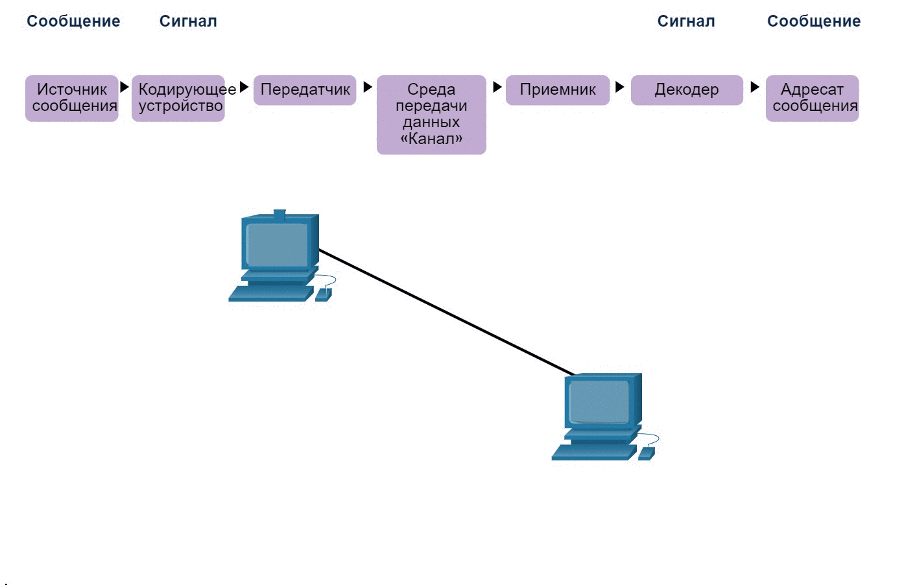

<!-- 3.1.7 -->
## Форматирование и инкапсуляция сообщений

При отправке сообщения от источника к адресату необходимо использовать определенный формат или структуру. Формат зависит от типа сообщения и канала доставки.

### Аналогия

Обычным примером требования правильного формата в человеческом общении является отправка письма. Нажмите кнопку Воспроизведение на рисунке, чтобы просмотреть анимацию форматирования и инкапсуляции письма.

На конверте в специально отведенном месте указывается адрес отправителя и получателя. Если адресат или формат неверен, письмо не дойдет.

Процесс размещения одного формата сообщения (письмо) внутри другого (конверт) называется инкапсуляцией. Деинкапсуляция происходит в тот момент, когда получатель достает письмо из конверта.


<!--
поля пакета IPv6, включая IP-адрес источника и IP-адрес назначения
-->

### Сеть

Для доставки и обработки письма в компьютерной сети необходимо придерживаться определенных правил форматирования.

Internet Protocol (IP) — это протокол с функцией, аналогичной примеру конверта. На рисунке поля пакета протокола Интернета версии 6 (IPv6) определяют источник пакета и его назначение. IP отвечает за отправку сообщения из источника сообщения в пункт назначения по одной или нескольким сетям.

**Примечание**: Поля пакета IPv6 подробно обсуждаются в другом модуле.

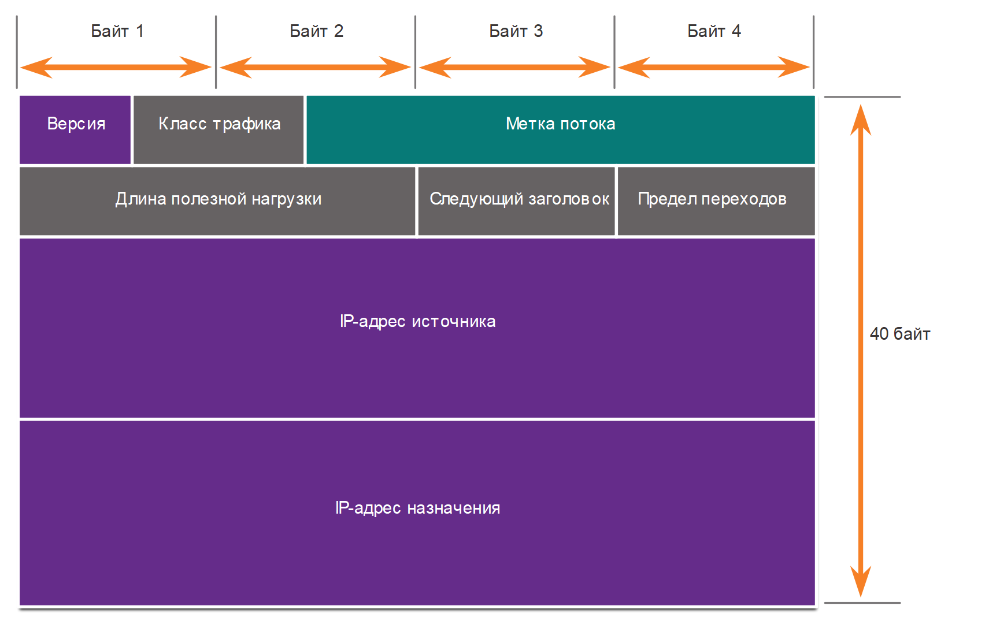
<!-- /courses/itn-dl/aeece080-34fa-11eb-ad9a-f74babed41a6/af1f6230-34fa-11eb-ad9a-f74babed41a6/assets/2db66fc1-1c25-11ea-81a0-ffc2c49b96bc.svg -->

<!--
The figure shows 4 rows of words. Above the rows are 4 uniform sections labeled byte 1 byte 2 byte 3 byte 4. Down the side of the rows there is a line with arrows at both end running from top to bottom labeled 40 bytes. The top row has 3 blocks. The first block is labeled version and its size is half of byte 1. The next block is traffic classes that runs half way between byte 1 and half way through byte 2. The last label is flow label and it uses the rest of the space until the end of byte 4. The second row has 3 sections payload length that runs between bytes 1 and 2, next header which takes up byte 3, and hop limit which takes up byte 4. Row 3 is labeled source i p address and runs across the 4 bytes. Row 4 is labeled destination i p address and runs across the 4 bytes.
-->

<!-- 3.1.8 -->
## Размер сообщений

Еще одно правило коммуникации — это размер сообщения.

### Аналогия

Нажмите кнопку «Воспроизведение» на рисунке, чтобы просмотреть анимацию о размере сообщения при общении лицом к лицу.

В процессе разговора люди делят свои высказывания на более мелкие части, или предложения. Размер этих предложений ограничен тем, сколько принимающее лицо может воспринять за один раз, как показано на рисунке. Это также облегчает для получателя чтение и понимание.

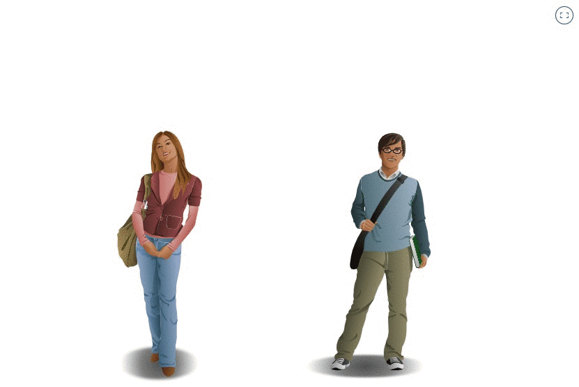

### Сеть

Кодирование используется также при обмене данными с помощью компьютера. Нажмите кнопку Воспроизведение на рисунке, чтобы просмотреть анимацию о размере сообщения в компьютерных сетях.

Кодировка данных при обмене между узлами должна быть в формате, соответствующем средству подключения. Прежде всего хост-отправитель преобразует передаваемое по сети сообщение в биты. Каждый бит кодируется набором звуков, световых волн или электрических импульсов в зависимости от типа средства сетевого подключения. Конечный хост принимает и декодирует сигналы и интерпретирует сообщение.

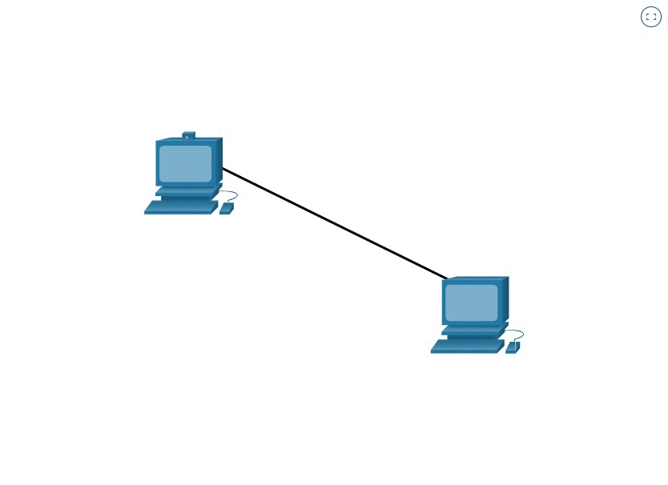

<!-- 3.1.9 -->
## Синхронизация сообщений

Синхронизация  сообщения также очень важны в сетевых коммуникациях. Синхронизация сообщений включает следующее:

* **Управление потоком -** это процесс управления скоростью передачи данных. Управление потоком определяет, сколько информации можно отправить и скорость, с которой она может быть доставлена. Если один человек говорит слишком быстро, другому сложно расслышать и понять сообщение. В сетевой связи существуют сетевые протоколы, используемые устройствами источника и назначения для согласования и управления потоком информации.
* **Время ожидания ответа -** Если человек задает вопрос и не получает ответа за приемлемое время, он предполагает, что ответа не будет, и предпринимает соответствующие действия. Он может повторить вопрос или продолжить разговор. У сетевых хостов также существуют правила, определяющие время ожидания ответа и действие, выполняемое по истечении этого времени.
* **Способ доступа**  - определяет, когда конкретный человек сможет отправить сообщение. Нажмите «Воспроизвести» на рисунке, чтобы увидеть анимацию двух людей, говорящих одновременно, затем происходит «столкновение информации», и им необходимо отступить и начать снова. Аналогичным образом, когда устройство хочет передавать данные по беспроводной локальной сети, необходимо, чтобы сетевая карта WLAN (NIC) определяла, доступен ли беспроводной носитель.

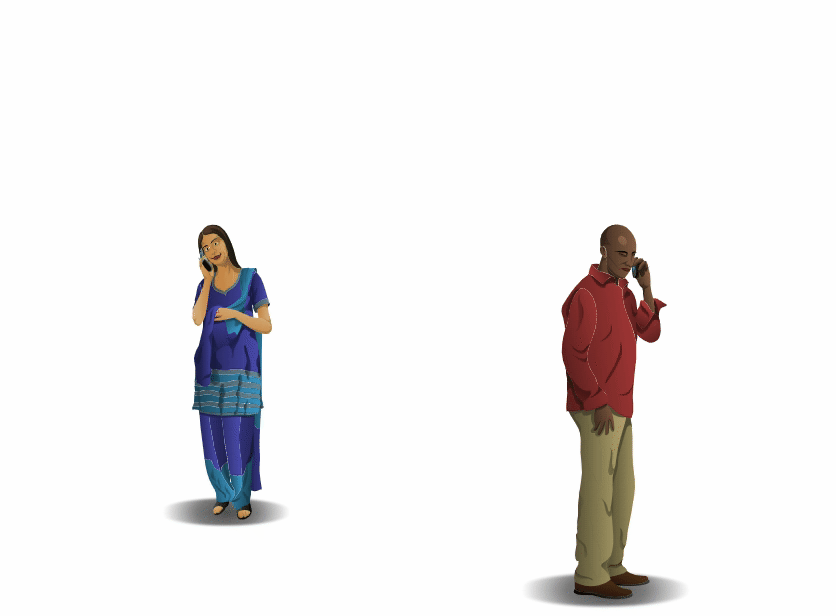

<!--
На анимации изображены женщина и мужчина, говорящие одновременно. Женщина спрашивает, во сколько кино? и человек говорит, когда мы встречаемся на ужин? Потому что они говорили одновременно, не понимали друг друга, и они оба говорят «Извините»? Повтори, пожалуйста.
-->

<!-- 3.1.10 -->
## Варианты доставки сообщений

Сообщение может доставляться разными способами.

### Аналогия

Иногда информацию нужно передать только одному человеку. В других случаях ее нужно одновременно передать группе людей или даже всем жителям определенного района.

Нажмите кнопки одноадресной рассылки, многоадресной рассылки и широковещательной рассылки на рисунке для просмотра примера каждого из них.

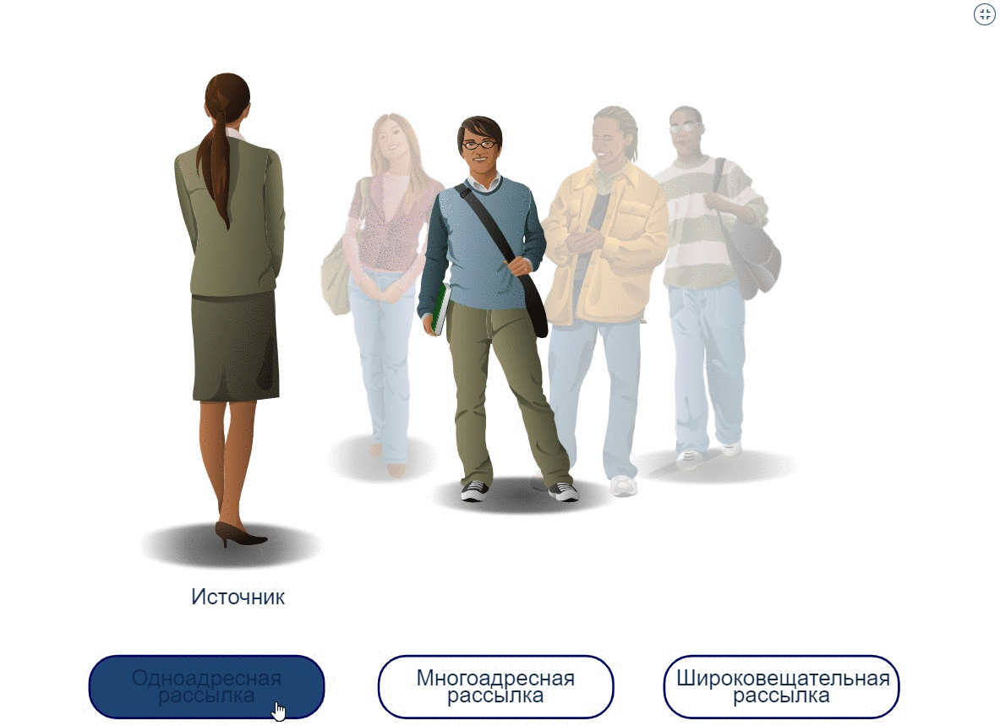

### Сеть

Сетевые коммуникации имеют аналогичные варианты доставки для связи. Как показано на рисунке, существует три типа передачи данных:

* **Одноадресная передача** - информация передается на одно конечное устройство.
* **Многоадресная передача** - информация передается на одно или несколько конечных устройств.
*  **Широковещательная  передача**  - информация передается на все конечные устройства.

Нажмите кнопки одноадресной рассылки, многоадресной рассылки и широковещательной рассылки на рисунке для примера каждого из них.

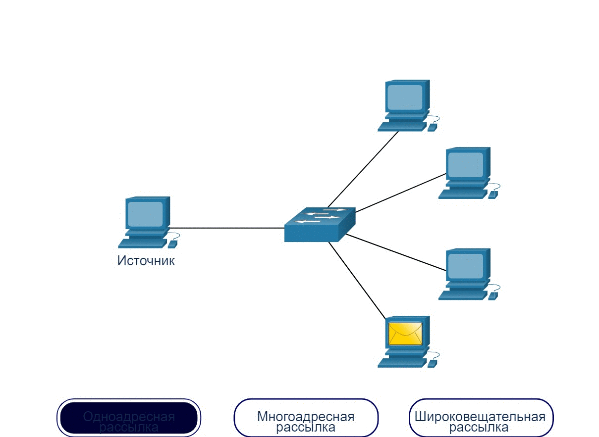

<!-- 3.1.11 -->
## Примечание о значке узлов

Сетевые документы и топологии часто представляют сети и конечные устройства с помощью значка узла. Узлы обычно представлены в виде круга. На рисунке показано сравнение трех различных вариантов доставки с использованием значков узлов вместо значков компьютера.

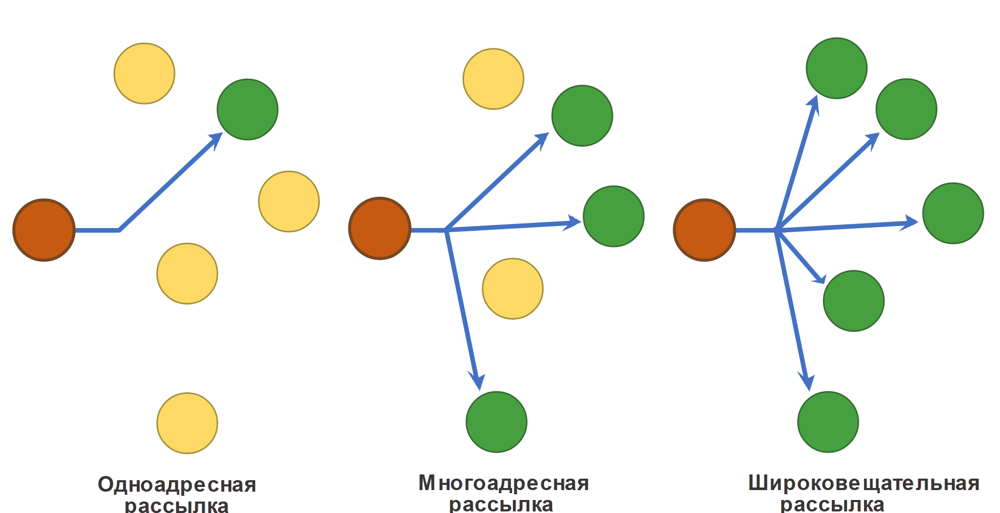
<!-- /courses/itn-dl/aeece080-34fa-11eb-ad9a-f74babed41a6/af1f6230-34fa-11eb-ad9a-f74babed41a6/assets/2db8b9b2-1c25-11ea-81a0-ffc2c49b96bc.svg -->

<!--
На рисунке используются круги, представляющие сетевые узлы, для иллюстрации трех различных вариантов доставки сообщений. Слева направо показаны три топологии. Топология слева изображает одноадресный сообщение и состоит из одного красного узла, одного зеленого узла и четырех желтых узлов. У него есть стрелка от красного узла, ведущая к зеленому узлу. Средняя топология изображает многоадресный сообщение и состоит из одного красного узла, трех зеленых узлов и двух желтых узлов. У него есть стрелка от красного узла, ведущая к каждому из зеленых узлов. Топология справа изображает трансляцию. Он имеет один красный узел и пять зеленых узлов. У него есть стрелка от красного узла, ведущая к каждому из зеленых узлов.
-->

<!-- 3.1.12 -->
<!-- quiz -->

