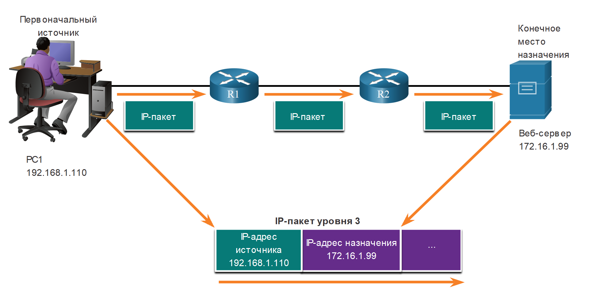
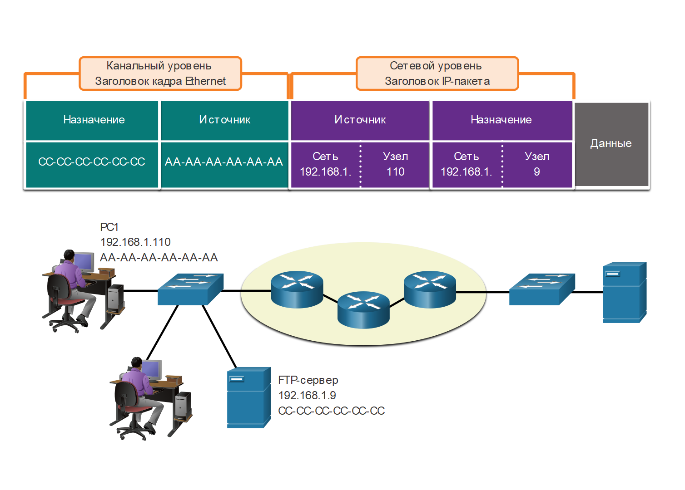
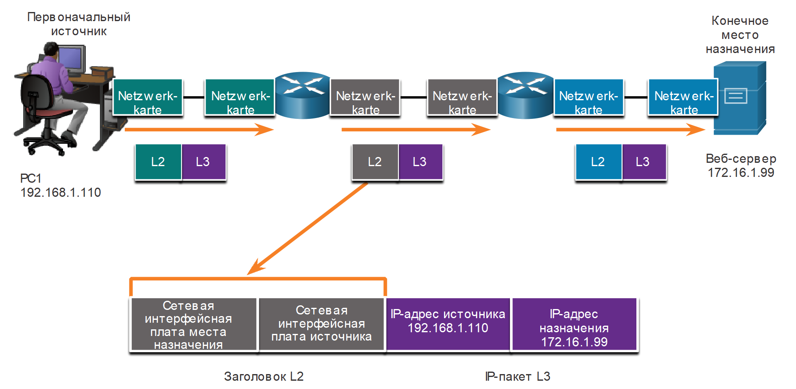

<!-- verified: agorbachev 03.05.2022 -->

<!-- 3.7.1 -->
## Адреса

Как вы только что узнали, необходимо сегментировать сообщения в сети. Но эти сегментированные сообщения никуда не пойдут, если они не будут должным образом адресованы. В этом разделе содержится обзор сетевых адресов. Вы также получите возможность использовать инструмент Wireshark, который поможет вам «просматривать» сетевой трафик.

Сетевой и канальный уровни отвечают за доставку данных с устройства источника на устройство назначения. Как показано на рисунке, протоколы на обоих уровнях содержат адреса источника и места назначения, но эти адреса служат разным целям.

* **Адрес источника и места назначения сетевого уровня** необходим для доставки IP-пакета от источника к месту назначения в той же или в удаленной сети.
* **Адрес источника и места назначения канального уровня** необходим для доставки кадра канала данных от одной сетевой интерфейсной платы (NIC) к другой сетевой интерфейсной плате в той же сети.

<!-- /courses/itn-dl/aeece080-34fa-11eb-ad9a-f74babed41a6/af1fd760-34fa-11eb-ad9a-f74babed41a6/assets/2dc786c2-1c25-11ea-81a0-ffc2c49b96bc.svg -->

<!-- 3.7.2 -->
## IP-адрес (логический адрес 3-го уровня).

IP-адрес — это логический адрес сетевого уровня, необходимый для доставки IP-пакета от источника к месту назначения.

На рисунке ниже показан IP-пакет, перемещающийся из исходного источника в конечный пункт назначения. Исходный источник PC1, показанный слева, с IP-адресом 192.168.1.110. Конечным пунктом назначения является веб-сервер, показанный в крайнем правом углу, с IP-адресом 172.16.1.99. Выводится пакет IP, оставляющий заголовок PC1 маршрутизатору R1. После этого IP-пакет отображается, оставляя маршрутизатор R1 и направляясь к маршрутизатору R2.  После этого IP-пакет выводится из R2 и направляется к веб-серверу. Ниже топологии сети расположена схема заголовка IP-пакета, показывающего 192.168.1.110 в качестве источника и 172.16.1.99 в качестве назначения.

<!-- /courses/itn-dl/aeece080-34fa-11eb-ad9a-f74babed41a6/af1fd760-34fa-11eb-ad9a-f74babed41a6/assets/2dc7d4e3-1c25-11ea-81a0-ffc2c49b96bc.svg -->

IP-пакет содержит два IP-адреса.

* **IP-адрес источника** — IP-адрес устройства-отправителя, изначального источника пакета.
* **IP-адрес назначения** — IP-адрес устройства-получателя, конечного места назначения пакета.

Адреса сетевого уровня, или IP-адреса, представляют собой сетевые адреса источника и места назначения. Это верно, независимо от того, находятся ли источник и адресат в одной и той же IP-сети или в разных IP-сетях.

IP-адрес состоит из двух частей.

* **Сетевая часть IP-адреса** — левая часть адреса, которая указывает на принадлежность IP-адреса к определенной сети. Все устройства в одной сети будут иметь одинаковую сетевую часть адреса.
* **Узловая часть** — оставшаяся часть адреса, которая идентифицирует конкретное устройство в сети. Узловая часть уникальна для каждого устройства в сети.

**Примечание**: Маска подсети (IPv4) или длина префикса (IPv6) используется для идентификации сетевой части IP-адреса из хост-части.

<!-- 3.7.3 -->
## Устройства в одной сети

В данном примере есть клиентский компьютер (PC1), который взаимодействует с файловым сервером (FTP server), находящимся в той же IP-сети.

* **IPv4-адрес источника** - IPv4-адрес устройства-отправителя, клиентского компьютера PC1: 192.168.1.110.
* **IPv4-адрес назначения** - IPv4-адрес устройства-получателя, FTP server: 192.168.1.9.

Обратите внимание, что на рисунке сетевая часть IP-адреса источника и IP-адреса места назначения принадлежат одной сети. Обратите внимание на рисунке, что сетевая часть исходного адреса IPv4 и сетевая часть адреса IPv4 назначения одинаковы и, следовательно, источник и пункт назначения находятся в одной сети.

<!-- /courses/itn-dl/aeece080-34fa-11eb-ad9a-f74babed41a6/af1fd760-34fa-11eb-ad9a-f74babed41a6/assets/2dc84a12-1c25-11ea-81a0-ffc2c49b96bc.svg -->

На рисунке показан заголовок кадра канального уровня Ethernet и заголовок IP-пакета сетевого уровня для информации, поступающей от источника к месту назначения в той же сети. Внизу находится топология сети. Начиная с левой стороны, он состоит из PC1 с IP-адресом 192.168.1.110 и MAC-адресом AA-AA-AA-AA, FTP-сервера с IP-адресом 192.168.1.9 и MAC-адресом CC-CC-CC-CC-CC, а также другого компьютера, подключенного к томуже коммутатору. В середине топологии находится строка из трех маршрутизаторов, к которым подключен коммутатор. Справа находится другой коммутатор, подключенный к серверу. Над топологией находится сообщение, разбитое на его различные компоненты. Он начинается слева с заголовка кадра канала передачи данных Ethernet, показывающего место назначения CC-CC-CC-CC-CC-CC и источник AA-AA-AA-AA-AA.  Далее — заголовок IP-пакета сетевого уровня, показывающий источник 192.168.1 (сеть) 110 (хост) и назначение 192.168.1 (сеть) 9 (хост).  Наконец, данные.

<!-- 3.7.4 -->
## Роль адресов канального уровня: Одна IP-сеть

Если отправитель и получатель IP-пакета находятся в одной и той же сети, кадр канала данных отправляется напрямую принимающему устройству. В сети Ethernet адреса каналов передачи данных известны как адреса управления доступом к среде (MAC) Ethernet, как показано на рисунке.

<!-- /courses/itn-dl/aeece080-34fa-11eb-ad9a-f74babed41a6/af1fd760-34fa-11eb-ad9a-f74babed41a6/assets/2dc8bf42-1c25-11ea-81a0-ffc2c49b96bc.svg -->

MAC-адреса физически присвоены сетевой интерфейсной плате Ethernet.

* **MAC-адрес источника** — это адрес канального уровня, или MAC-адрес Ethernet устройства, отправляющего кадр канала данных с инкапсулированным IP-пакетом. MAC-адрес сетевой интерфейсной платы Ethernet PC1: AA-AA-AA-AA-AA-AA в шестнадцатиричном представлении.
* **MAC-адреса назначения** - Когда принимающее устройство находится в той же сети, что и передающее устройство, это адрес канала передачи данных принимающего устройства. В этом примере MAC-адрес назначения - это MAC-адрес FTP-сервера: CC-CC-CC-CC-CC-CC, написанная шестнадцатеричной записью.

Теперь кадр с инкапсулированным IP-пакетом может быть передан напрямую с PC1 на FTP server.

<!-- 3.7.5 -->
## Устройства в удаленной сети

Какова роль адреса сетевого уровня и адреса канального уровня при взаимодействии устройства с другим устройством в удаленной сети? В данном примере есть клиентский компьютер (PC1), который взаимодействует с сервером (Web Server), находящимся в другой IP-сети.

<!-- 3.7.6 -->
## Роль адресов сетевого уровня

Если отправитель и получатель пакета находятся в разных сетях, IP-адреса источника и места назначения будут представлять узлы в разных сетях. На это будет указывать сетевая часть IP-адреса узла назначения.

* **IPv4-адрес источника** - IPv4-адрес устройства-отправителя, клиентского компьютера PC1: 192.168.1.110.
* **IPv4-адрес назначения** - IPv4-адрес устройства-получателя, Web Server: 172.16.1.99.

Обратите внимание, что на рисунке сетевая часть IP-адреса источника и IP-адреса места назначения принадлежат разным сетям.

<!-- /courses/itn-dl/aeece080-34fa-11eb-ad9a-f74babed41a6/af1fd760-34fa-11eb-ad9a-f74babed41a6/assets/2dc93473-1c25-11ea-81a0-ffc2c49b96bc.svg -->

<!-- 3.7.7 -->
## Роль адресов канального уровня: Разные IP-сети

Если отправитель и получатель IP-пакета находятся в разных сетях, кадр канала данных Ethernet не может быть отправлен напрямую к узлу назначения, поскольку он недоступен в сети отправителя. Кадр Ethernet нужно выслать на другое устройство: маршрутизатор или шлюз по умолчанию. В нашем примере шлюз по умолчанию — R1. R1 имеет адрес канала данных Ethernet в той же сети, что и PC1. Это позволяет PC1 получить доступ к маршрутизатору напрямую.

* **MAC-адрес источника** — MAC-адрес Ethernet отправляющего устройства, PC1. MAC-адрес интерфейса Ethernet на PC1 — AA-AA-AA-AA-AA-AA.
* **MAC-адрес места назначения** — устройство-отправитель использует MAC-адрес Ethernet шлюза по умолчанию или маршрутизатора, если получающее и передающее устройства находятся в разных сетях. В этом примере MAC-адресом места назначения является MAC-адрес интерфейса Ethernet R1 (11-11-11-11-11-11). Это интерфейс, который подключен к той же сети, что и PC1, как показано на рисунке.

<!-- /courses/itn-dl/aeece080-34fa-11eb-ad9a-f74babed41a6/af1fd760-34fa-11eb-ad9a-f74babed41a6/assets/2dc9a9a4-1c25-11ea-81a0-ffc2c49b96bc.svg -->

Кадр Ethernet с инкапсулированным IP-пакетом теперь может быть передан на R1. R1 пересылает пакет к месту назначения (Web Server). Это может означать, что R1 пересылает пакет на другой маршрутизатор или непосредственно на Web Server, если он находится в одной из сетей, подключенных к R1.

Для каждого узла в локальной сети важно правильно настроить IP-адрес основного шлюза. Все пакеты, предназначенные для отправки в удаленную сеть, направляются на шлюз по умолчанию. MAC-адреса Ethernet и шлюз по умолчанию рассматриваются в следующих главах.

<!-- 3.7.8 -->
## Адреса канального уровня

Физический адрес канального уровня (уровня 2) играет другую роль. Назначение адреса канального уровня — доставить кадр канала данных с одного сетевого интерфейса на другой в одной и той же сети.

Прежде чем IP-пакет можно будет отправить по проводной или беспроводной сети, его необходимо инкапсулировать в кадр канала данных для последующего перемещения по физическому средству подключения.

### От узла до маршрутизатора

<!-- /courses/itn-dl/aeece080-34fa-11eb-ad9a-f74babed41a6/af1fd760-34fa-11eb-ad9a-f74babed41a6/assets/2dca45e1-1c25-11ea-81a0-ffc2c49b96bc.svg -->

На рисунке показан заголовок L2 в первом переходе по мере того, как информация поступает от узла в одной сети на сервер в другой сети. Топология сети показывает исходный источник PC1 по адресу 192.168.1.10, подключенный к маршрутизатору, подключенному к другому маршрутизатору, подключенному к конечным веб-серверу назначения по адресу 172.16.1.99. Ниже топологии находится IP-пакет L3 с исходным IP-адресом 192.168.1.110 и конечным IP-адресом 172.16.1.99. Перед пакетом находится заголовок L2 с конечным NIC и исходным NIC. Эти адреса заголовков второго уровня соответствуют NIC исходного источника (PC1) и интерфейсу маршрутизатора следующего узла.

### От маршрутизатор до маршрутизатора

<!-- /courses/itn-dl/aeece080-34fa-11eb-ad9a-f74babed41a6/af1fd760-34fa-11eb-ad9a-f74babed41a6/assets/2dcabb13-1c25-11ea-81a0-ffc2c49b96bc.svg -->

На рисунке показан заголовок L2 в виде потока информации между маршрутизаторами на пути от исходного ПК до конечного сервера назначения. Топология сети показывает исходный источник PC1 по адресу 192.168.1.10, подключенный к маршрутизатору, подключенному к другому маршрутизатору, подключенному к конечным веб-серверу назначения по адресу 172.16.1.99. Ниже топологии находится IP-пакет L3 и заголовок L2, представляющие адресации при перемещении данных между двумя маршрутизаторами.  IP-пакет третьего уровня имеет исходный IP-адрес 192.168.1.110 и конечный IP-адрес 172.16.1.99. Перед пакетом находится заголовок L2 с конечным NIC и исходным NIC. Адреса заголовков L2 соответствуют NIC интерфейсов, соединяющих два маршрутизатора.

### От маршрутизатора до сервера

<!-- /courses/itn-dl/aeece080-34fa-11eb-ad9a-f74babed41a6/af1fd760-34fa-11eb-ad9a-f74babed41a6/assets/2dcba573-1c25-11ea-81a0-ffc2c49b96bc.svg -->

На рисунке показан заголовок L2 в виде потока информации от маршрутизатора на конечный сервер назначения. Топология сети показывает исходный источник PC1 по адресу 192.168.1.10, подключенный к маршрутизатору, подключенному к другому маршрутизатору, подключенному к конечным веб-серверу назначения по адресу 172.16.1.99. Ниже топологии находится IP-пакет L3 и заголовок L2, представляющие адресации по мере перемещения данных с последнего маршрутизатора на конечный пункт назначения.  IP-пакет третьего уровня имеет исходный IP-адрес 192.168.1.110 и конечный IP-адрес 172.16.1.99. Перед пакетом находится заголовок L2 с конечным NIC и исходным NIC. Адреса заголовков L2 совпадают с сетевыми адаптерами интерфейса маршрутизаторов в сети назначения и конечного веб-сервера назначения.

В ходе пересылки IP-пакетов от узла к маршрутизатору, между маршрутизаторами и, наконец, от маршрутизатора к узлу в каждой точке на пути своего следования IP-пакет инкапсулируется в новый кадр канала передачи данных. Каждый кадр канального уровня содержит адрес канала-источника (передавшего этот кадр сетевой платы) и адрес канала назначения (сетевой платы, принимающей этот кадр).

Протокол канального уровня (уровня 2) используется только для доставки пакета между сетевыми интерфейсными платами в одной сети. Маршрутизатор удаляет информацию уровня 2 после получения пакета сетевой интерфейсной платой и добавляет новую информацию канального уровня перед пересылкой пакета другой сетевой интерфейсной плате по пути к месту назначения.

На канальном уровне IP-пакет инкапсулируется в кадр, содержащий следующую информацию канального уровня.

* Адрес источника канального уровня — физический адрес сетевой интерфейсной платы устройства, которое передает пакет.
* Адрес места назначения канального уровня — физический адрес сетевой интерфейсной платы устройства, которое получает пакет. Это адрес ближайшего транзитного маршрутизатора или устройства назначения.

<!-- 3.7.9 -->
## Лабораторная работа: Установка программы Wireshark

Wireshark — это программа для анализа протоколов (анализатор пакетов), которая используется для поиска и устранения неполадок в сети, анализа, разработки программного обеспечения и протоколов, а также обучения. В этом курсе программа Wireshark используется для демонстрации принципов работы сети. В этой лабораторной работе вам нужно будет загрузить и установить программу Wireshark.

[Установка программы Wireshark (lab)](./assets/3.7.9-lab---install-wireshark.pdf)

<!-- 3.7.10 -->
## Лабораторная работа: Использование программы Wireshark для просмотра сетевого трафика

В этой лабораторной работе вы воспользуетесь программой Wireshark для захвата и анализа трафика.

[Использование программы Wireshark для просмотра сетевого трафика (lab)](./assets/3.7.10-lab---use-wireshark-to-view-network-traffic.pdf)

<!-- 3.7.11 -->
<!-- quiz -->

