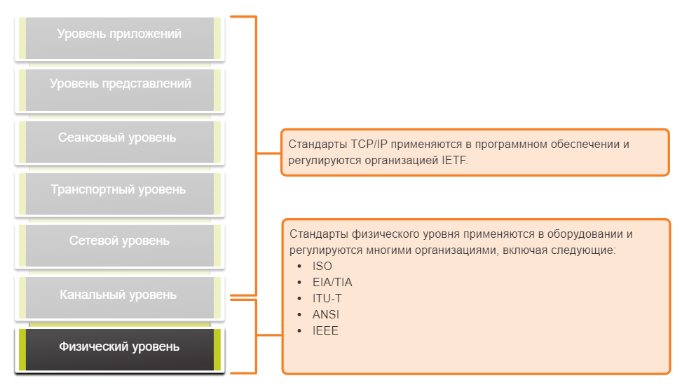
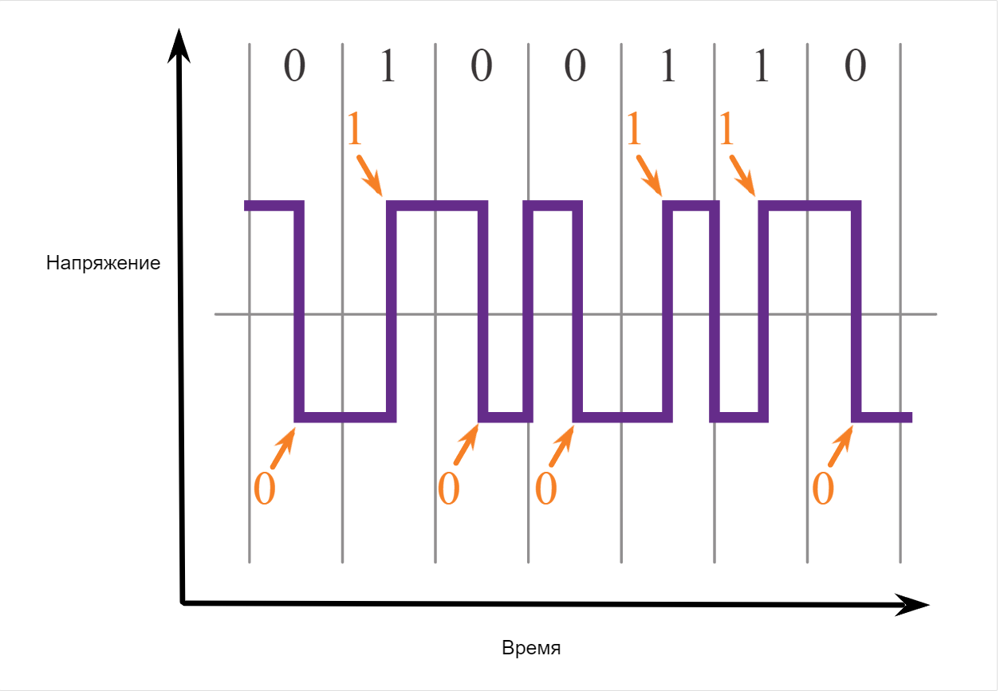
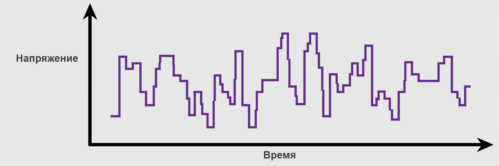
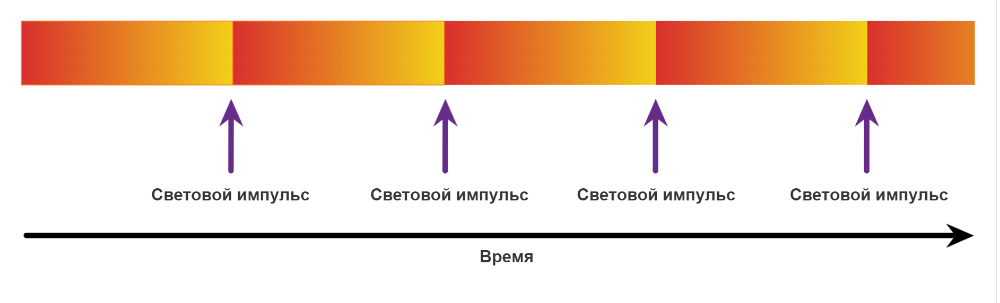
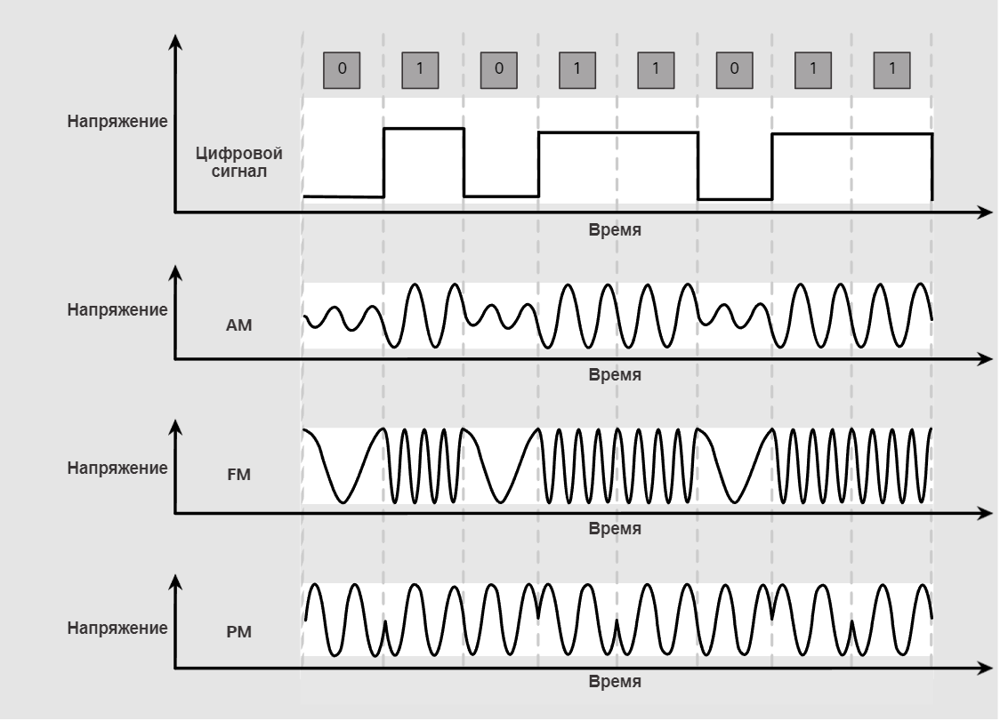

# Характеристики физического уровня

<!-- 4.2.1 -->
## Стандарты физического уровня

В предыдущей теме вы получили общий обзор физического уровня и его места в сети. В этой теме мы немного глубже погружается в специфику физического уровня. Мы рассмотрим компоненты и носители, используемые для построения сети, а также стандарты, необходимые для того, чтобы все работало вместе.

Протоколы и операции вышестоящих уровней модели OSI реализованы в программном обеспечении, созданном разработчиками программного обеспечения и компьютерными специалистами. Службы и протоколы в стеке протоколов TCP/IP определяются Инженерной группой по развитию Интернета (IETF).

Физический уровень состоит из электронных схем, средств подключения и разъемов, разрабатываемых инженерами. Поэтому закономерно, что стандарты, регламентирующие это оборудование, определяются соответствующими организациями по электротехнике и связи.

В создании и реализации стандартов физического уровня участвует целый ряд различных международных и национальных организаций, правительственных регулирующих организаций, а также частных компаний. Например, стандарты на оборудование, средства подключения, кодирование и сигналы физического уровня разрабатывают следующие организации.

* Международная организация по стандартизации (ISO)
* Ассоциация телекоммуникационной промышленности/Ассоциация электронной промышленности (TIA/EIA)
* Международный союз электросвязи (ITU)
* Американский национальный институт стандартизации (ANSI)
* Институт инженеров по электротехнике и электронике (IEEE)
* Региональные органы регулирования телекоммуникаций, в том числе Федеральная комиссия по связи (FCC) в США и Европейский институт телекоммуникационных стандартов (ETSI).

Кроме этого, нередко местные спецификации разрабатываются региональными группами по кабельным стандартам, например CSA (Канадская ассоциация по стандартизации), CENELEC (Европейский комитет электротехнической стандартизации) и JSA/JIS (Японская ассоциация по стандартизации).

<!-- /courses/itn-dl/aeece082-34fa-11eb-ad9a-f74babed41a6/af202580-34fa-11eb-ad9a-f74babed41a6/assets/2dd3bbc2-1c25-11ea-81a0-ffc2c49b96bc.svg -->

<!--

-->

<!-- 4.2.2 -->
## Физические компоненты

Стандарты физического уровня регламентируют три функциональные области.

* Физические компоненты
* Кодирование
* Способы передачи сигналов

**физические компоненты**

Физические компоненты — это электронные устройства, средства подключения, а также другие соединители и разъемы, обеспечивающие передачу сигналов, с помощью которых представлены биты информации. Все аппаратные компоненты, в том числе сетевые интерфейсные платы (NIC), интерфейсы и соединители, а также материалы и конструкция кабелей описаны в стандартах, относящихся к физическому уровню. Различные порты и интерфейсы маршрутизатора Cisco 1941 также являются примерами физических компонентов, разъемы и схемы подключения контактов, для которых определяются стандартами.

<!-- 4.2.3 -->
## Кодирование

Кодирование (физическое кодирование) — это способ преобразования потока битов в определенный «код». Коды — это группы битов, используемые для формирования предсказуемых комбинаций, которые могут распознаваться как отправителем, так и получателем. Другими словами, кодирование — это способ или шаблон, используемые для представления цифровой информации, Это аналогично тому, как азбука Морзе кодирует сообщения с помощью серии точек и тире.

Например, при манчестерском кодировании нули будут представлены переходом от высокого напряжения к низкому; а единицы — переходом от низкого напряжения к высокому. Пример манчестерского кодирования показан на рисунке. Переход состояний сигнала происходит в середине каждого битового интервала. Этот тип кодирования применяется в ранних модификациях Ethernet со скоростью 10 Мбит/с. Для более высоких скоростей передачи требуется более сложное кодирование. Манчестерское кодирование используется в более старых стандартах Ethernet, таких как 10BASE-T. В семействе Ethernet 100BASE-X используется кодирование 4B/5B, а в 1000BASE-X — 8B/10B.

<!-- /courses/itn-dl/aeece082-34fa-11eb-ad9a-f74babed41a6/af202580-34fa-11eb-ad9a-f74babed41a6/assets/2dd430f0-1c25-11ea-81a0-ffc2c49b96bc.svg -->

Переход состояний сигнала происходит в середине каждого битового интервала.

<!--
Изображение представляет собой линейный график напряжения во времени, изображающий манчестерское кодирование потока из семи бит. Горизонтальные линии, расположенные равномерно друг от друга, представляют битовые периоды. Существует также вертикальная линия, нарисованная на полпути вверх по оси y, используемой в качестве опорной точки.  По мере отправки потока битов (сигнала) происходит падение и повышение уровней напряжения в середине каждого битового периода. Если бит является двоичным нулем, то напряжение падает в середине. Если бит двоичный, то напряжение поднимается посередине. Переданы биты 0100110.
-->

<!-- 4.2.4 -->
## Способы передачи сигналов

Для представления значений битов «1» и «0» в среде передачи физический уровень должен генерировать электрические, оптические или радиосигналы. Метод представления битов с помощью сигналов называется способом передачи сигналов. Стандарты физического уровня должны определять, какой тип сигнала соответствует единице («1»), а какой нулю («0»). Для передачи сигнала можно использовать простое изменение длительности электрического или оптического импульса. Например, длинный импульс может представлять 1, тогда как короткий импульс может представлять 0.

Это аналогично способу сигнализации, используемому в азбуке Морзе, который может включать серию тонов включения-выключения, световых сигналов или щелчков для отправки текста по телефонным проводам или между судами в море.

Цифры отображают сигнализацию

### Медный кабель

**Электрические сигналы по медному кабелю**

<!-- /courses/itn-dl/aeece082-34fa-11eb-ad9a-f74babed41a6/af202580-34fa-11eb-ad9a-f74babed41a6/assets/2dd47f11-1c25-11ea-81a0-ffc2c49b96bc.svg -->

<!--
график напряжения с течением времени, показывающий квадрат волн с различными уровнями пиков и желобов
-->

### Оптоволоконный кабель

**Световые импульсы по оптоволоконному кабелю**

<!-- /courses/itn-dl/aeece082-34fa-11eb-ad9a-f74babed41a6/af202580-34fa-11eb-ad9a-f74babed41a6/assets/2dd4f441-1c25-11ea-81a0-ffc2c49b96bc.svg -->

<!--
график четырех световых импульсов с течением времени, показывающий снижение интенсивности света после каждого
-->

### Беспроводные среды передачи данных

**Микроволновые сигналы по беспроводной среде**

<!-- /courses/itn-dl/aeece082-34fa-11eb-ad9a-f74babed41a6/af202580-34fa-11eb-ad9a-f74babed41a6/assets/2dd56970-1c25-11ea-81a0-ffc2c49b96bc.svg -->

<!--
На рисунке показаны четыре отдельных графика, каждый из которых имеет напряжение во времени. Верхний график показывает цифровой сигнал с квадратными волнами, изображающими передачу битов 01011011. Ниже приведен график синусоидальной волны AM. Ниже приведен график FM синусоидальной волны. Ниже приведен график синусоидальной волны PM.
-->

<!-- 4.2.5 -->
## Пропускная способность

Разные физические средства подключения поддерживают различные скорости передачи битов. Основной характеристикой передачи данных является пропускная способность (bandwidth). Пропускная способность (bandwidth) — это количественная характеристика, отражающая возможности передачи данных по конкретному средству подключения. В цифровых сетях под пропускной способностью понимается объем данных, который можно передать из одной точки в другую за определенное время. Обычно пропускная способность измеряется в килобитах в секунду (Кбит/с), мегабитах в секунду (Мбит/с) или гигабитах в секунду (Гбит/с). Иногда под пропускной способностью понимают скорость доставки битов, хотя это не совсем точно. Например, и в сети Ethernet 10 Мбит/с, и в сети Ethernet 100 Мбит/с биты передаются со скоростью распространения электрического сигнала. Разница заключается в количестве битов, передаваемых в секунду.

Фактическая пропускная способность сети определяется сочетанием следующих факторов.

* Свойства физических средств подключения
* Технологии передачи и обнаружения сигналов в сети.

На реальную пропускную способность влияют свойства физических средств подключения, используемые технологии и законы физики.

В следующей таблице приведены наиболее часто используемые единицы измерения пропускной способности.

| **Единица пропускной способности** | **Сокращение** | **Эквивалентность** |
| --- | --- | --- |
| Биты в секунду | бит/с | 1 бит/с = основная единица пропускной способности |
| Килобиты в секунду | кбит/с | 1 Кбит/с = 1000 бит/с = 103 бит/с |
| Мегабиты в секунду | Мбит/с | 1 Мбит/с = 1 000 000 бит/с = 106 бит/с |
| Гигабиты в секунду | Гбит/с | 1 Гбит/с = 1,000,000,000 bps = 109 бит/с |
| Терабиты в секунду | Тбит/с | 1 Тбит/с = 1,000,000,000,000 бит/с = 1012 бит/с |

<!-- 4.2.6 -->
## Терминология пропускной способности

Термины, используемые для измерения качества полосы пропускания, включают:

* Задержка;
* Производительность (throughput);
* Полезная пропускная способность.

**задержка**

Задержки в сети оказывают влияние на итоговое время, необходимое для доставки данных из одной точки в другую.

Производительность сети, состоящей из нескольких сетей или нескольких сегментов, не может превышать скорость самого медленного соединения между источником и получателем. Даже если все или большинство сегментов имеют высокую пропускную способность, один-единственный сегмент с низкой производительностью создаст узкое место и производительность всей сети будет снижена.

**производительность**

Производительность (throughput) — это количество битов, передаваемых по средствам подключения за определенный период времени.

Из-за множества факторов производительность (throughput) обычно не соответствует заявленной пропускной способности (bandwidth) в реализациях на физическом уровне. Производительность способность обычно ниже, чем пропускная способность. Есть три фактора, которые влияют на производительность:

* Объем трафика
* Тип трафика
* Суммарная задержка, зависящая от количества сетевых устройств между источником и пунктом назначения.

Существует множество веб-сервисов проверки скорости, позволяющих узнать реальную производительность интернет-соединения. На рисунке показан пример результата тестирования скорости.

**Полезная пропускная способность**

Существует также третий параметр, характеризующий передачу полезных данных, который называется полезной пропускной способностью (goodput). Полезная пропускная способность — это объем полезных данных, передаваемых за определенный период времени. Полезная пропускная способность (goodput) равна производительности (throughput) за вычетом служебного трафика, необходимого для создания сеансов, подтверждений, инкапсуляции и повторной передачи битов. Полезная пропускная способность (goodput) всегда ниже производительности, которая, как правило, ниже пропускной способности.

<!-- /courses/itn-dl/aeece082-34fa-11eb-ad9a-f74babed41a6/af202580-34fa-11eb-ad9a-f74babed41a6/assets/2dd62cc3-1c25-11ea-81a0-ffc2c49b96bc.svg -->

<!--
мера измерения Мбит/с находится в диапазоне от 0 до 100 Мбит/с с дисплеем, показывающим скорость загрузки 80,78 Мбит/с, и другим дисплеем, показывающим скорость загрузки 8,78 Мбит/с.
-->

<!-- 4.2.7 -->
<!-- quiz -->

