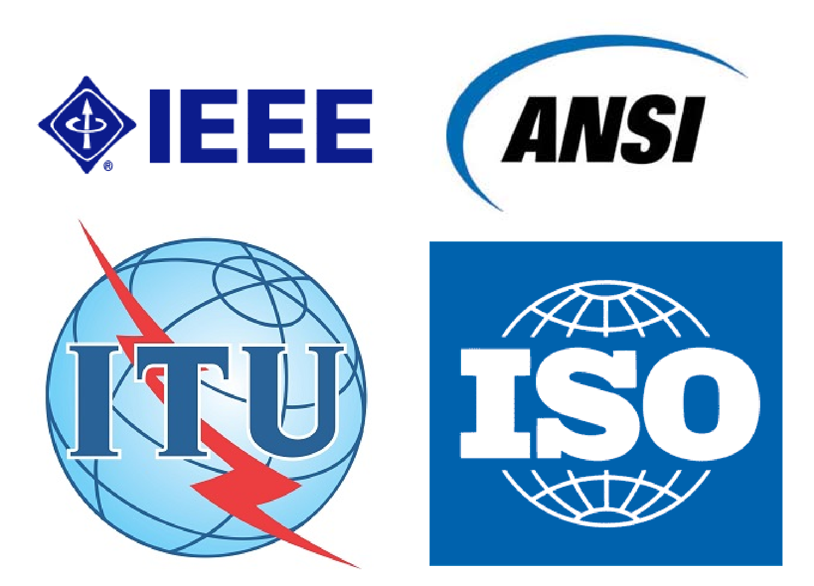

<!-- verified: agorbachev 03.05.2022 -->

<!-- 6.1.1 -->
## Канальный уровень

Как показано на рисунке, канальный уровень модели OSI (Уровень 2) подготавливает сетевые данные для физической сети Уровень канала передачи данных отвечает за связь между сетевыми интерфейсными картами (NIC). Канальный уровень выполняет следующие функции:

* Обеспечение доступа вышестоящих уровней к среде подключения. Протокол верхнего уровня полностью не знает тип среды, которая используется для пересылки данных.
* Принимает данные, обычно пакеты уровня 3 (например, IPv4 или IPv6), и инкапсулирует их в кадры уровня 2.
* Управление передачей и приемом данных в среде передачи данных.
* Обмен кадрами между узлами по физическим среде сетевого подключения.
* Получает инкапсулированные данные, обычно пакеты уровня 3, и направляет их на соответствующий протокол верхнего уровня.
* Обнаружение ошибок и отклонение любого поврежденного кадра.

<!-- /courses/itn-dl/aeed0790-34fa-11eb-ad9a-f74babed41a6/af20e8d0-34fa-11eb-ad9a-f74babed41a6/assets/2ded8551-1c25-11ea-81a0-ffc2c49b96bc.svg -->

В компьютерных сетях термин узел — это устройство, которое может принимать, создавать, хранить или пересылать данные по каналам связи. Узел может быть конечным устройством, таким как ноутбук или мобильный телефон, или промежуточным устройством, таким как коммутатор Ethernet.

Если бы канального уровня не существовало, протоколы сетевого уровня, например IP, должны были бы обеспечивать соединение для всех типов средств подключения, которые могли встретиться на пути следования пакета. Более того, протоколу IP пришлось бы каждый раз адаптироваться к новой сетевой технологии или среде.

На рисунке показан пример того, как канальный уровень передачи данных добавляет сведения о адресате Ethernet уровня 2 и источнике NIC в пакет уровня 3. Затем он преобразует эту информацию в формат, поддерживаемый физическим уровнем (уровень 1).

<!-- /courses/itn-dl/aeed0790-34fa-11eb-ad9a-f74babed41a6/af20e8d0-34fa-11eb-ad9a-f74babed41a6/assets/2dedfa81-1c25-11ea-81a0-ffc2c49b96bc.svg -->

<!-- 6.1.2 -->
## Подуровни канала передачи данных

Стандарт IEEE 802 LAN/MAN специфичен для сетей Ethernet, беспроводных локальных сетей (WLAN), беспроводных персональных сетей (WPAN) и других типов локальных и городских сетей. Уровень канала данных IEEE 802 LAN/MAN состоит из следующих двух подуровней:

* **Управление логическим соединением (Logical Link Control, LLC)** - Этот подуровень IEEE 802.2 взаимодействует между сетевым программным обеспечением на верхних слоях и аппаратным обеспечением устройства на нижних слоях. Он помещает в кадр информацию, указывающую, какой протокол сетевого уровня используется для данного кадра. Данная информация позволяет различным протоколам 3-го уровня, таким как IPv4 и IPv6, использовать один и тот же сетевой интерфейс и одно и то же средство подключения.
* **Управление доступом к среде (Media Access Control, MAC)**   — этот подуровень (IEEE 802.3, 802.11 или 802.15) определяет процессы доступа к среде, выполняемые оборудованием. Он отвечает за инкапсуляцию данных и управление доступом к среде передачи данных. Он обеспечивает адресацию уровня передачи данных и интегрирован с различными технологиями физического уровня.

На рисунке показаны два подуровня (LLC и MAC) канального уровня.

<!-- /courses/itn-dl/aeed0790-34fa-11eb-ad9a-f74babed41a6/af20e8d0-34fa-11eb-ad9a-f74babed41a6/assets/2deebdd0-1c25-11ea-81a0-ffc2c49b96bc.svg -->

Подуровень LLC использует данные сетевых протоколов, которые обычно представлены в виде IPv4 или IPv6 пакета, и добавляет управляющую информацию 2 уровня для доставки пакета к узлу назначения. 

Подуровень MAC управляет сетевым адаптером NIC и другим оборудованием, отвечающим за отправку и получение данных на проводном или беспроводном носителе LAN/MAN.

Подуровень MAC обеспечивает инкапсуляцию данных:

* **Разделение кадра:**  процесс формирования кадров предоставляет важные разделители для идентификации полей в кадре. Эти разграничивающие биты обеспечивают синхронизацию между передающими и получающими узлами.
* **Адресация:**  обеспечивает адресацию источника и назначения для переноса кадра уровня 2 между устройствами в одной и той же общей среде.
* **Обнаружение ошибок:**  каждый кадр содержит концевик, позволяющий выявлять ошибки передачи.

Подуровень MAC также обеспечивает контроль доступа к среде передачи данных, позволяя нескольким устройствам обмениваться данными через общую (полудуплексную) среду передачи. Полнодуплексная связь не требует контроля доступа.

<!-- 6.1.3 -->
## Предоставление доступа к среде

Все сетевые среды, по которым проходят пакеты в ходе передачи от локального узла до удаленного, могут иметь разные характеристики. Например, локальная сеть Ethernet состоит из множества узлов, конкурирующих за доступ к средству подключения. Подуровень MAC решает это. По последовательным каналам метод доступа может состоять только из прямого соединения только между двумя устройствами, обычно двумя маршрутизаторами. Поэтому они не требуют методов, используемых подуровнем IEEE 802 MAC.

Интерфейсы маршрутизатора инкапсулируют пакет в соответствующий кадр. Для доступа к каждому каналу используется подходящий метод управления доступом к среде передачи данных. При любом обмене пакетами сетевого уровня возможны многократные переходы между канальным уровнем и средой.

На каждом переходе по пути маршрутизатор выполняет следующие функции уровня 2:

1.  Принимает кадр из среды;
2.  Деинкапсулирует кадр;
3.  Повторно инкапсулирует пакет в новый кадр;
4.  Передает новый кадр, который соответствует среде данного сегмента физической сети.

Показанный на анимации маршрутизатор имеет интерфейс Ethernet для подключения к локальной сети (LAN) и последовательный интерфейс для подключения к глобальной сети (WAN). В ходе обработки кадров маршрутизатор использует службы канального уровня, чтобы получить кадр из среды подключения, деинкапсулировать его в единицу данных протокола (PDU) уровня 3, повторно инкапсулировать PDU в новый кадр и поместить кадр в среду подключения следующего сегмента сети.

<!-- 6.1.4 -->
## Стандарты канального уровня

В отличие от протоколов верхних уровней стека TCP/IP протоколы канального уровня, как правило, не определяются документами RFC (Request for Comments, RFC). Несмотря на то, что Инженерная группа по развитию Интернета (IETF) поддерживает функциональные протоколы и службы для стека протоколов TCP/IP на верхних уровнях, IETF не определяет функции и принципы работы уровня доступа к сети для этой модели.

Определением открытых стандартов и протоколов, применимых к канальному уровню доступа (т.е. физический уровень OSI и канальный уровень), занимаются следующие организации:

* Институт инженеров по электротехнике и электронике (IEEE);
* Международный союз электросвязи (ITU);
* Международная организация по стандартизации (ISO);
* Американский национальный институт стандартизации (ANSI).

Логотипы этих организаций показаны на рисунке.

### Логотипы инженерных организаций

<!-- /courses/itn-dl/aeed0790-34fa-11eb-ad9a-f74babed41a6/af20e8d0-34fa-11eb-ad9a-f74babed41a6/assets/2deff656-1c25-11ea-81a0-ffc2c49b96bc.svg -->

<!-- 6.1.5 -->
<!-- quiz -->

