# Топологии

<!-- 6.2.1 -->
## Физическая и логическая топология

Вы узнали из предыдущей темы, что канальный уровень подготавливает сетевые данные для физической сети. Он должен знать логическую топологию сети, чтобы иметь возможность определить, что необходимо для передачи кадров с одного устройства на другое. В этом разделе объясняется, как канальный уровень связи данных работает с различными логическими топологиями сети.

Топология сети описывает расположение или взаимосвязь сетевых устройств, а также соединения между ними.

Существует два типа топологий, используемых при описании сетей LAN и WAN:

* **Физическая топология** – Этот термин относится к физическим соединениям и определяет, каким образом соединяются друг с другом оконечные устройства и устройства сетевой инфраструктуры, такие как маршрутизаторы, коммутаторы и точки беспроводного доступа. Топология может также включать определенное местоположение устройства, например номер комнаты и местоположение на стойке оборудования. Физическая топология чаще всего организована по схеме «точка-точка» или «звезда».
* **Логическая топология** – Термин, используемый для описания путей передачи кадров между узлами. Эта топология определяет виртуальные подключения с использованием интерфейсов устройств и схем IP-адресации уровня 3.

При управлении доступом данных к среде канальный уровень «видит» логическую топологию сети. Именно логическая топология влияет на выбор типа кадрирования в сети и управления доступом к среде.

На рисунке отображается образец **физической** топологии для небольшой выборки сети.

### Физическая топология

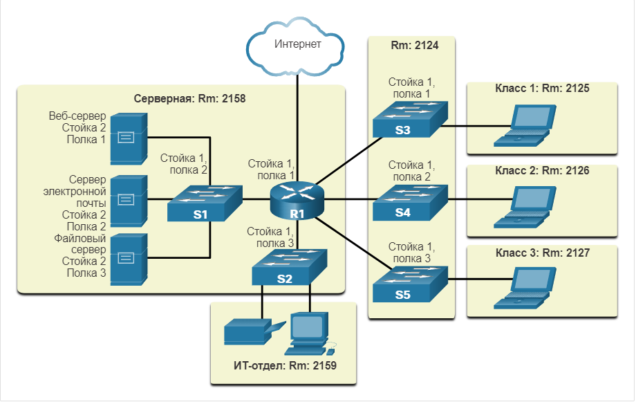
<!-- /courses/itn-dl/aeed0790-34fa-11eb-ad9a-f74babed41a6/af210fe0-34fa-11eb-ad9a-f74babed41a6/assets/2df1f223-1c25-11ea-81a0-ffc2c49b96bc.svg -->

<!--
Топология физической сети показывает шесть комнат, каждая из которых выделена светло-желтым прямоугольником, с различными сетевыми устройствами и кабелями.  С левой стороны находится серверная комната с надписью комната 2158.  Он содержит маршрутизатор с маркировкой R1, установленный на полке 1 стойки 1 с шестью кабельными соединениями.  Кабель в верхней части подключается к облаку с надписью Интернет.  Кабель слева подключается к коммутатору с надписью S1, установленному на полке 2 стойки 1.  S1 подключен к трем серверам: веб-серверу, установленному на полке 1 стойки 2, почтовому серверу, установленному на полке 2 стойки, и файловому серверу, установленному на полке 3 стойки 2. Кабель, подключенный к нижней части R1, подключается к коммутатору с пометкой S2 установлен на стойке 1 полка 3.  S2 имеет два соединения, ведущие к принтеру и ПК в ИТ-офисе с пометкой комната 2159.  R1 имеет три кабеля справа, подключенных к трем коммутаторам, расположенным в комнате 2124.  Верхний коммутатор имеет маркировку S3 и установлен на полке 1 стойки 1.  Средний переключатель имеет маркировку S4 и установлен на стойке 1 полка 2.  Нижний выключатель имеет маркировку S5 и установлен на стойке 1 полка 3.  S3 имеет кабель слева подключен к ноутбуку в комнате класса 1 комната 2125.  S4 имеет кабель слева подключен к ноутбуку в комнате класса 2 комната 2126.  S5 имеет кабель слева подключен к ноутбуку в комнате класса 3 комната 2127.
-->

На следующем рисунке показан пример **logical** топологии для той же сети.

### Логическая топология

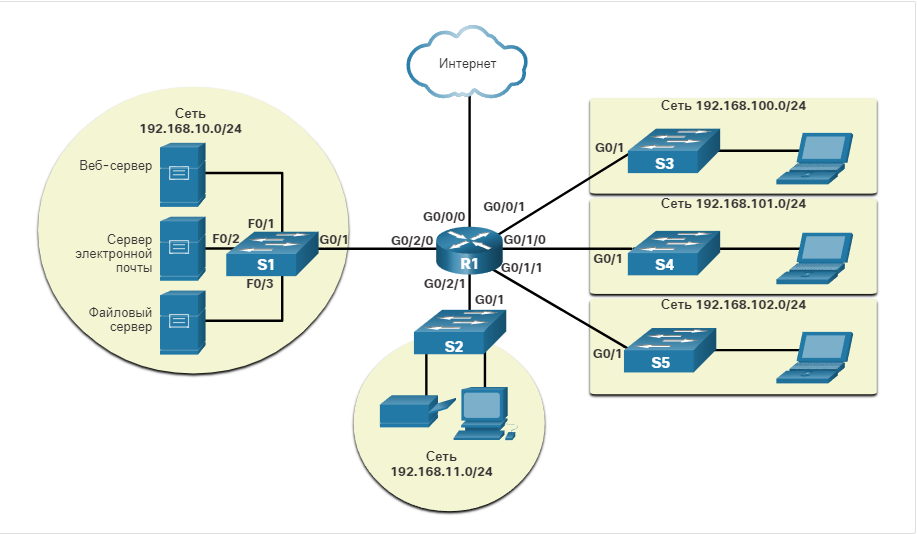
<!-- /courses/itn-dl/aeed0790-34fa-11eb-ad9a-f74babed41a6/af210fe0-34fa-11eb-ad9a-f74babed41a6/assets/2df26750-1c25-11ea-81a0-ffc2c49b96bc.svg -->

<!--
В логической топологии сети отображаются устройства, метки портов и схема сетевой адресации.  В середине изображения находится маршрутизатор с надписью R1.  Порт с надписью G0/0/0 подключается к облаку в верхней части помеченного Интернета.  Порт с надписью G0/2/0 подключается слева к коммутатору с надписью S1 на порту G0/1.  S1 подключен к трем серверам.  S1 и серверы подсвечены светло-желтым кругом с сетью 192.168.10.0/24, написанной вверху.  Порт F0/1 на S1 подключается к веб-серверу.  Порт F0/2 на S1 подключается к почтовому серверу.  Порт F0/3 на S1 подключается к файловому серверу.  Порт G0/0/1 на R1 соединяется внизу к коммутатору с надписью S2.  S2 подключается к принтеру и ПК, все из которых выделены в светло-желтый круг с сетью 192.168.11.0/24, написанной внизу.  Справа от R1 расположены три дополнительных соединения, каждое из которых подключается к коммутатору на порту G0/1, который затем подключается к ноутбуку на порту F0/1. Каждый коммутатор и ноутбук выделены желтым цветом, а сетевой адрес отображается.  Порт G0/0/1 R1 подключается вверху к коммутатору с меткой S3 в сети 192.168.100.0.  Порт G0/1/0 R1 соединяется посередине с коммутатором S4 в сети 192.169.101.0.  Порт G0/1/1 на R1 подключается внизу к коммутатору с надписью S5 в сети 192.168.102.0. R1 подключается к Интернету по интерфейсу G0/0/0.
-->

<!-- 6.2.2 -->
## Топологии глобальных сетей (WAN)

На рисунках показаны три общие физические топологии WAN.

### Точка-точка (point-to-point)

Это самая простая и распространенная топология WAN. Она представляет собой постоянное соединение между двумя оконечными устройствами.

<!-- /courses/itn-dl/aeed0790-34fa-11eb-ad9a-f74babed41a6/af210fe0-34fa-11eb-ad9a-f74babed41a6/assets/2df30391-1c25-11ea-81a0-ffc2c49b96bc.svg -->

<!--
На рисунке показаны два маршрутизатора с одной линией, представляющие связь, соединяющую их.
-->

### Топология типа «звезда»

Версия звездообразной топологии для глобальной сети, в которой центральный узел соединен с периферийными с помощью соединений «точка-точка». Сайты филиалов не могут обмениваться данными с другими сайтами филиалов без прохождения центрального сайта.

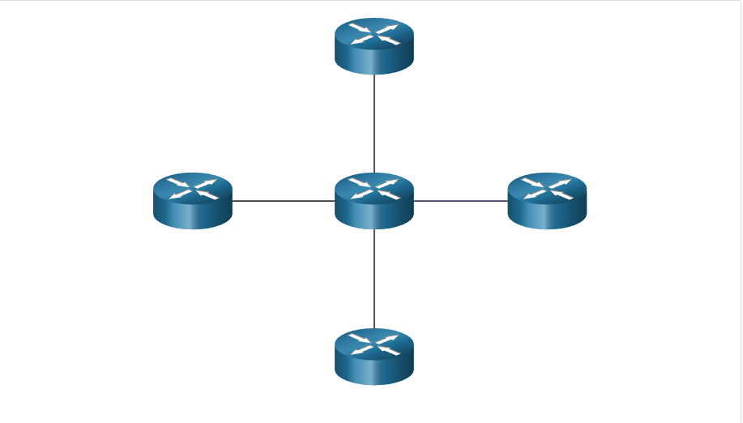
<!-- /courses/itn-dl/aeed0790-34fa-11eb-ad9a-f74babed41a6/af210fe0-34fa-11eb-ad9a-f74babed41a6/assets/2df32aa0-1c25-11ea-81a0-ffc2c49b96bc.svg -->

<!--
На изображении показаны пять маршрутизаторов. Один маршрут в середине соединен четырьмя линиями, представляющими четыре канала, с другими четырьмя маршрутизаторами.
-->

### Ячеистая

Эта топология обеспечивает высокий уровень доступности, но требует, чтобы каждая оконечная система была связана со всеми остальными системами. Поэтому административные и физические расходы могут быть весьма значительными. Каждый канал в такой сети фактически является каналом, связанным с другим узлом соединением «точка-точка».

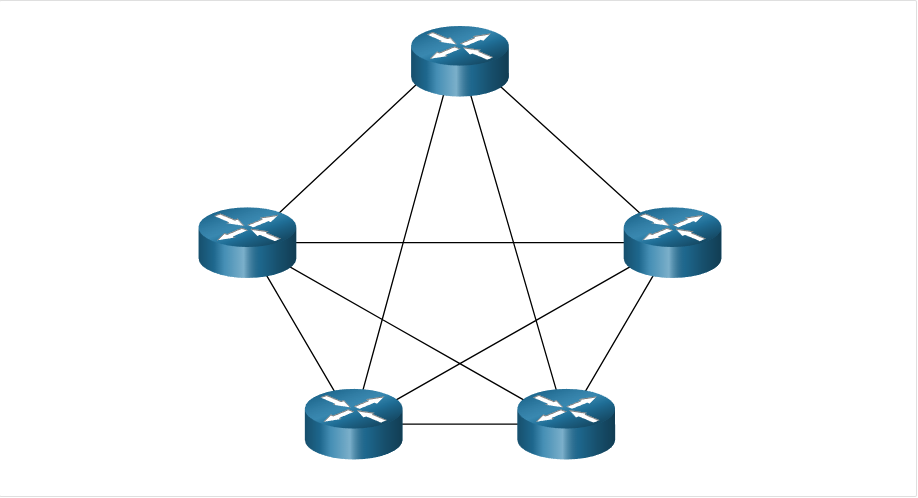
<!-- /courses/itn-dl/aeed0790-34fa-11eb-ad9a-f74babed41a6/af210fe0-34fa-11eb-ad9a-f74babed41a6/assets/2df32aa4-1c25-11ea-81a0-ffc2c49b96bc.svg -->

<!--
На изображении показаны пять маршрутизаторов. Каждый маршрутизатор имеет четыре линии, представляющие четыре канала, к каждому из четырех других маршрутизаторов. Существует в общей сложности десять линий (каналов), соединяющих все пять маршрутизаторов друг с другом.
-->

Гибрид — это вариант или сочетание каких-либо из топологий. Например, частично-ячеистая сеть — это гибридная топология, в которой соединены некоторые, но не все оконечные устройства.

<!-- 6.2.3 -->
## Топология «точка-точка» (point-to-point ) сети WAN

Физические двухточечные топологии напрямую связывают два узла, как показано на рисунке. В такой сети двум узлам не нужно использовать среду совместно с другими узлами. Кроме того, при использовании протокола последовательной связи, такого как протокол «точка-точка»  (PPP), узлу не нужно определять, адресован ли входящий кадр именно ему или же другому узлу. Следовательно, протоколы управления логическими соединениями канального уровня могут быть очень простыми, поскольку все кадры в среде могут передаваться только между двумя узлами. Узел на одном конце помещает кадры в среду, а узел на другом конце двухточечного соединения получает эти кадры из среды.

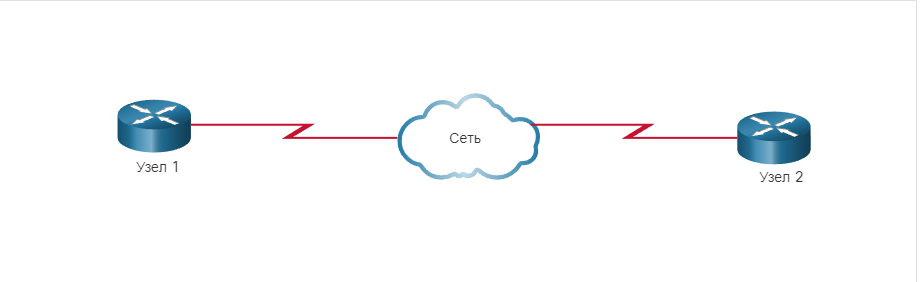
<!-- /courses/itn-dl/aeed0790-34fa-11eb-ad9a-f74babed41a6/af210fe0-34fa-11eb-ad9a-f74babed41a6/assets/2df378c3-1c25-11ea-81a0-ffc2c49b96bc.svg -->

Топологии точка-точка ограничены двумя узлами.

<!--
На рисунке показан пример сети «точка-точка», состоящей из двух маршрутизаторов, обозначенных узлом 1 и узлом 2, каждый из которых подключен к облаку сети по каналам глобальной сети.
-->

**Примечание**: Для соединения «точка-точка» через Ethernet требуется, чтобы устройство определило, предназначен ли входящий кадр для этого узла.

Находящиеся на некотором удалении друг от друга узел источника и узел назначения могут соединяться друг с другом не напрямую, используя несколько посреднических устройств. Однако то, как эти физические устройства используются в сети, не влияет на логическую топологию, как показано на рисунке. Добавление промежуточных физических соединений не изменит логическую топологию. Логическое соединение «точка-точка» — это то же самое.

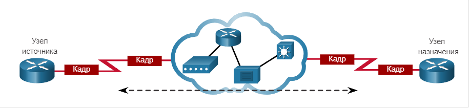
<!-- /courses/itn-dl/aeed0790-34fa-11eb-ad9a-f74babed41a6/af210fe0-34fa-11eb-ad9a-f74babed41a6/assets/2df39fd5-1c25-11ea-81a0-ffc2c49b96bc.svg -->

<!--
На рисунке показан пример сети «точка-точка», состоящей из двух маршрутизаторов, обозначенных «Исходный узел» и «Конечный узел», каждый из которых подключен к облаку сети по каналам глобальной сети. Показаны два маршрутизатора, отправляющие кадры в облако сети.
-->

<!-- 6.2.4 -->
## Топологии локальных сетей (LAN)

В сетях с множественным доступом конечные устройства (то есть узлы) связаны с помощью топологий "звезда" или "расширенная звезда", как показано на рисунке.  В топологии этого типа конечные устройства подключаются к центральному промежуточному устройству, в данном случае коммутатору Ethernet. А **extended star** расширяет эту топологию за счет подключения нескольких коммутаторов Ethernet. Топологию типа «звезда» отличают простой монтаж, высокая масштабируемость (простое добавление и удаление оконечных устройств) и простое устранение неполадок. В ранних топологиях типа «звезда» оконечные устройства соединялись с помощью концентраторов Ethernet.

Иногда в локальной сети Ethernet могут подключаться только два устройства. В качестве примера можно привести два соединенных маршрутизатора. Это будет пример Ethernet, используемого в топологии «точка-точка».

**Устаревшие топологии локальных сетей**

Ранние технологии Ethernet и устаревшие технологии Token Ring LAN включали два других типа топологий:

* **Шина (Bus).**  Все оконечные системы связаны друг с другом общим кабелем, имеющим на концах специальные заглушки («терминаторы»). Для соединения оконечных устройств коммутаторы не требуются. Топологии шины на основе коаксиальных кабелей использовались ранее в сетях Ethernet благодаря своей дешевизне и простому монтажу.
* **Кольцо.**  Каждая оконечная система соединяется с соседней системой, образуя сеть в форме кольца. Кольцо не нужно прерывать, в отличие от топологии шины. Кольцевые топологии использовались в устаревших сетях FDDI (Fiber Distributed Data Interface) и Token Ring.

На рисунке показана организация соединений между оконечными устройствами в локальных сетях. Как правило, при графическом изображении структуры сетей прямыми линиями обозначаются локальные сети Ethernet, включая топологии типа «звезда» и «расширенная звезда».

### Физические топологии

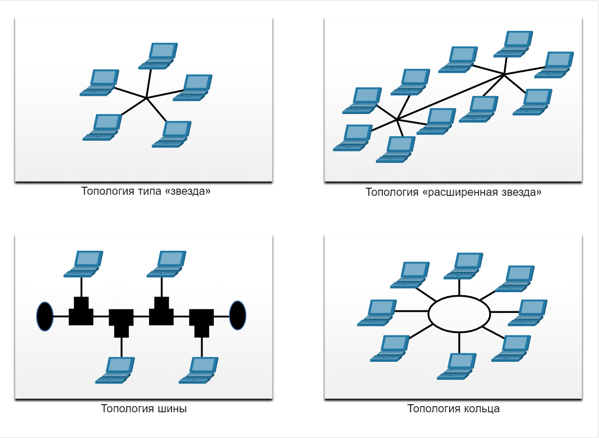
<!-- /courses/itn-dl/aeed0790-34fa-11eb-ad9a-f74babed41a6/af210fe0-34fa-11eb-ad9a-f74babed41a6/assets/2df41502-1c25-11ea-81a0-ffc2c49b96bc.svg -->

<!--
сравнение четырех физических топологий: звезда, расширенная шина и кольцо
-->

<!-- 6.2.5 -->
## Полудуплексная и полнодуплексная связь

Понимание дуплексной связи важно при обсуждении топологий локальной сети, поскольку это относится к направлению передачи данных между двумя устройствами. Существует два общих режима дуплекса.

**Полудуплексное соединение**

Оба устройства могут передавать и получать данные в среде, но не одновременно. Полудуплексный режим используется в устаревших шинных топологиях и при использовании концентраторов Ethernet. Полудуплексный режим позволяет осуществлять передачу или прием по общей среде одновременно только одному устройству. Нажмите кнопку «Воспроизведение» на рисунке, чтобы увидеть анимацию, показывающую полудуплексную связь.

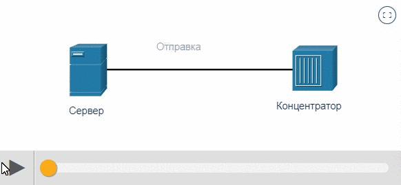

<!--
полудуплексная связь между сервером и концентратором
-->

**Полнодуплексное соединение**

Оба устройства могут одновременно передавать и принимать в общей среде. Канальный уровень предполагает одновременную доступность среды обоим узлам для передачи. Коммутаторы Ethernet по умолчанию работают в полнодуплексном режиме, но могут работать и в полудуплексе при подключении к таким устройствам, как коммутаторы Ethernet. Нажмите кнопку «Воспроизведение» на рисунке, чтобы увидеть анимацию, показывающую полнодуплексную связь.

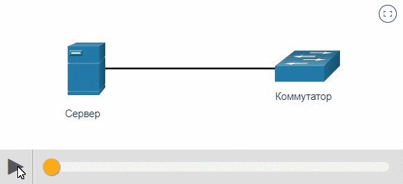

<!--
полнодуплексная связь между сервером и концентратором
-->

Таким образом, полудуплексная связь ограничивает обмен данными в одном направлении за раз. Полнодуплексное соединение поддерживает одновременную отправку и получение данных.

Важно, чтобы два связанных интерфейса, например сетевой интерфейс узла и интерфейс коммутатора Ethernet, использовали один и тот же дуплексный режим. В противном случае будет возникать несоответствие дуплексных режимов, приводящее к снижению эффективности и задержкам в канале связи.

<!-- 6.2.6 -->
## Управления доступом к среде передачи

Примерами таких сетей являются локальные сети Ethernet и беспроводные локальные сети (WLAN). Сеть с множественным доступом — это сеть, которая может иметь два или более конечных устройств, пытающихся получить доступ к сети одновременно.

В некоторых сетях с множественным доступом необходимы правила регулирования доступа устройств к общей физической среде. Существует два основных метода управления доступом к общей среде.

* Конкурентный доступ
* Контролируемый доступ

**Конкурентный доступ** 

В сетях с множественным доступом на основе конкуренции все узлы работают в полудуплексном режиме, конкурируя за использование среды. Одновременно может отправлять данные только одно устройство. Однако существует специальный протокол, определяющий, что должно происходить в случае одновременной передачи обоими устройствами. Примеры методов управления конкурентным доступом к среде передачи

* Множественный доступ с прослушиванием несущей и обнаружением столкновений (Carrier Sense Multiple Access/Collision Detection; CSMA/CD) в стандартных сетях Ethernet с топологией шина.
* Множественный доступ с прослушиванием несущей и обнаружением столкновений применяется в беспроводных LAN

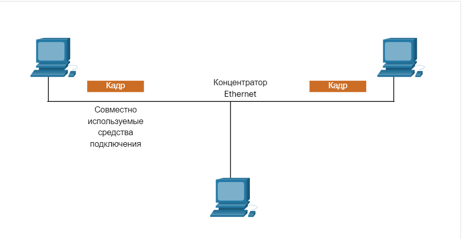
<!-- /courses/itn-dl/aeed0790-34fa-11eb-ad9a-f74babed41a6/af210fe0-34fa-11eb-ad9a-f74babed41a6/assets/2df52672-1c25-11ea-81a0-ffc2c49b96bc.svg -->

<!--
На изображении показаны три компьютера, подключенных к концентратору Ethernet. Два компьютера посылают кадры одновременно.
-->

**Контролируемый доступ**

В управляемой сети с множественным конкурентным доступом каждый узел имеет свое время для использования среды. Такие детерминистические типы сетей являются неэффективными из-за того, что устройство должно дожидаться своей очереди для доступа к среде. Примеры сетей с множественным доступом, использующих контролируемый доступ, включают следующие:

* Устаревший Token Ring
* Устаревший ARCNET

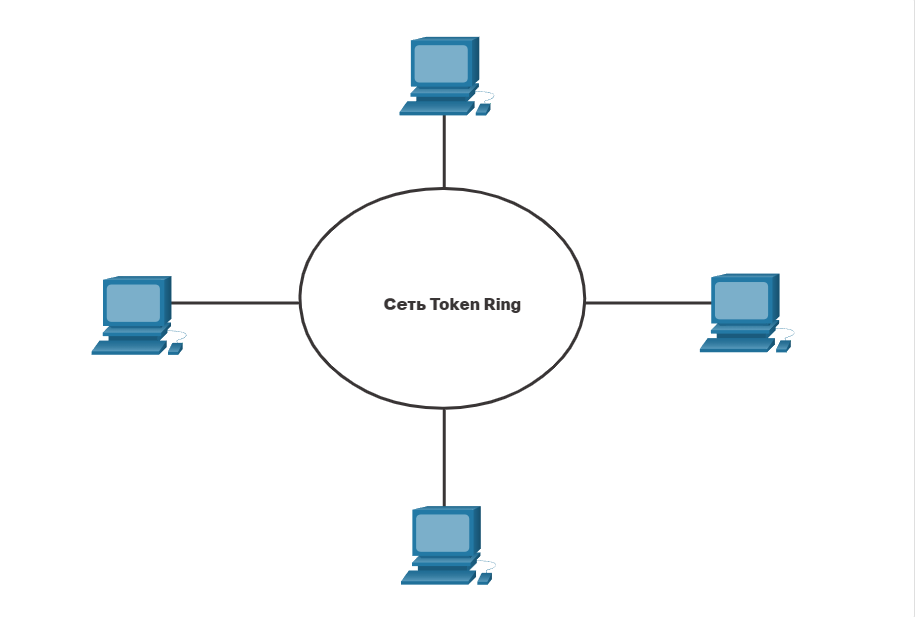
<!-- /courses/itn-dl/aeed0790-34fa-11eb-ad9a-f74babed41a6/af210fe0-34fa-11eb-ad9a-f74babed41a6/assets/2df54d83-1c25-11ea-81a0-ffc2c49b96bc.svg -->

Каждый узел должен дождаться своего хода, чтобы получить доступ к сетевой среде.

<!--
На изображении показаны четыре компьютера, подключенных к сети Token Ring.
-->

**Примечание**: Сегодня сети Ethernet работают в полнодуплексном режиме и не требуют метода управления доступом.

<!-- 6.2.7 -->
## Конкурентный доступ — CSMA/CD

Примеры управления конкурентным доступом к среде передачи включают:

* Беспроводная локальная сеть (использует CSMA/CA)
* Устаревшая топология шина Ethernet LAN (использует CSMA/CD)
* Устаревшие сети Ethernet с использованием концентратора (использует CSMA/CD)

Сети WLAN работают в полудуплексном режиме, что означает, что в каждый момент времени передачу или прием может осуществлять только одно устройство. При этом необходим специальный протокол, определяющий, когда устройство может осуществлять передачу, и что происходит в случае одновременной передачи несколькими устройствами.

Если два устройства выполняют передачу одновременно, возникает конфликт. В устаревших локальных сетях Ethernet, сетевой конфликт будет обнаружен обоими устройствами. Это часть обнаружения столкновений (CD) CSMA/CD. Сетевая плата распознает этот конфликт, сравнивая отправленные данные с принятыми или определяя превышение нормальной амплитуды сигнала в среде передачи данных. Данные, передаваемые обоими устройствами, будут повреждены, из-за чего потребуется их повторная отправка.

### PC1 отправляет кадр

В PC1 имеется кадр Ethernet, который нужно передать в PC3. Сетевая плата PC1 должна определить, осуществляет ли кто-либо передачу по среде. Если она не обнаруживает сигнал несущей, другими словами, не принимает данные от другого устройства, то делает вывод о том, что сеть свободна для передачи.

Сетевая плата PC1 отправляет Ethernet кадр, когда среда доступна, как показано на рисунке.

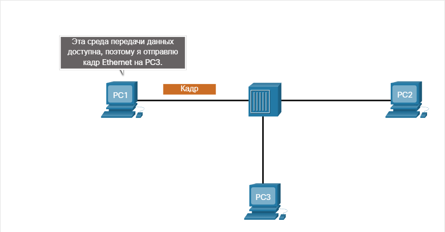
<!-- /courses/itn-dl/aeed0790-34fa-11eb-ad9a-f74babed41a6/af210fe0-34fa-11eb-ad9a-f74babed41a6/assets/2df59ba1-1c25-11ea-81a0-ffc2c49b96bc.svg -->

<!--
На изображении показаны три компьютера (PC1, PC2 и PC3), подключенных к концентратору Ethernet. PC1 отправляет кадр. Текст над компьютером PC1 гласит: «Эта среда передачи данных доступна, поэтому я отправлю кадр Ethernet на PC3».
-->

### Концентратор принимает кадр.

Концентратор Ethernet принимает и посылает кадр. Концентратор Ethernet также называют многопортовым ретранслятором. Он осуществляет регенерацию всех битов, принятых на входящем порте, и их рассылку через все остальные порты, как показано на рисунке.

Если другое устройство, например PC2, хочет осуществить передачу, но в данный момент принимает кадр, оно должно дождаться освобождения канала, как показано на рисунке.

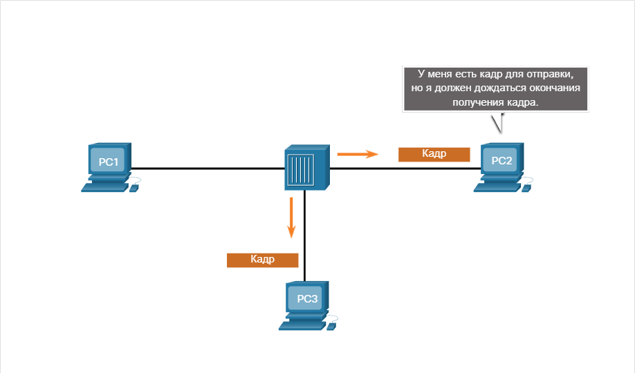
<!-- /courses/itn-dl/aeed0790-34fa-11eb-ad9a-f74babed41a6/af210fe0-34fa-11eb-ad9a-f74babed41a6/assets/2df5c2b1-1c25-11ea-81a0-ffc2c49b96bc.svg -->

<!--
На изображении показаны три компьютера (PC1, PC2 и PC3), подключенных к концентратору Ethernet. Концентратор Ethernet пересылает кадр с PC1 на PC2 и PC3. Компьютер PC2 говорит: «У меня есть кадр для отправки, но я должен дождаться окончания получения кадра».
-->

### Концентратор отправляет кадр

Кадр будет доставлен всем устройствам, подключенным к концентратору. Но поскольку в кадре указан адрес целевого канала данных, относящегося к PC3, то только это устройство будет принимать и сохранять весь кадр. Сетевые платы всех остальных устройств игнорируют кадр, как показано на рисунке.

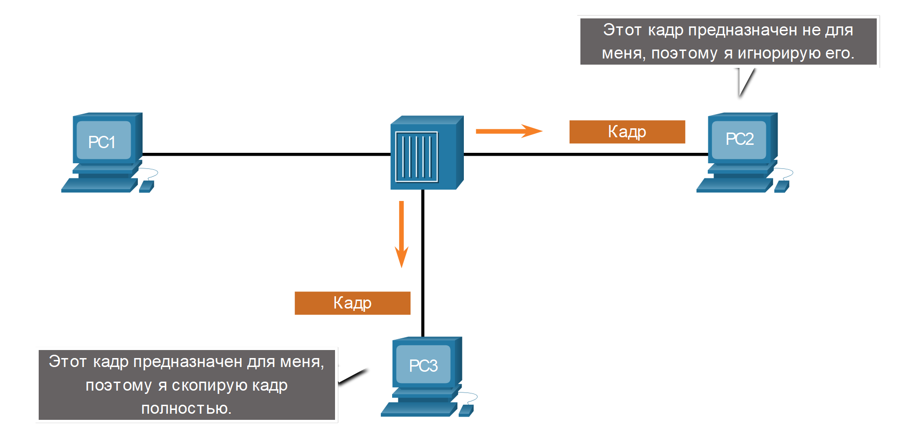
<!-- /courses/itn-dl/aeed0790-34fa-11eb-ad9a-f74babed41a6/af210fe0-34fa-11eb-ad9a-f74babed41a6/assets/2df5e9c2-1c25-11ea-81a0-ffc2c49b96bc.svg -->

<!--
На изображении показаны три компьютера (PC1, PC2 и PC3), подключенных к концентратору Ethernet. PC2 и PC3 получили кадр из концентратора. Компьютер PC2 говорит: «Этот кадр предназначен не для меня, поэтому я игнорирую его». Компьютер PC3 говорит: «Этот кадр предназначен для меня, поэтому я скопирую кадр полностью».
-->

<!-- 6.2.8 -->
## Конкурентный доступ — CSMA/CA

Другим видом доступа CSMA, используемым в беспроводных локальных сетях IEEE 802.11, является множественный доступ с прослушиванием несущей и избежанием столкновений (Carrier Sense Multiple Access/Collision Avoidance; CSMA/CA).

При доступе CMSA/CA для контроля освобождения среды используется метод, аналогичный CSMA/CD. В CMSA/CA также используются дополнительные процедуры. В беспроводных средах устройство может не иметь возможности обнаружить столкновение. CMSA/CA не обнаруживает конфликты, а старается избежать их, ожидая своей очереди для передачи. Каждое передающее устройство включает в передаваемую информацию сведения о времени, необходимом ему для передачи. Все остальные беспроводные устройства принимают эту информацию и знают, как долго среда передачи данных будет занята.

На рисунке, если хост A получает беспроводной кадр от точки доступа, хосты B и C также будут видеть кадр и как долго среда будет недоступна.

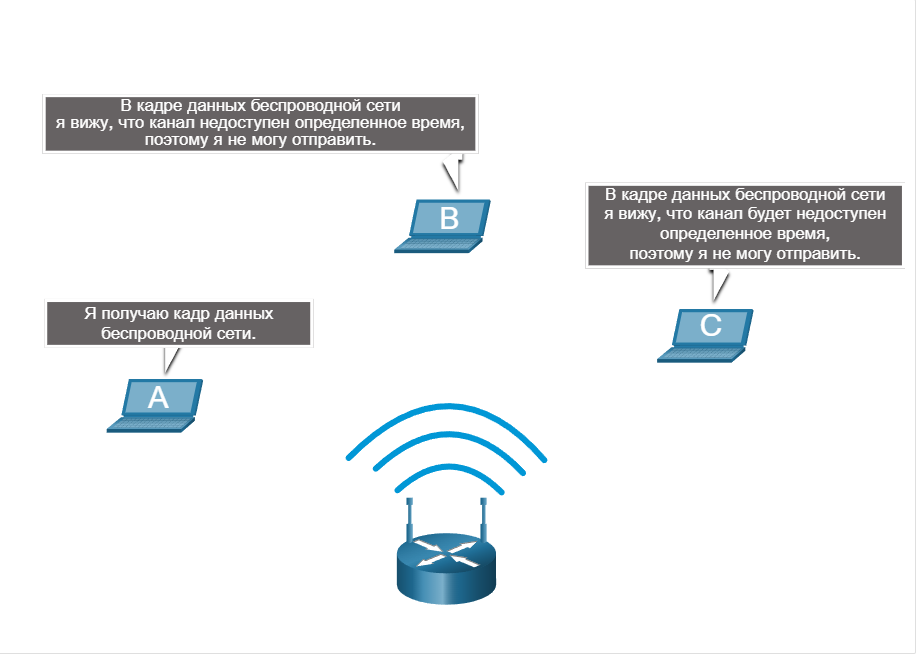
<!-- /courses/itn-dl/aeed0790-34fa-11eb-ad9a-f74babed41a6/af210fe0-34fa-11eb-ad9a-f74babed41a6/assets/2df610d4-1c25-11ea-81a0-ffc2c49b96bc.svg -->

<!--
На изображении показана беспроводная сеть, состоящая из точки доступа и трех ноутбуков, ноутбук A, B и C. Ноутбук A имеет текстовое поле, которое гласит: Я принимаю этот беспроводной кадр. Ноутбук B имеет текстовое поле с надписью: В кадре данных беспроводной сети я вижу, что канал будет недоступен определенное время, поэтому я не могу отправить. Ноутбук С имеет текстовое поле с надписью: В кадре данных беспроводной сети я вижу, что канал будет недоступен определенное время, поэтому я не могу отправить.
-->

После передачи беспроводным устройством кадра 802.11 получатель возвращает подтверждение, информируя отправителя о доставке кадра.

Независимо от вида сети (будь то локальная сеть Ethernet с концентраторами или беспроводная локальная сеть), системы с конкурентным доступом плохо масштабируются при интенсивном использовании средства подключения.

**Примечание**: В локальных сетях Ethernet с коммутаторами состязательный доступ не используется, поскольку коммутатор и сетевая интерфейсная плата хоста работают в полнодуплексном режиме.

<!-- 6.2.9 -->
<!-- quiz -->

