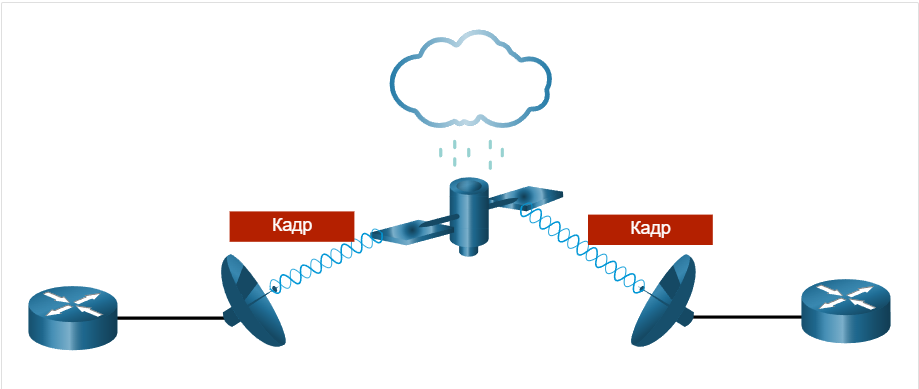
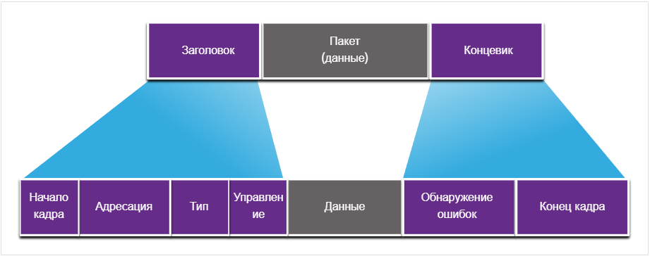
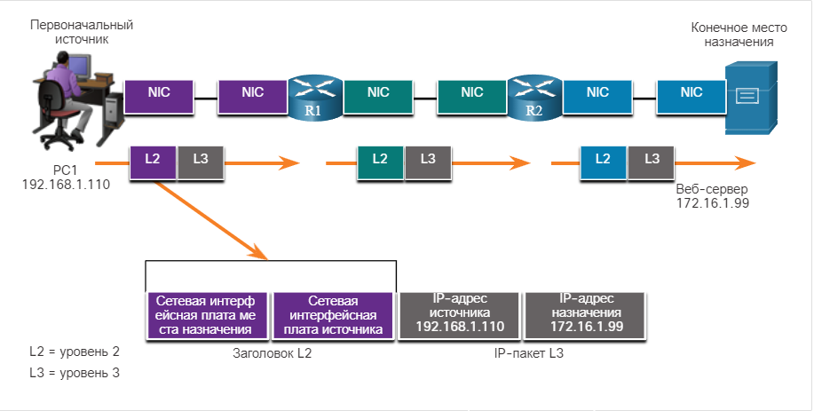
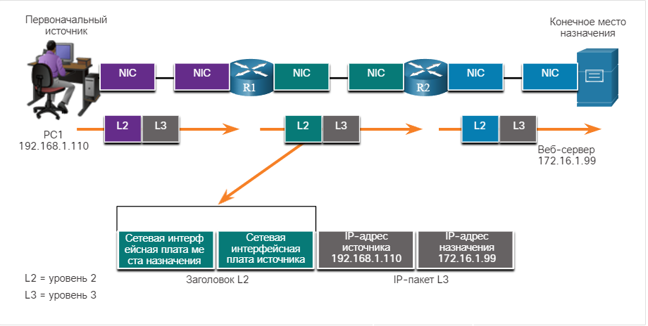
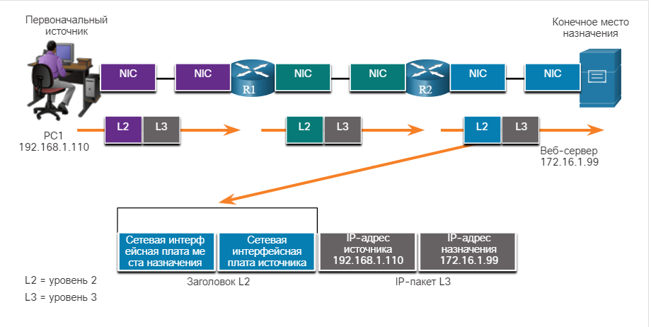
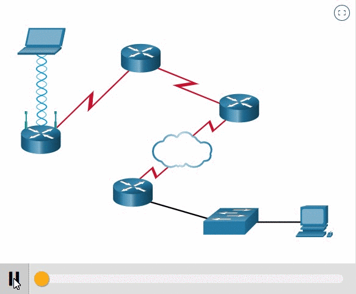

# Кадр канала передачи данных

<!-- 6.3.1 -->
## Кадр

В этом разделе подробно рассматривается, что происходит с кадром при его перемещении по сети. Информация, добавленная к кадру, определяется используемым протоколом.

Канальный уровень подготавливает инкапсулированные данные (обычно пакет IPv4 или IPv6) для перемещения по среде передачи данных локальной сети, добавляя к нему заголовок и концевик с целью создать кадр.

Протокол передачи данных отвечает за связь между одной NIC и другой NIC в одной сети. Хотя кадры канального уровня описываются множеством различных протоколов канального уровня, кадры любого типа состоят из трех основных компонентов.

* Заголовок
* Данные
* Концевик

В отличие от других протоколов инкапсуляции, канальный уровень добавляет информацию в виде концевика в конце кадра.

Все протоколы канального уровня инкапсулируют единицу данных протокола (PDU) уровня 3 в пределах поля данных кадра. Однако структура кадра и полей, содержащихся в заголовке и концевике, отличается в зависимости от протокола.

Не существует такой структуры кадра, которая соответствовала бы требованиям всех видов передачи данных во всех типах средств подключения. Количество управляющей информации, которая должна присутствовать в кадре, зависит от окружения и изменяется в соответствии с требованиями управления доступом для конкретной среды и логической топологии. Например, кадр WLAN должен включать процедуры предотвращения столкновений и, следовательно, требует дополнительной управляющей информации по сравнению с кадром Ethernet.

Как показано на рисунке, для обеспечения доставки в нестабильной среде требуется больше средств управления. Поля заголовка и концевика увеличиваются, поскольку необходимо больше информации по управлению.

<!-- /courses/itn-dl/aeed0790-34fa-11eb-ad9a-f74babed41a6/af210fe2-34fa-11eb-ad9a-f74babed41a6/assets/2df74952-1c25-11ea-81a0-ffc2c49b96bc.svg -->

Необходимы более активные усилия для обеспечения доставки данных. Это означает более высокие накладные расходы и более медленные скорости передачи.

<!--
Два маршрутизатора, взаимодействующие через беспроводную глобальную сеть через спутниковое соединение
-->

<!-- 6.3.2 -->
## Поля кадра

Механизм создания кадров делит поток на дешифруемые группы. Управляющая информация помещается в заголовок и концевик в виде значений в разных полях. Этот формат придает физическим сигналам структуру, которую узлы способны принимать и декодировать в пакеты в точке назначения.

Общие поля кадра показаны на рисунке. Не каждый протокол включает в себя все эти поля. Фактический формат кадра определяется стандартами для конкретного канального протокола.

<!-- /courses/itn-dl/aeed0790-34fa-11eb-ad9a-f74babed41a6/af210fe2-34fa-11eb-ad9a-f74babed41a6/assets/2df77063-1c25-11ea-81a0-ffc2c49b96bc.svg -->

Поля кадра включают следующее:

* **Флаги начала и конца кадра:**  используются для определения границ начала и конца кадра.
* **Адресация:**  указывает узлы источника и назначения в среде передачи данных.
* **Тип:** Указывает протокол уровня 3 в поле данных.
* **Управление:**  указывает особые службы управления потоком, например качество обслуживания (QoS). Служба QoS используется для приоритетной пересылки определенных типов сообщений. Например, кадры протокола VoIP, обычно пользуются приоритетом, поскольку они чувствительны к задержкам.
* **Данные:** Содержит полезные данные кадра (т.е. заголовок пакета, заголовок сегмента и данные).
* **Обнаружение ошибок:**  Идет после данных, чтобы сформировать концевик.

<!--
На изображении показан пакет данных, инкапсулированный заголовком и концевиком канального уровня. Заголовок разбивается на поля: начало кадра, адресация, тип и элемент управления. Концевик разбит на два поля: Обнаружение ошибок и конец кадра.
-->

Протоколы канального уровня добавляют концевик в конец каждого кадра. В процессе, называемом обнаружением ошибок, концевик определяет, прибыл ли кадр без ошибок. Этот процесс называется обнаружением ошибок. Для этого в концевике кадра размещается специальная информация, полученная путем математической или логической обработки содержимого кадра. Биты обнаружения ошибок добавляются на канальном уровне, т.к. сигналы в среде передачи могут быть подвержены помехам, искажениям или потерям, в результате чего значения представленных этими сигналами битов могут изменяться.

Передающий узел путем логической обработки содержимого кадра создает так называемый циклический избыточный код (cyclic redundancy check, CRC). Значение этого кода помещается в поле контрольной последовательности кадра (Frame Check Sequence, FCS) и предоставляет информацию о содержимом кадра. Поле FCS в концевике кадра Ethernet позволяет принимающему узлу проверять кадр на наличие ошибок передачи.

<!-- 6.3.3 -->
## Адрес уровня 2

Канальный уровень обеспечивает адресацию, используемую при пересылке кадра по совместно используемой среде передачи данных в локальной сети. Адреса устройств на этом уровне называются физическими адресами. Адресация канального уровня содержится в заголовке кадра и указывает узел назначения кадра в локальной сети. Обычно адресация находится в начале кадра, поэтому сетевой адаптер NIC может быстро определить, соответствует ли он своему собственному адресу уровня 2, прежде чем принимать остальную часть кадра. Заголовок кадра может также содержать адрес источника кадра.

В отличие от логических адресов уровня 3, которые являются иерархическими, физические адреса не указывают, в какой сети находится устройство. Физический адрес — это адрес конкретного физического устройства. Если устройство перемещается в другую сеть или подсеть, оно продолжит функционировать с тем же физическим адресом уровня 2. Поэтому адреса уровня 2 используются только для подключения устройств в одной и той же общей среде, в одной IP-сети.

На рисунках 1–3 представлены функции адресов уровней 2 и 3. В ходе пересылки IP-пакетов от узла к маршрутизатору, между маршрутизаторами и, наконец, от маршрутизатора к узлу в каждой точке на пути своего следования IP-пакет инкапсулируется в новый кадр канала передачи данных. Каждый кадр канального уровня содержит адрес канала-источника (сетевой платы, передающей этот кадр) и адрес канала назначения (сетевой платы, принимающей этот кадр).

### хост-маршрутизатор

Исходный хост инкапсулирует IP-пакет уровня 3 в кадр уровня 2. В заголовке кадра хост добавляет свой адрес уровня 2 в качестве источника и адрес уровня 2 для R1 в качестве назначения.

<!-- /courses/itn-dl/aeed0790-34fa-11eb-ad9a-f74babed41a6/af210fe2-34fa-11eb-ad9a-f74babed41a6/assets/2df7be86-1c25-11ea-81a0-ffc2c49b96bc.svg -->

<!--
На изображении показана сеть, состоящая из исходного ПК, маршрутизатора R1, маршрутизатора R2 и конечного веб-сервера назначения. Показывается текстовое поле, представляющее NIC интерфейса каждого устройства. PC1 имеет IP-адрес 192.168.1.100. Сервер имеет IP-адрес 172.16.1.99. PC1 отправляет кадр L2 с адресом NIC назначения R1 и адресом NIC источника собственной NIC. Кадр инкапсулирует IP-пакет L3 с IP-адресом источника 192.168.1.110 и адресом назначения 172.16.1.99.
-->

### Маршрутизатор-маршрутизатор

R1 инкапсулирует IP-пакет уровня 3 в новый кадр уровня 2. В заголовке кадра R1 добавляет свой адрес уровня 2 в качестве источника и адрес уровня 2 для R2 в качестве назначения.

<!-- /courses/itn-dl/aeed0790-34fa-11eb-ad9a-f74babed41a6/af210fe2-34fa-11eb-ad9a-f74babed41a6/assets/2df833b5-1c25-11ea-81a0-ffc2c49b96bc.svg -->

<!--
На изображении показана сеть, состоящая из исходного ПК, маршрутизатора R1, маршрутизатора R2 и конечного веб-сервера назначения. Показывается текстовое поле, представляющее NIC интерфейса каждого устройства. PC1 имеет IP-адрес 192.168.1.100. Сервер имеет IP-адрес 172.16.1.99. R1 пересылает кадр на R2, используя адрес NIC назначения R2 и адрес NIC источника собственного интерфейса. Кадр инкапсулирует IP-пакет L3 с IP-адресом источника 192.168.1.110 и адресом назначения 172.16.1.99. 
-->

### Маршрутизатор-узел

R2 инкапсулирует IP-пакет уровня 3 в новый кадр уровня 2. В заголовке кадра R2 добавляет свой адрес уровня 2 в качестве источника и адрес уровня 2 для сервера в качестве назначения.

<!-- /courses/itn-dl/aeed0790-34fa-11eb-ad9a-f74babed41a6/af210fe2-34fa-11eb-ad9a-f74babed41a6/assets/2df8a8e1-1c25-11ea-81a0-ffc2c49b96bc.svg -->

<!--
На изображении показана сеть, состоящая из исходного PC1, маршрутизатора R1, маршрутизатора R2 и конечного веб-сервера назначения. Показывается текстовое поле, представляющее NIC интерфейса каждого устройства. PC1 имеет IP-адрес 192.168.1.100. Сервер имеет IP-адрес 172.16.1.99.  R2 переправляет кадр на веб-сервер, используя адрес NIC назначения веб-сервера и адрес NIC источника собственного интерфейса. Кадр инкапсулирует IP-пакет L3 с IP-адресом источника 192.168.1.110 и адресом назначения 172.16.1.99. 
-->

Адрес канального уровня используется только для локальной доставки пакетов. Адреса этого уровня не имеют смысла за пределами локальной сети. Сравните их с уровнем 3, где адреса в заголовке пакета передаются от узла источника на узел назначения, независимо от количества транзитных участков сети на протяжении маршрута.

Если данные должны перейти в другой сегмент сети, необходимо промежуточное устройство, например маршрутизатор. Маршрутизатор должен принять кадр согласно физическому адресу и деинкапсулировать его для анализа иерархического адреса или IP-адреса. С помощью IP-адреса маршрутизатор может определить местоположение устройства назначения в сети, а также наилучший путь к нему. Узнав, куда необходимо переслать пакет, маршрутизатор создает для него новый кадр, который отправляется в следующий сетевой сегмент к месту назначения.

<!-- 6.3.4 -->
## Кадры LAN и WAN

Протоколы Ethernet используются проводными LAN. Беспроводная связь подпадает под протоколы WLAN (IEEE 802.11). Эти протоколы были разработаны для сетей с множественным доступом.

WAN традиционно используют другие типы протоколов для различных типов топологий «точка-точка», «звезда» и полной ячеистой. Некоторые из общих протоколов WAN на протяжении многих лет включали:

* Протокол «точка-точка» (PPP);
* Высокоуровневый протокол управления каналом (HDLC);
* Сеть Frame Relay;
* Асинхронный режим передачи (ATM);
* X.25.

Эти протоколы уровня 2 теперь заменены в глобальной сети Ethernet.

 В сети на основе стека протоколов TCP/IP все протоколы уровня 2 модели OSI работают с протоколом IP на уровне 3 модели OSI. Однако фактически используемый протокол уровня 2 зависит от логической топологии сети и физической среды передачи данных.

Каждый протокол управляет доступом к среде для указанных логических топологий уровня 2. Это означает, что при реализации этих протоколов в качестве узлов, действующих на канальном уровне, может использоваться целый ряд различных сетевых устройств. К таким устройствам относятся сетевые платы на компьютерах, а также интерфейсы на маршрутизаторах и коммутаторах уровня 2.

Протокол уровня 2, используемый для конкретной топологии сети, определяется технологией, используемой для реализации этой топологии. Эта технология, в свою очередь, определяется размером сети (с точки зрения количества узлов и территории) и сервисами, предоставляемыми в этой сети.

В локальных сетях обычно используются технологии, которые обеспечивают высокую пропускную способность и поддерживают большое количество узлов. Сравнительно небольшая протяженность локальных сетей (в пределах одного здания или комплекса зданий) и высокая плотность пользователей обеспечивают рентабельность этой технологии.

Однако использование технологии с высокой пропускной способностью обычно нерентабельно для глобальных сетей, охватывающих обширные территории (например, города или целые области). Ввиду высокой стоимости физических каналов большой протяженности и технологий, используемых для передачи сигналов на большие расстояния, пропускная способность таких сетей, как правило, определяется уровнем рентабельности.

Разница в пропускной способности требует использования различных протоколов для локальных и глобальных сетей.

К протоколам канального уровня относятся:

* Ethernet
* Беспроводная сеть 802.11
* Протокол точка-точка (протокол PPP)
* Высокоуровневый протокол управления каналом (HDLC)
* Сеть Frame Relay

Чтобы увидеть примеры протоколов уровня 2, нажмите кнопку «Воспроизведение».

<!--
изображение сети, состоящей из взаимосвязанных локальных сетей и WAN
-->

<!-- 6.3.5 -->
<!-- quiz -->

