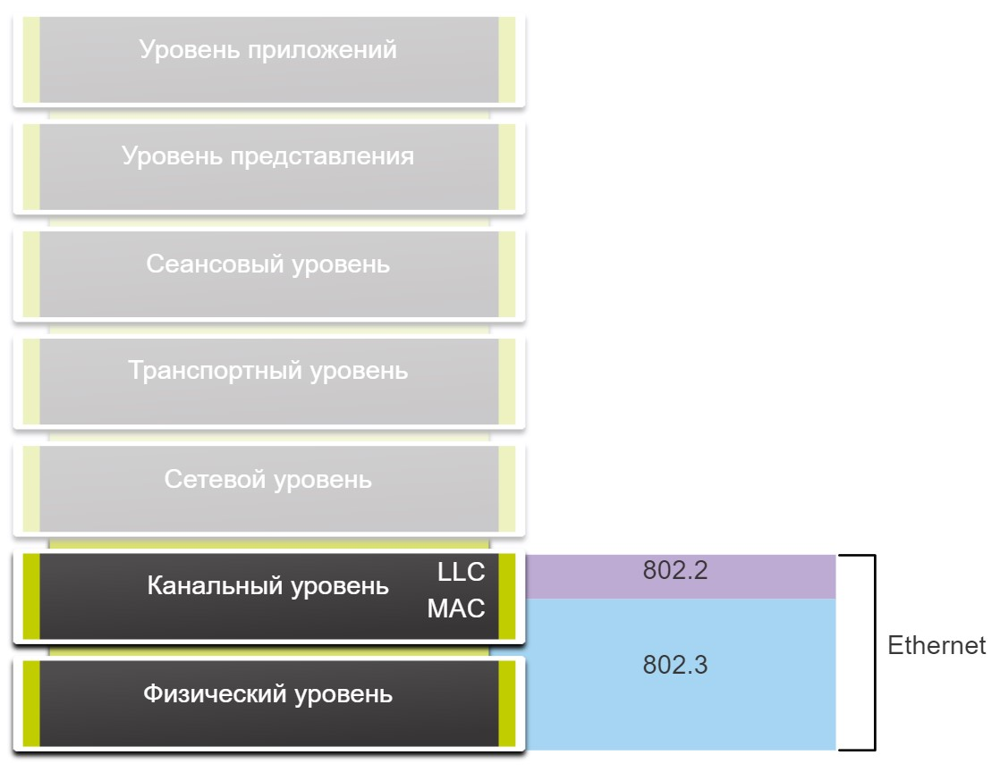
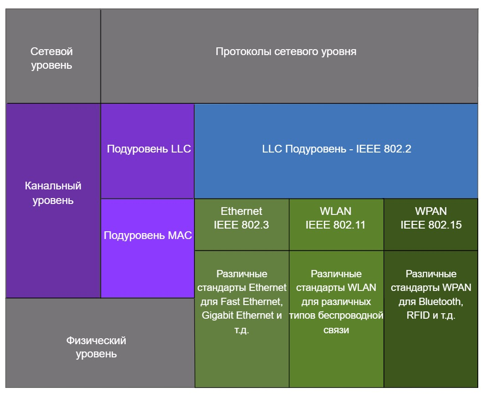
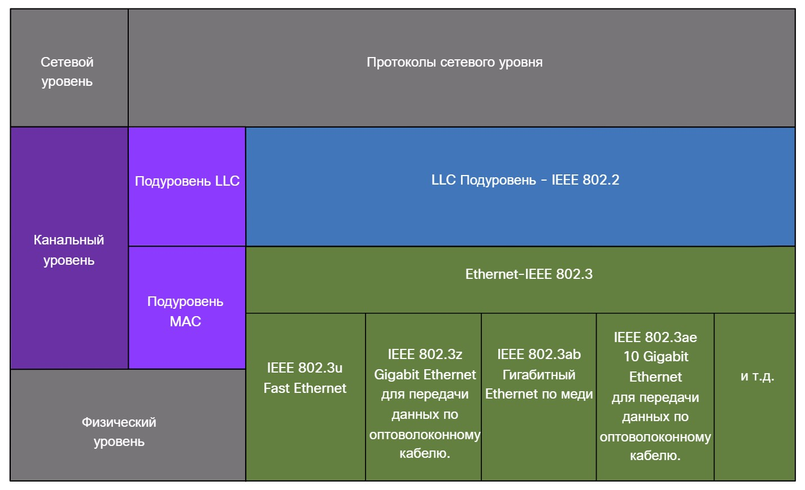
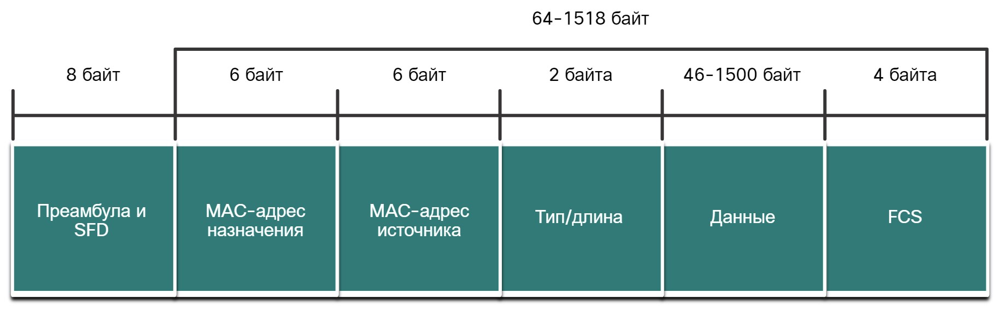

# Кадры Ethernet

<!-- 7.1.1 -->

## Инкапсуляция Ethernet

Этот модуль начинается с обсуждения технологии Ethernet, включая объяснение подслоя MAC и полей кадра Ethernet.

Ethernet является одной из двух технологий локальной сети, используемых сегодня, а другой — беспроводные локальные сети (WLAN). Ethernet использует проводную связь, включая витую пару, волоконно-оптические каналы и коаксиальные кабели.

Ethernet функционирует на канальном и физическом уровнях. Это семейство сетевых технологий, которые регламентируются стандартами IEEE 802.2 и 802.3. Технология Ethernet поддерживает передачу данных на следующих скоростях.

- 10 Мбит/с
- 100 Мбит/с
- 1000 Мбит/с (1 Гбит/с)
- 10 000 Мбит/с (10 Гбит/с)
- 40 000 Мбит/с (40 Гбит/с)
- 100000 Мбит/с (100 Гбит/с)

Как показано на рисунке, стандарты Ethernet регламентируют как протоколы уровня 2, так и технологии уровня 1.

### Ethernet и модель OSI

<!-- /courses/itn-dl/aeed0792-34fa-11eb-ad9a-f74babed41a6/af2136f0-34fa-11eb-ad9a-f74babed41a6/assets/2dfc5263-1c25-11ea-81a0-ffc2c49b96bc.svg -->

Ethernet определяется протоколами канального и физического уровня

***

<!-- 7.1.2 -->
## Подуровни канального уровня

Протоколы IEEE 802 LAN/MAN, включая Ethernet, используют следующие два отдельных канальных подуровня для работы. Это управление логическими связями (LLC) и управление доступом к среде (MAC), как показано на рисунке.

Напомним, что LLC и MAC имеют следующие роли в уровне канала передачи данных:

- **Управление логическим соединением (Logical Link Control, LLC)** - Этот подуровень IEEE 802.2 взаимодействует между сетевым программным обеспечением на верхних уровнях и аппаратным обеспечением устройства на нижних уровнях. Он помещает в кадр информацию, указывающую, какой протокол сетевого уровня используется для данного кадра. Данная информация позволяет различным протоколам 3-го уровня, таким как IPv4 и IPv6, использовать один и тот же сетевой интерфейс и одну и туже среду передачи данных.
- **Подуровень MAC** - этот подуровень (например, IEEE 802.3, 802.11 или 802.15) реализован в аппаратном обеспечении и отвечает за инкапсуляцию данных и контроль доступа к среде передачи данных. Он обеспечивает адресацию уровня передачи данных и интегрирован с различными технологиями физического уровня.

<!-- /courses/itn-dl/aeed0792-34fa-11eb-ad9a-f74babed41a6/af2136f0-34fa-11eb-ad9a-f74babed41a6/assets/2dfcc793-1c25-11ea-81a0-ffc2c49b96bc.svg -->

***

<!-- 7.1.3 -->

## Подуровень MAC

Подуровень MAC отвечает за инкапсуляцию данных и доступ к среде передачи данных.

**Инкапсуляция данных**

Инкапсуляция данных IEEE 802.3 включает следующее:

- **Кадр Ethernet** - это внутренняя структура кадра Ethernet.
- **Адресация Ethernet** - Кадр Ethernet включает MAC-адрес источника и назначения для доставки кадра Ethernet из Ethernet NIC в Ethernet в одной локальной сети.
- **Обнаружение ошибок Ethernet.** Кадр Ethernet включает трейлер последовательности проверок кадров (FCS), используемый для обнаружения ошибок.

**Доступ к среде передачи даннх**

Как показано на рисунке, подуровень MAC IEEE 802.3 включает спецификации для различных стандартов связи Ethernet для различных типов сред передачи данных, включая медь и волокно.

Рисунок показывает различные стандарты Ethernet в подуровне MAC. В верхней части диаграммы находится сетевой уровень и протокол сетевого уровня. Ниже находится уровень канала передачи данных и его подуровни. Верхним подуровнем является подуровень IEEE 802.2 LLC. Далее идет подуровень Ethernet IEEE 802.3 MAC. Ниже приведены пять столбцов с различными стандартами Ethernet и типами сред передачи данных, которые охватывают нижнюю часть подуровня MAC и весь физический уровень OSI. Слева направо столбцы: IEEE 802.3u Fast Ethernet; IEEE 802.3z Gigabit Ethernet по оптоволокну; IEEE 802.ab Gigabit Ethernet по меди; IEEE 802.3ae 10 Gigabit Ethernet по оптоволокну; и так далее.

### Стандарты Ethernet в подуровне MAC

<!-- /courses/itn-dl/aeed0792-34fa-11eb-ad9a-f74babed41a6/af2136f0-34fa-11eb-ad9a-f74babed41a6/assets/2dfd3cc0-1c25-11ea-81a0-ffc2c49b96bc.svg -->

Напомним, что устаревшие Ethernet, использующие топологию шины или концентраторы, являются общей полудуплексной средой передачи данных. Ethernet в полудуплексной среде использует метод доступа на основе конкуренции, обнаружение множественного доступа/обнаружение конфликтов (CSMA/CD) с поддержкой несущей. Это обеспечивает одновременную передачу только одного устройства. CSMA/CD позволяет нескольким устройствам совместно использовать одну и ту же полудуплексную среду, обнаруживая коллизию, когда более чем одно устройство пытается передавать одновременно. Он также предоставляет алгоритм отката для повторной передачи.

В современных локальных сетях Ethernet используются коммутаторы, работающие в полнодуплексном режиме. Полнодуплексная связь с коммутаторами Ethernet не требует контроля доступа через CSMA/CD.

***

<!-- 7.1.4 -->

## Поля кадра Ethernet

Минимальный размер кадра Ethernet — 64 байта, максимальный — 1518 байт. К этому количеству относятся все байты, начиная с поля «MAC-адрес назначения» и заканчивая полем «Проверочная последовательность кадра (FCS)». Поле «Преамбула» при описании размера кадра не включено.

Любой кадр с длиной менее 64 байтов считается «фрагментом коллизии» или «карликовым кадром» и автоматически отклоняется принимающими станциями. Кадры с длиной более 1500 байт называются Jumbo-кадрами (значительно превышающие допустимый размер) или Baby Giant (слегка превышающие допустимый размер).

Если размер передаваемого кадра меньше минимального значения или больше максимального значения, получающее устройство сбрасывает такой кадр. Отброшенные кадры, скорее всего, являются результатом коллизий или других нежелательных сигналов и, следовательно, считаются недействительными. Кадры Jumbo обычно поддерживаются большинством коммутаторов Fast Ethernet и Gigabit Ethernet и сетевых адаптеров.

На рисунке показано каждое поле в кадре Ethernet. Дополнительные сведения о функциях каждого поля см. в таблице.

### Поля кадра Ethernet

<!-- /courses/itn-dl/aeed0792-34fa-11eb-ad9a-f74babed41a6/af2136f0-34fa-11eb-ad9a-f74babed41a6/assets/2dfd8ae3-1c25-11ea-81a0-ffc2c49b96bc.svg -->

### Подробная информация о полях кадра Ethernet

|Поле|	Описание|
|-|-|
|Поля «Преамбула» и «Начальный разделитель кадра»|	Преамбула (7 байт) и Начальный разделитель кадров (SFD), также называемое Начало кадра (1 байт), поля используются для синхронизации между устройствами отправки и приема. Эти первые восемь байтов кадра используются, чтобы привлечь внимание принимающих узлов. По сути, первые несколько байт сообщают получателям о необходимости приготовиться к поступлению нового кадра.|
|Поле «MAC-адрес назначения»|	Это 6-байтное поле является идентификатором для предполагаемого получателя. Как вы помните, этот адрес используется на уровне 2, чтобы помочь устройствам определить, адресован ли им кадр. Адрес в кадре сравнивается с MAC-адресом в устройстве. Если есть совпадение, то устройство принимает кадр. Адрес может быть предназначен для одноадресной, многоадресной и широковещательной рассылок.|
|Поле «МАС-адреса источника»|	Это 6-байтное поле определяет сетевую интерфейсную плату или интерфейс, отправившие кадр.|
|Тип/длина|	Это 2-байтное поле определяет протокол верхнего уровня, инкапсулированный в кадр Ethernet. Характерные значения — значения в шестнадцатеричном формате 0x800 для IPv4, 0x86DD для IPv6 и 0x806 для ARP.   **Примечание.** Вы также можете увидеть это поле, называемое Тип EtherType, тип или длина.|
|Поле «Данные»|	Это поле (46 - 1500 байт) содержит инкапсулированные данные из более высокого уровня, который представляет собой общий PDU уровня 3 или, что более часто, из пакета IPv4. Длина всех кадров должна быть не менее 64 байт. Если небольшой пакет инкапсулирован, дополнительные биты, называемые пэдом, используются для увеличения размера кадра до этого минимального размера.|
|Поле FCS (Проверочная последовательность кадра)|	Поле FCS (Проверочная последовательность кадра) (4 байта) используется для обнаружения ошибок в кадре. В нем используется циклический избыточный код (CRC). Отправляющее устройство включает само результаты CRC в поле FCS кадра. Принимающее устройство получает кадр и генерирует CRC для поиска ошибок. Если расчеты совпадают, ошибки отсутствуют. Расчеты, которые не совпадают, указывают на то, что данные изменились; следовательно, кадр опущен. Изменение данных может быть результатом нарушения электрических сигналов, которые представляют биты.|

***

<!-- 7.1.5 quiz -->

<!-- 7.1.6 -->
## Лабораторная работа. Анализ кадров Ethernet с помощью программы Wireshark

В этой лабораторной работе вы выполните следующие задачи.

- Часть 1: Изучение полей заголовков в кадре Ethernet II
- Часть 2: Перехват и анализ кадров Ethernet с помощью программы Wireshark

[Открыть описание в PDF](./assets/7.1.6-lab---use-wireshark-to-examine-ethernet-frames_ru-RU.pdf)

