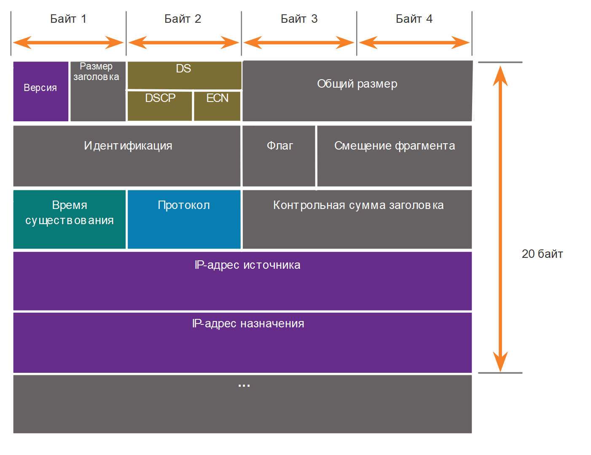

<!-- verified: agorbachev 03.05.2022 -->

<!-- 8.2.1 -->
## Заголовок пакета IPv4

IPv4 является одним из основных протоколов связи сетевого уровня. Заголовок пакета IPv4 используется для обеспечения доставки пакета на следующую остановку по пути к конечному устройству назначения.

Заголовок пакета IPv4 состоит из нескольких полей, включающих важную информацию о пакете. Эти поля содержат двоичные числа, которые анализируются процессом уровня 3.

<!-- 8.2.2 -->
## Поля заголовка пакета IPv4

Двоичные значения каждого поля определяют различные параметры IP-пакета. Схемы заголовков протокола, считываемые слева направо и сверху вниз, предоставляют наглядную информацию о полях протоколов. Схема заголовков IP-протокола на рисунке определяет поля IPv4-пакета.

### Поля в заголовке пакета IPv4

<!-- /courses/itn-dl/aeed0794-34fa-11eb-ad9a-f74babed41a6/af218510-34fa-11eb-ad9a-f74babed41a6/assets/2e0b6d94-1c25-11ea-81a0-ffc2c49b96bc.svg -->

Среди наиболее важных полей в заголовке IPv4 можно выделить следующие:

* **Версия.  -** Содержит 4-битное двоичное значение, определяющее версию IP-пакета. Для пакетов IPv4 в этом поле всегда указано значение 0100.
* **Дифференцированные сервисы (Differentiated Services, DS).  -** Поле, которое ранее называлось «Тип сервиса» (Type of Service, ToS). DS —это 8-битное поле, используемое для определения приоритета каждого пакета. 6 наиболее важных битов поля дифференцированных услуг (DSCP) и последние 2 бита — это биты явного уведомления о заторах (ECN).
* **Контрольная сумма заголовка**   - используется для обнаружения повреждения в заголовке IPv4.
* **Время существования (Time-to-Live, TTL).**  Содержит 8-битное двоичное значение, используемое для ограничения времени существования пакета. Отправитель пакета устанавливает начальное значение времени существования (TTL), которое уменьшается на единицу каждый раз при обработке пакета маршрутизатором. Если значение в поле TTL уменьшается до нуля, маршрутизатор отбрасывает пакет и отправляет на IP-адрес источника сообщение о превышении времени протокола ICMP (управление сообщениями в сети). Поскольку маршрутизатор уменьшает TTL каждого пакета, маршрутизатор также должен пересчитать контрольную сумму заголовка.
* **Протокол. –** Это поле используется для определения протокола следующего уровня. Это 8-битное двоичное значение, указывающее тип полезной нагрузки данных, которые переносит пакет, что позволяет сетевому уровню пересылать данные на соответствующий протокол более высокого уровня. Обычно используются значения ICMP (1), TCP (6) и UDP (17).
* **IPv4-адрес источника. -**  Содержит 32-битное двоичное значение, которое представляет IPv4-адрес источника пакета. IPv4-адрес источника — это всегда индивидуальный адрес.
* **IPv4-адрес назначения. –**  Содержит 32-битное двоичное значение, которое представляет IPv4-адрес назначения пакета. IPv4-адрес назначения — одноадресная рассылка, многоадресная рассылка, или широковещательный адрес.

Два наиболее часто используемых поля — это IP-адрес источника и IP-адрес назначения. Эти поля определяют, откуда поступил пакет и куда он направляется. Обычно в процессе передачи от узла источника к узлу назначения эти адреса не меняются.

Поля «Размер заголовка» (Internet Header Length, IHL), «Общий размер» и «Контрольная сумма заголовка» используются для определения и проверки пакета.

Остальные поля используются для переупорядочивания фрагментированного пакета. В связи с этим IPv4-пакет использует поля «Идентификация», «Флаги» и «Смещение фрагмента» для отслеживания фрагментов. Маршрутизатору может понадобиться выполнить фрагментацию пакета IPv4 при его пересылке из одной среды передачи данных в другую среду с меньшим максимальным размером передаваемого блока данных (MTU).

Поля «Параметры» и «Заполнитель» используются редко и в данной главе не рассматриваются.

<!-- 8.2.3 -->
## Видео. Пример заголовков IPv4 в программе Wireshark

Просмотрите видео об изучении заголовков IPv4 с помощью программы Wireshark.

<iframe width="970" height="546" src="https://www.youtube.com/embed/PArGE7H_eN8" title="YouTube video player" frameborder="0" allow="accelerometer; autoplay; clipboard-write; encrypted-media; gyroscope; picture-in-picture" allowfullscreen></iframe>

<!-- 8.2.4 -->
<!-- quiz -->

