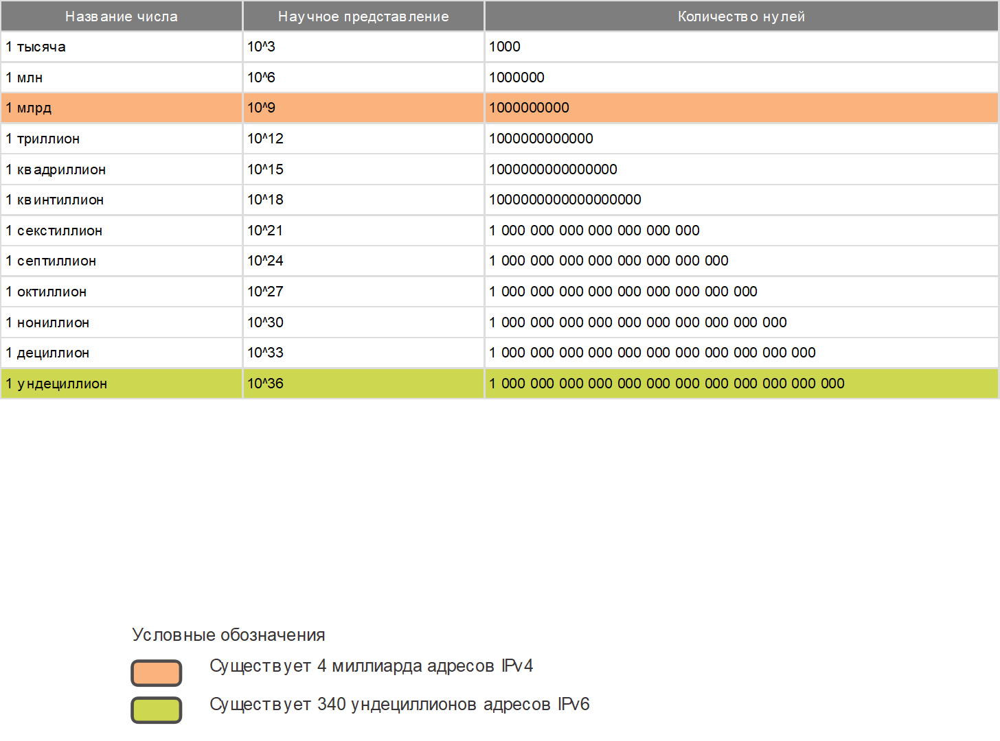
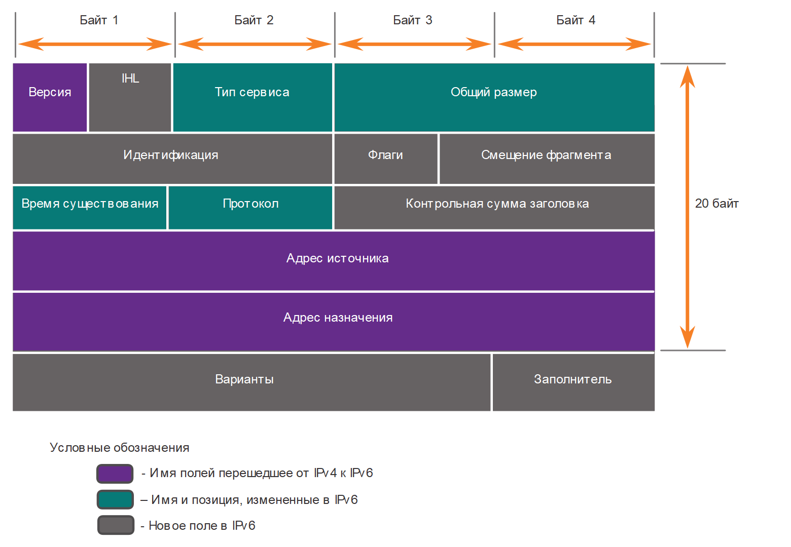
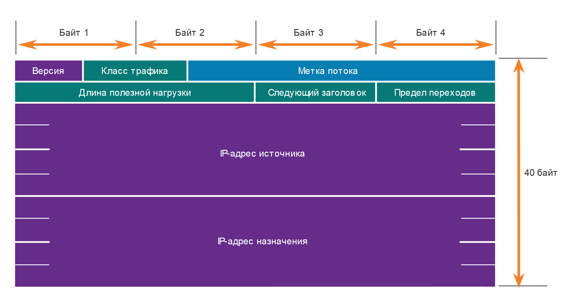

<!-- verified: agorbachev 03.05.2022 -->

<!-- 8.3.1 -->
## Ограничения IPv4

IPv4 по-прежнему используется и сегодня. Этот раздел посвящен IPv6, который в конечном итоге заменит IPv4. Чтобы лучше понять, почему вам нужно знать протокол IPv6, он помогает понять ограничения IPv4 и преимущества IPv6.

На протяжении многих лет разрабатывались дополнительные протоколы и процессы для решения новых задач. Тем не менее даже в результате изменений IPv4 по-прежнему имеет три основных недостатка.

* **Нехватка IP-адресов. -** IPv4 может предложить лишь ограниченное количество уникальных публичных IP4-адресов. Несмотря на то что существует примерно 4 миллиарда IPv4-адресов, возросшее число новых устройств, в которых используется протокол IP, а также потенциальный рост менее развитых регионов привели к необходимости дополнительного увеличения количества адресов.
* **Нехватка сквозных соединений.  -** Преобразование сетевых адресов (NAT) представляет собой технологию, которая обычно применяется в сетях IPv4. NAT позволяет различным устройствам совместно использовать один публичный IPv4-адрес. При этом, поскольку публичный IPv4-адрес используется совместно, IPv4-адрес узла внутренней сети скрыт. Это может представлять проблему при использовании технологий, для которых необходимы сквозные соединения.
* **Повышенная сложность сети** — несмотря на то, что NAT продлил срок службы IPv4, он был предназначен только как механизм перехода на IPv6. NAT в своей разнообразной реализации создает дополнительную сложность в сети, создавая задержку и затрудняя поиск и устранение неисправностей.

<!-- 8.3.2 -->
## Обзор IPv6

В начале 90-х годов специалисты инженерной группы по развитию Интернета (IETF) подняли вопрос о недостатках протокола IPv4 и начали поиски альтернативных решений. Результатом поисков стала разработка протокола IP версии 6 (IPv6). IPv6 помогает преодолеть ограничения протокола IPv4 и значительно расширяет доступные возможности, предлагая функции, которые оптимально соответствуют текущим и прогнозируемым сетевым требованиям.

К улучшениям, которые предлагает протокол IPv6, относятся следующие.

* **Расширенное адресное пространство.**  IPv6-адреса используют 128-битную иерархическую адресацию, в отличие от протокола IPv4, использующего 32 бита.
* **Улучшенная обработка пакетов.**  Структура заголовка IPv6 была упрощена благодаря уменьшению количества полей.
* **Отсутствие необходимости в использовании NAT.**  Благодаря большому количеству публичных IPv6-адресов нет необходимости в преобразовании сетевых адресов (NAT) между частными и публичными адресами IPv4. Это позволяет избежать некоторых проблем, связанных с NAT, с которыми сталкиваются приложения, требующие сквозного подключения.

32-битное адресное пространство IPv4 предусматривает примерно 4294967296 уникальных адресов. Адресное пространство протокола IPv6 поддерживает 340282366920938463463374607431768211456 или 340 ундециллионов адресов. Это примерно эквивалентно каждой песчинке на Земле.

На рисунке представлено визуальное сравнение адресного пространства протоколов IPv4 и IPv6.

### Сравнение адресного пространства IPv4 и IPv6

<!-- /courses/itn-dl/aeed0794-34fa-11eb-ad9a-f74babed41a6/af21ac20-34fa-11eb-ad9a-f74babed41a6/assets/2e0d1b43-1c25-11ea-81a0-ffc2c49b96bc.svg -->

<!-- 8.3.3 -->
## Поля заголовка пакета IPv4 в заголовке пакета IPv6

Одним из основных конструктивных улучшений протокола IPv6 по сравнению с IPv4 является упрощенный заголовок IPv6.

Например, заголовок IPv4 состоит из 20 октетов (до 60 байт, если используется поле «Параметры») и 12 основных полей заголовка, не учитывая поля «Параметры» и «Заполнитель».

Как видно на рисунке, в IPv6 некоторые поля остались прежними, некоторые поля заголовка IPv4 более не используются, а в некоторых полях изменены названия и расположение.

### Заголовок пакета IPv4

<!-- /courses/itn-dl/aeed0794-34fa-11eb-ad9a-f74babed41a6/af21ac20-34fa-11eb-ad9a-f74babed41a6/assets/2e0d9072-1c25-11ea-81a0-ffc2c49b96bc.svg -->

На рисунке показаны поля заголовков пакетов IPv4, которые были сохранены, перемещены, изменены, а также те, которые не были сохранены в заголовке пакетов IPv6. 

* Поля, которые сохранили одно и то же имя: версия, адрес источника и адрес назначения.  
* Поля, которые изменили имена и положение: тип службы, общая длина, время жизни и протокол.  
* Поля, которые не были сохранены в IPv6: IHL, идентификация, флаги, смещение фрагмента, контрольная сумма заголовка, параметры и заполнение.

<!-- 8.3.4 -->
## Заголовок пакета IPv6 

Схема заголовков IP-протокола на рисунке определяет поля IPv6-пакета.

### Поля в заголовке пакета IPv6

<!-- /courses/itn-dl/aeed0794-34fa-11eb-ad9a-f74babed41a6/af21ac20-34fa-11eb-ad9a-f74babed41a6/assets/2e0e53c0-1c25-11ea-81a0-ffc2c49b96bc.svg -->

Поля в заголовке пакета IPv6:

* **Версия** — данное поле содержит 4-битное двоичное значение, которое определяет версию IP-пакета. Для пакетов IPv6 в этом поле всегда указано значение 0110.
* **Класс трафика** — 8-битное поле, соответствующее полю «Дифференцированные услуги (DS)» в заголовке IPv4.
* **Метка потока** — 20-битное поле указывает на то, что всем пакетам с одинаковыми метками потока назначается одинаковый тип обработки маршрутизаторами.
* **Длина полезной нагрузки** — 16-битное поле указывает длину блока данных или полезной нагрузки пакета IPv6. Это не включает длину заголовка IPv6, который является фиксированным 40-байтным заголовком.
* **Следующий заголовок** — 8-битное поле, соответствующее полю «Протокол» в заголовке IPv4. Оно указывает тип полезной нагрузки данных, которые переносит пакет, что позволяет сетевому уровню пересылать данные на соответствующий протокол более высокого уровня.
* **Предел перехода** — 8-битное поле, заменяющее поле «Время существования» (TTL) в IPv4. Это значение уменьшается на единицу каждым маршрутизатором, пересылающим пакет. Когда счетчик достигает значения 0, пакет отбрасывается и на отправляющий узел пересылается сообщение ICMPv6, которое означает,  что пакет не достиг своего назначения, так как был превышен предел переходов. В отличие от IPv4, IPv6 не включает контрольную сумму заголовка IPv6, так как эта функция выполняется как на нижнем, так и на верхнем уровнях. Это означает, что контрольную сумму не нужно пересчитывать каждым маршрутизатором при уменьшении поля Hop Limit, что также повышает производительность сети.
* **IPv6-адрес источника** — 128-битное поле, определяющее IPv6-адрес хоста-отправителя.
* **IPv6-адрес назначения** — 128-битное поле, определяющее IPv6-адрес хоста-получателя.

Пакет IPv6 также может содержать заголовки расширений (EH), которые предоставляют дополнительную информацию сетевого уровня. Заголовки расширений являются дополнительными и помещаются между заголовком IPv6 и полезной нагрузкой. Заголовки расширений используются для фрагментации, обеспечения безопасности, поддержки мобильности и многого другого.

В отличие от IPv4, маршрутизаторы не делят на части направленные IPv6-пакеты.

<!-- 8.3.5 -->
## Видео: Пример заголовков IPv6 в программе Wireshark

Просмотрите видеоролик об изучении заголовков IPv6 с помощью программы Wireshark.

<iframe width="970" height="546" src="https://www.youtube.com/embed/aOwXEempJ4k" title="YouTube video player" frameborder="0" allow="accelerometer; autoplay; clipboard-write; encrypted-media; gyroscope; picture-in-picture" allowfullscreen></iframe>

<!-- 8.3.6 -->
<!-- quiz -->

