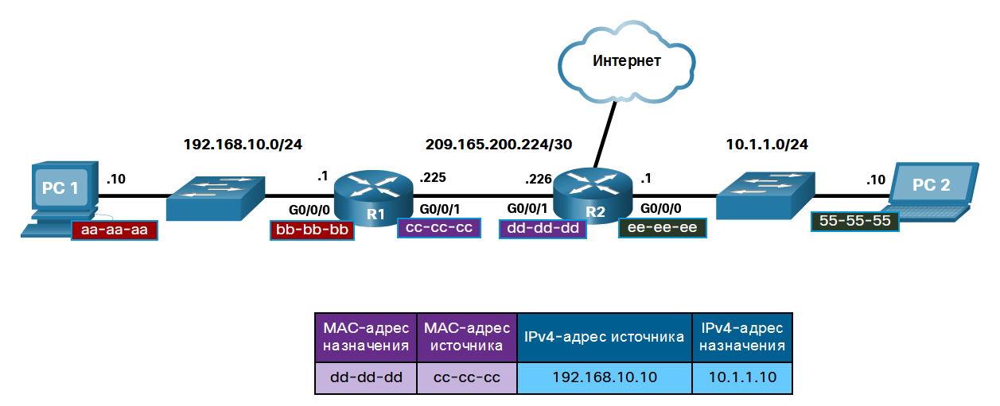
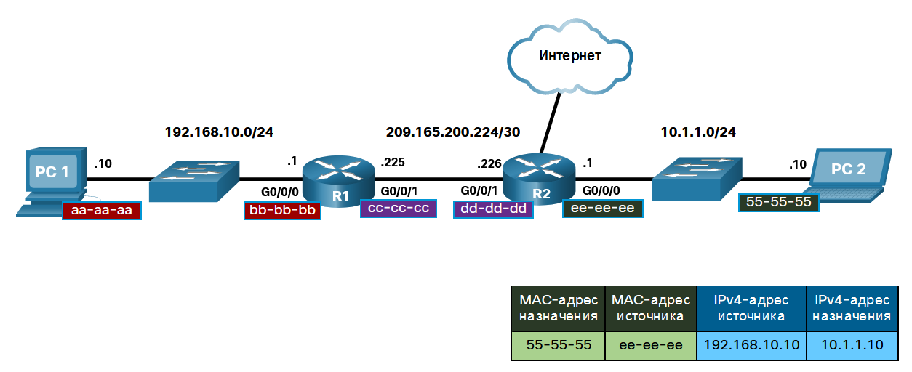

<!-- verified: agorbachev 03.05.2022 -->

<!-- 9.1.1 -->
## Устройство назначения в той же сети

Иногда хост должен отправить сообщение, но он знает только IP-адрес устройства назначения. Хост так же должен знать MAC-адрес этого устройства, но как его можно обнаружить? Именно здесь решающее значение приобретает процесс разрешение адресов.

Устройству в локальной сети Ethernet присваиваются два основных адреса.

* **Физический адрес (MAC-адрес)** используется для обмена данными между сетевыми платами Ethernet устройств, находящихся в одной сети.
* **Логический адрес (IP-адрес)** используется для отправки пакетов от источника к назначению. IP-адрес назначения может находиться в той же IP-сети, что и источник, либо в удаленной сети.

Они используются для доставки кадра, передаваемого по каналу в инкапсулированном IP-пакете, от одной сетевой интерфейсной платы к другой в той же сети. Если IP-адрес назначения находится в той же сети, то MAC-адресом назначения является адрес устройства назначения.

Рассмотрим следующий пример с использованием упрощенных  MAC-адресов.

<!-- /courses/itn-dl/aeed2ea0-34fa-11eb-ad9a-f74babed41a6/af21ac2a-34fa-11eb-ad9a-f74babed41a6/assets/2e157fb4-1c25-11ea-81a0-ffc2c49b96bc.svg -->

В этом примере ПК1 хочет отправить пакет к ПК2. На рисунке показаны MAC-адреса назначения и источника уровня 2, а также адреса IPv4 уровня 3, которые будут включены в пакет, отправленный с ПК1.

Кадр Ethernet уровня 2 содержит следующее.

* **MAC-адрес** — упрощенный MAC-адрес ПК2, 55-55.
* **Исходный MAC-адрес** — упрощенный MAC-адрес сетевого адаптера Ethernet на ПК1, aa-aa-aa.

IP-пакет уровня 3 содержит следующее:

* **Исходный IPv4-адрес** — это адрес IPv4 ПК1, 192.168.10.10.
* **Адрес назначения IPv4** — это адрес IPv4 ПК2, 192.168.10.11.

<!-- 9.1.2 -->
## Устройство назначения в удаленной сети

Если IP-адрес назначения находится в удаленной сети, то MAC-адресом назначения является адрес шлюза хоста по умолчанию.

Рассмотрим следующий пример с использованием упрощенных MAC-адресов.

<!-- /courses/itn-dl/aeed2ea0-34fa-11eb-ad9a-f74babed41a6/af21ac2a-34fa-11eb-ad9a-f74babed41a6/assets/2e15cdd3-1c25-11ea-81a0-ffc2c49b96bc.svg -->

В этом примере ПК1 хочет отправить пакет к ПК2. ПК2 расположен в удаленной сети. Поскольку адрес назначения IPv4 не находится в той же локальной сети, что и ПК1, MAC-адрес назначения — это адрес локального шлюза по умолчанию (маршрутизатор).

Маршрутизаторы проверяют IPv4-адрес назначения для определения наилучшего способа пересылки IPv4-пакета. При получении маршрутизатором кадра Ethernet происходит деинкапсуляция информации уровня 2. На основе IP-адреса назначения маршрутизатор определяет следующее транзитное устройство и инкапсулирует IP-пакет в новый кадр для передачи в исходящий интерфейс.

В нашем примере R1 теперь инкапсулирует пакет с новой информацией адреса уровня 2, как показано на рисунке.

<!-- /courses/itn-dl/aeed2ea0-34fa-11eb-ad9a-f74babed41a6/af21ac2a-34fa-11eb-ad9a-f74babed41a6/assets/2e161bf3-1c25-11ea-81a0-ffc2c49b96bc.svg -->

Новый MAC-адрес назначения будет адрес интерфейса R2 G0/0/1, а новый MAC-адрес источника будет адрес интерфейса R1 G0/0/1.

В каждом канале на пути IP-пакет инкапсулируется в кадр. Кадр связан с конкретной  технологии канала передачи данных, связанной с этим каналом, например Ethernet. Если следующее транзитное устройство является назначением, то MAC-адресом назначения будет адрес сетевой платы Ethernet этого устройства, как показано на рисунке.

<!-- /courses/itn-dl/aeed2ea0-34fa-11eb-ad9a-f74babed41a6/af21ac2a-34fa-11eb-ad9a-f74babed41a6/assets/2e166a11-1c25-11ea-81a0-ffc2c49b96bc.svg -->

Каким образом IP-адреса IP-пакетов в потоке данных ассоциируются с MAC-адресами в каждом канале на пути к узлу назначения? В IPv4 для этого используется протокол разрешения адресов (ARP). Для пакетов IPv6 этим процессом является обнаружение соседей ICMPv6 (ND).

<!-- 9.1.3 -->
## Работа в симмуляторе: Определение MAC- и IP-адресов

В рамках данного упражнения Packet Tracer необходимо решить следующие задачи.

* Сбор информации PDU для локальной сети связи
* Сбор информации PDU для удаленной сетевой связи

Это упражнение оптимизировано для просмотра единиц данных протокола (PDU). Устройства уже настроены. Вам необходимо в режиме моделирования собрать сведения о единице данных протокола (PDU), а также ответить на ряд вопросов о собираемых данных.

[Определение MAC- и IP-адресов (pdf)](./assets/9.1.3-packet-tracer---identify-mac-and-ip-addresses.pdf)

[Определение MAC- и IP-адресов (pka)](./assets/9.1.3-packet-tracer---identify-mac-and-ip-addresses.pka)

<!-- 9.1.4 -->
<!-- quiz -->

