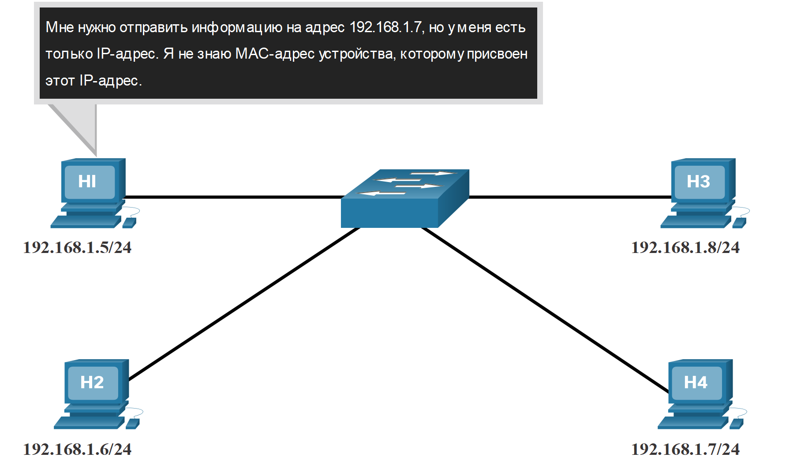
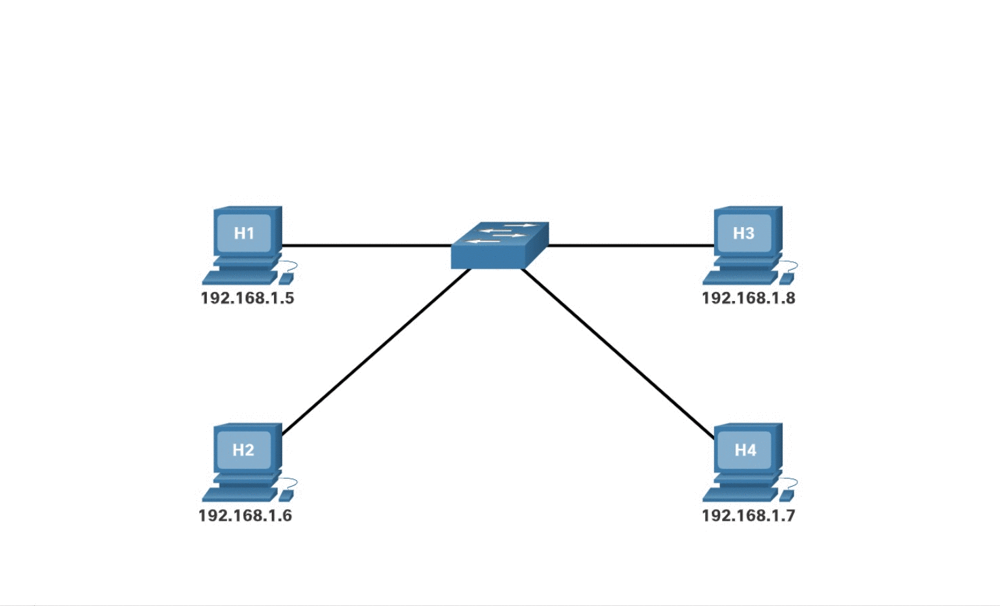
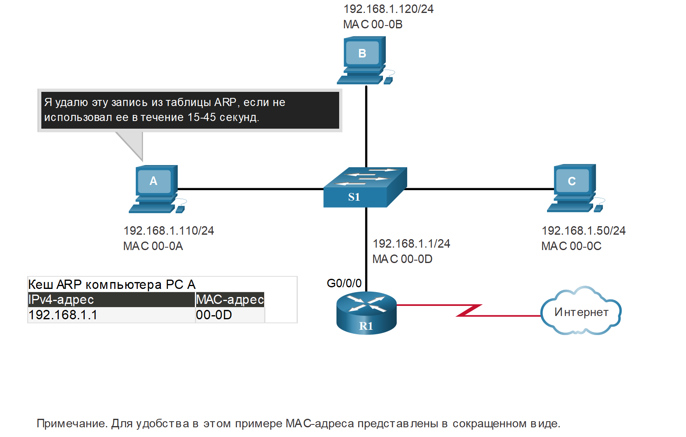
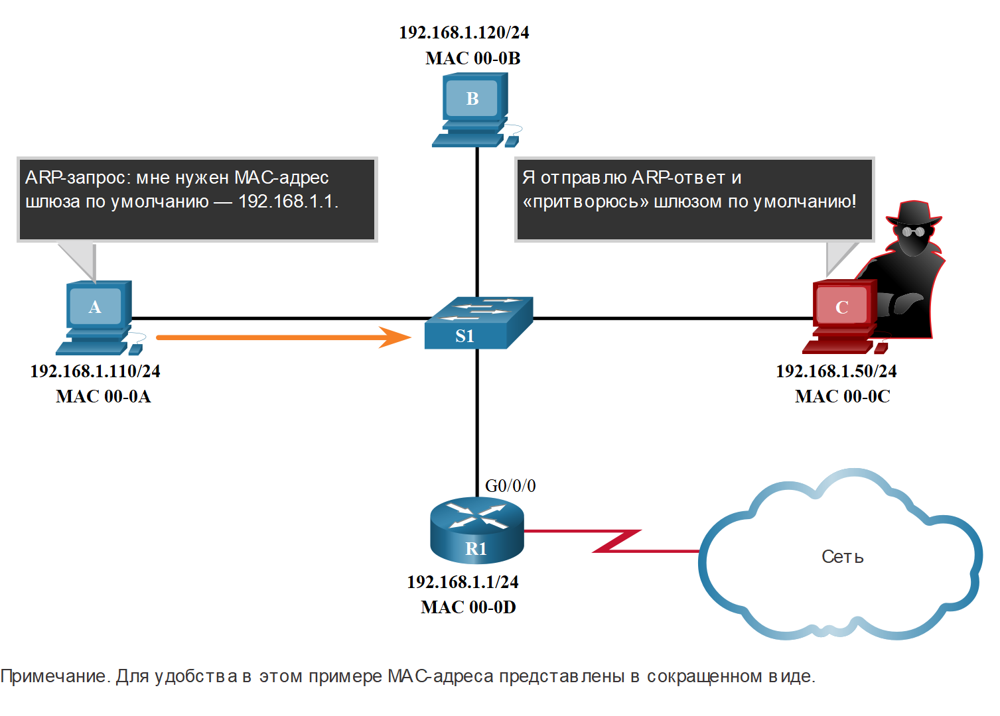

# Протокол ARP

<!-- 9.2.1 -->
## Обзор ARP

Если в сети используется протокол связи IPv4, для сопоставления IPv4-адресов с MAC-адресами необходимо использовать протокол разрешения адресов или ARP. В этом разделе объясняется, как работает ARP.

Каждое IP-устройство в сети Ethernet имеет уникальный MAC-адрес Ethernet. Когда устройство отправляет кадр Ethernet, он содержит оба этих адреса.

* **MAC-адрес назначения** - MAC-адрес Ethernet устройства назначения в том же сегменте локальной сети . Если узел назначения находится в другой сети, то адресом назначения в кадре будет адрес шлюза по умолчанию (например, маршрутизатора).
* **MAC-адрес источника** - Это MAC-адрес сетевой платы Ethernet отправителя.

На рисунке показана проблема при отправке кадра другому узлу в том же сегменте сети IPv4.


<!-- /courses/itn-dl/aeed2ea0-34fa-11eb-ad9a-f74babed41a6/af21d330-34fa-11eb-ad9a-f74babed41a6/assets/2e17a290-1c25-11ea-81a0-ffc2c49b96bc.svg -->

<!--
Четыре узла, H1, H2, H3 и H4, подключены к одному коммутатору.  H1 имеет IP 192.168.1.5/24, H2 имеет IP 192.168.1.6/24, H3 имеет IP 192.168.1.8/24, и H4 имеет IP 192.168.1.7/24.  У H1 есть выноска, которая гласит: мне нужно отправить информацию на 192.168.1.7, но у меня есть только IP-адрес. Я не знаю MAC-адрес устройства, которому присвоен этот IP-адрес.
-->

Чтобы отправить пакет другому узлу в той же локальной сети IPv4, узел должен знать адрес IPv4 и MAC-адрес устройства назначения. Адреса назначения устройства IPv4 либо известны, либо разрешаются по имени устройства. Однако MAC-адреса должны быть обнаружены.

Устройство использует протокол разрешения адресов (ARP) для определения MAC-адреса назначения локального устройства, если известен IPv4-адрес.

Протокол ARP выполняет две основные функции.

* Сопоставление IPv4-адресов и МАС-адресов
* Ведение таблицы соответствий IPv4-MAC-адресов

<!-- 9.2.2 -->
## Функции ARP

Когда пакет отправляется на канальный уровень для инкапсуляции в кадре Ethernet, устройство обращается к таблице в своей памяти, чтобы найти MAC-адрес, который сопоставлен с IPv4-адресом. Эта таблица хранитися в ОЗУ и называется ARP-таблицей  или ARP-кешем.

Передающее устройство ищет в своей таблице ARP IPv4-адрес назначения и соответствующий MAC-адрес.

* Если IPv4-адрес назначения пакета находится в той же сети, что и IPv4-адрес источника, устройство ищет в таблице ARP IPv4-адрес назначения.
* Если IPv4-адрес назначения пакета находится не в той же сети, что IPv4-адрес источника, устройство ищет в таблице ARP IPv4-адрес шлюза по умолчанию.

В обоих случаях необходимо найти IPv4-адрес и соответствующий MAC-адрес устройства.

Каждая запись или строка в таблице ARP связывает IPv4-адрес с MAC-адресом. Отношение между двумя значениями называется сопоставлением. Это просто означает, что адрес IPv4 можно найти в таблице и с его помощью определить соответствующий MAC-адрес. Таблица ARP временно сохраняет (кеширует) сопоставление устройств в локальной сети (LAN).

Если устройство находит IPv4-адрес, то в качестве MAC-адреса в кадре используется соответствующий MAC-адрес. Если запись не найдена, устройство отправляет ARP-запрос.

Нажмите кнопку «Воспроизведение», чтобы просмотреть анимацию, иллюстрирующую процесс ARP.



<!--
Эта анимация иллюстрирует, как хост будет использовать ARP для обнаружения MAC-адреса известного IP-адреса. Хост H1 должен отправить некоторую информацию хосту с IP-адресом 192.168.1.7. Однако H1 не имеет MAC-адреса для этого адреса. Таким образом он отправляет запрос ARP на IP-адрес 192.168.1.7. Все хосты в подсети получают и обрабатывают этот ARP-запрос. Однако только хост H4 с IP-адресом 192.168.1.7 отправит ответ ARP, содержащий его MAC-адрес.
-->

<!-- 9.2.3 -->
## Видео. Принцип работы протокола ARP — ARP-запрос

ARP-запрос отправляется в том случае, когда устройству требуется MAC-адрес, связанный с IPv4-адресом, но в его таблице ARP нет данных о IPv4-адресе.

Сообщения ARP-запроса инкапсулируются непосредственно в кадре Ethernet. Заголовок IPv4 отсутствует. ARP-запрос инкапсулируется в кадре Ethernet со следующей информацией в заголовке.

* **MAC-адрес назначения.**  Широковещательный адрес FF-FF-FF-FF-FF-FF, требующей принятия и обработки ARP-запроса всеми сетевыми интерфейсными платами Ethernet в локальной сети (LAN).
* **MAC-адрес источника.**  Это отправитель MAC-адреса в ARP-запросе.
* **Тип.**  В сообщении ARP-запроса есть поле «Тип» со значением 0x806. Оно информирует принимающую сетевую плату о том, что для части кадра, выделенной для данных, необходимо использовать процесс ARP.

Поскольку ARP-запросы являются широковещательной рассылкой, они рассылаются через все порты коммутатора, кроме принимающего порта. Все сетевые адаптеры Ethernet в процессе локальной сети транслируют и должны доставить запрос ARP в свою операционную систему для обработки. Каждое устройство обрабатывает ARP-запрос на предмет совпадения целевого IPv4-адреса с собственным адресом. Маршрутизатор не пересылает широковещательные рассылки другим интерфейсам.

Только у одного устройства в локальной сети (LAN) будет IPv4-адрес, совпадающий в целевым IPv4-адресом в ARP-запросе. Ответ от других устройств не поступает.

Нажмите кнопку «Воспроизведение», чтобы просмотреть видеоролик об ARP-запросе IPv4-адреса назначения, который находится в локальной сети.

<video width="768" height="432" controls>
  <source src="./assets/9.2.3.mp4" type='video/mp4; codecs="avc1.42E01E, mp4a.40.2"'>
</video>

<!-- 9.2.4 -->
## Видео. Принцип работы протокола ARP — ARP-ответ

Только устройство с IPv4-адресом, связанным с целевым IPv4-адресом в ARP-запросе, возвращает ARP-ответ. ARP-ответ инкапсулируется в кадре Ethernet со следующей информацией в заголовке.

* **MAC-адрес получателя.**  Это отправитель MAC-адреса в ARP-запросе.
* **MAC-адрес источника.**  Это отправитель MAC-адреса в ARP-запросе.
* **Тип.**  В сообщении ARP-запроса есть поле «Тип» со значением 0x806. Оно информирует принимающую сетевую плату о том, что для части кадра, выделенной для данных, необходимо использовать процесс ARP.

Одноадресный ARP-ответ получит только то устройство, которое отправило ARP-запрос. После получения ARP-ответа устройство добавит адрес IPv4 и соответствующий MAC-адрес в свою таблицу ARP. Теперь пакеты для этого IPv4-адреса можно инкапсулировать в кадрах, используя соответствующий ему MAC-адрес.

Если на ARP-запрос не отвечает ни одно устройство, пакет отбрасывается, поскольку сформировать кадр невозможно.

Записи в таблице ARP получают метку времени. Если к моменту истечения метки времени устройство не получит кадр от какого-либо устройства, запись для этого устройства будет удалена из таблицы ARP.

Кроме того, в таблицу ARP можно добавлять статические записи сопоставления, но это делается нечасто. Срок действия статических записей в таблице ARP не истекает со временем, поэтому их необходимо удалять вручную.

**Примечание**: Для IPv6 используется протокол, аналогичный протоколу разрешения адресов (ARP) для IPv4, который называется «протокол обнаружения соседей» ICMPv6 (ND). Для IPv6 используются сообщения опроса и объявления соседей, которые схожи по своему назначению с ARP-запросами и ответами в IPv4.

Нажмите кнопку Play (Воспроизведение), чтобы просмотреть видеоролик об ARP-ответе.

<video width="768" height="432" controls>
  <source src="./assets/9.2.4.mp4" type='video/mp4; codecs="avc1.42E01E, mp4a.40.2"'>
</video>

<!-- 9.2.5 -->
## Видео. Роль ARP в обмене данными с удаленными сетями

Если IPv4-адрес назначения находится не в той же сети, что IPv4-адрес источника, устройству-отправителю необходимо отправить кадр на свой шлюз по умолчанию. Это интерфейс локального маршрутизатора Когда в устройстве источника есть пакет с IPv4-адресом в другой сети, оно инкапсулирует этот пакет в кадре, используя MAC-адрес назначения маршрутизатора.

IPv4-адрес шлюза по умолчанию хранится в конфигурации IPv4 узлов. Когда узел создает пакет для адресата, он сравнивает IPv4-адрес назначения и свой собственный IPv4-адрес, чтобы определить, находятся ли эти два IPv4-адреса в одной и той же сети уровня 3. Если конечный хост находится в другой сети, источник ищет в своей таблице ARP запись с IPv4-адресом шлюза по умолчанию. Если запись отсутствует, то для определения MAC-адреса шлюза по умолчанию используется процесс ARP.

Нажмите кнопку Play (Воспроизведение), чтобы просмотреть видеоролик об ARP-запросе и ответе, связанных со шлюзом по умолчанию.

<video width="768" height="432" controls>
  <source src="./assets/9.2.5.mp4" type='video/mp4; codecs="avc1.42E01E, mp4a.40.2"'>
</video>

<!-- 9.2.6 -->
## Удаление записей из таблицы ARP

В каждом устройстве есть таймер кэша ARP, который удаляет записи из таблицы ARP, не используемые в течение указанного периода времени. Этот период может быть разным в зависимости от операционной системы устройства. Например, новые операционные системы Windows хранят записи таблицы ARP от 15 до 45 секунд, как показано на рисунке.


<!-- /courses/itn-dl/aeed2ea0-34fa-11eb-ad9a-f74babed41a6/af21d330-34fa-11eb-ad9a-f74babed41a6/assets/2e183ed3-1c25-11ea-81a0-ffc2c49b96bc.svg -->

<!--

-->

Кроме того, можно использовать некоторые команды, чтобы вручную удалить все или некоторые записи из таблицы ARP. После удаления записи процесс отправки ARP-запроса и получения ARP-ответа необходимо задействовать повторно, чтобы зарегистрировать сопоставление в таблице ARP.

<!-- 9.2.7 -->
## Таблицы ARP на сетевых устройствах

На маршрутизаторе Cisco для просмотра таблицы ARP используется команда **show ip arp**.

```
R1# show ip arp  
Protocol Address Age (min) Hardware Addr Type Interface
Internet 192.168.10.1 - a0e0.af0d.e140 ARPA GigabitEthernet0/0/0
Internet 209.165.200.225 - a0e0.af0d.e141 ARPA GigabitEthernet0/0/1
Internet 209.165.200.226 1 a03d.6fe1.9d91 ARPA GigabitEthernet0/0/1
R1#
```

На компьютерах под управлением Windows 10 для отображения таблицы ARP используется команда **arp –a**.

```
C:\Users\PC > arp -a
Interface: 192.168.1.124 --- 0x10
  Internet Address Physical Address Type
  192.168.1.1 c8-d7-19-cc-a0-86 dynamic
  192.168.1.101 08-3e-0c-f5-f7-77 dynamic
  192.168.1.110 08-3e-0c-f5-f7-56 dynamic
  192.168.1.112 ac-b3-13-4a-bd-d0 dynamic
  192.168.1.117 08-3e-0c-f5-f7-5c dynamic
  192.168.1.126 24-77-03-45-5d-c4 dynamic
  192.168.1.146 94-57-a5-0c-5b-02 dynamic
  192.168.1.255 ff-ff-ff-ff-ff-ff static
  224.0.0.22 01-00-5e-00-00-16 static
  224.0.0.251 01-00-5e-00-00-00-fb static
  239.255.255.250 01-00-5e-7f-ff-fa static
  255.255.255.255 ff-ff-ff-ff-ff static
C:\Users\PC >
```

<!-- 9.2.8 -->
## Проблемы ARP широковещательная рассылка ARP и ARP-спуфинг  

Поскольку ARP-запрос является кадром широковещательной рассылки, его получают и обрабатывают все устройства в локальной сети. В стандартной бизнес-сети такие широковещательные рассылки, скорее всего, не окажут серьезного влияния на производительность сети. Но если в сети много устройств и все они одновременно попытаются получить доступ к сетевым службам, это может на короткий период времени негативно повлиять на работу сети, как показано на рисунке. После того как устройства разошлют начальные запросы широковещательной рассылки ARP и получат необходимые MAC-адреса, любое влияние на сеть будет сведено к минимуму.


<!-- /courses/itn-dl/aeed2ea0-34fa-11eb-ad9a-f74babed41a6/af21d330-34fa-11eb-ad9a-f74babed41a6/assets/2e188cf5-1c25-11ea-81a0-ffc2c49b96bc.svg -->

<!--
На диаграмме показаны семь устройств в общей среде (коллективный доступ), все подключены одновременно. Текстовое поле гласит: широковещательные рассылки ARP могут зафлудить среду передачи данных.
-->

В некоторых случаях использование протокола разрешения адресов (ARP) может представлять определенный риск для безопасности.  Злоумышленник может использовать ARP spoofing для выполнения атаки «отравление» ARP-кеша. В ходе таких атак хакер отправляет ответ на ARP-запрос IPv4-адреса с адресом другого устройства, например шлюза по умолчанию, как показано на рисунке. Хакер отправляет ARP-ответ со своим MAC-адресом. Получатель ARP-ответа добавит фальсифицированный MAC-адрес в свою таблицу ARP, что позволит хакеру получать отправляемые пакеты.

Коммутаторы корпоративного уровня оснащены функцией защиты от такого рода атак, которая называется Dynamic ARP Inspection (DAI). Функция DAI не рассматривается в этом курсе.


<!-- /courses/itn-dl/aeed2ea0-34fa-11eb-ad9a-f74babed41a6/af21d330-34fa-11eb-ad9a-f74babed41a6/assets/2e18b406-1c25-11ea-81a0-ffc2c49b96bc.svg -->

<!--
Изображение представляет собой схему сети, показывающую два хоста, хоста A с IP 192.168.1.110/24 и MAC 00-0A и хоста B с IP 192.168.1.120/24 и MAC 00-0B, подключенных к коммутатору S1, который подключен к порту G0/0/0 (шлюз по умолчанию с IP 192.168.1.1/24 и MAC 00-0D), который подключен к Интернету облако. Также к S1 подключен злоумышленник на хосте C с IP 192.168.1.50/24 и MAC 00-0C. Хост A имеет выноску, которая гласит: ARP Request: мне нужен MAC-адрес шлюза по умолчанию, 192.168.1.1. Компьютер злоумышленника хост C имеет выноску, которая гласит: Я отправлю ответ ARP и притворяюсь шлюзом по умолчанию! Примечание. Для удобства в этом примере MAC-адреса представлены в сокращенном виде.
-->

<!-- 9.2.9 -->
## Cisco Packet Tracer. Изучение таблицы АRP

В рамках данного упражнения Packet Tracer необходимо решить следующие задачи.

* Анализ ARP-запроса
* Изучение таблицы MAC-адресов коммутатора
* Анализ процесса ARP в удаленных подключениях

Это упражнение оптимизировано для просмотра единиц данных протокола (PDU). Устройства уже настроены. Вам необходимо в режиме моделирования собрать сведения о единице данных протокола (PDU), а также ответить на ряд вопросов о собираемых данных.


[Изучение таблицы АRP (pdf)](./assets/9.2.9-packet-tracer---examine-the-arp-table.pdf)

[Изучение таблицы АRP (pka)](./assets/9.2.9-packet-tracer---examine-the-arp-table.pka)

<!-- 9.2.10 -->
<!-- quiz -->

